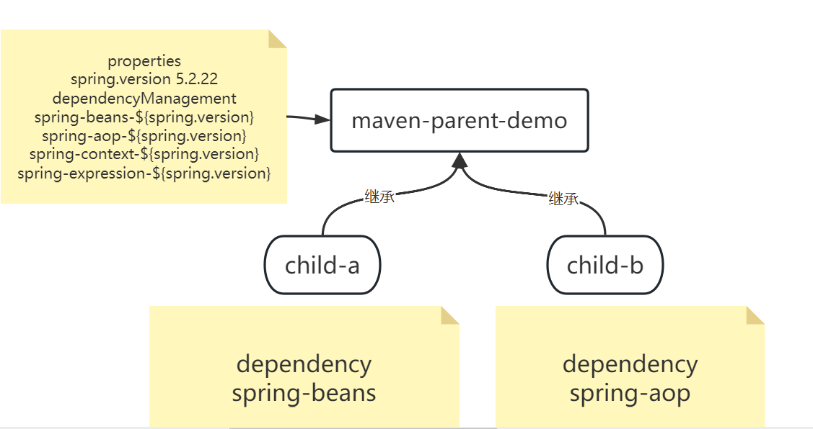
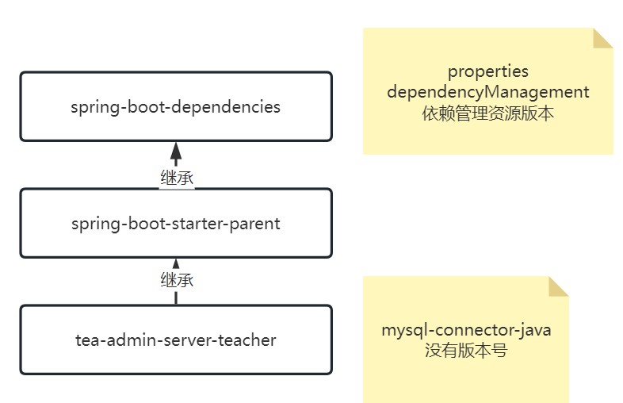
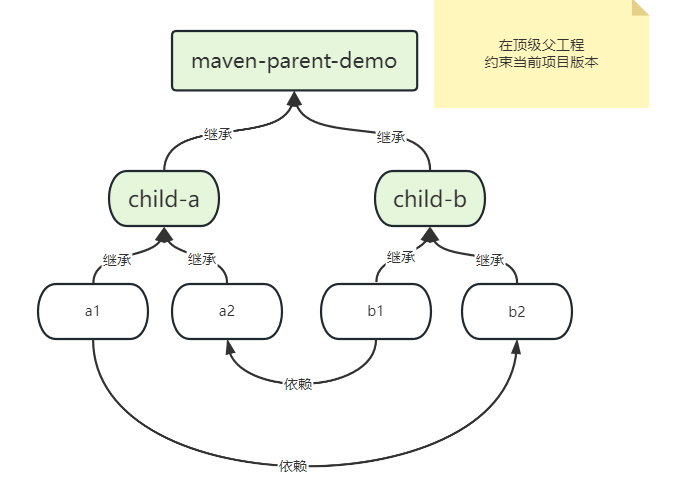

# **Day01**

## 1 克隆 笔记仓库

仓库地址:https://gitee.com/xiaolaoshi2021/notes-2303.git

## 2 自我介绍

**掌握**50%拿不到1万来找我的 肖老师.

### 2.1 掌握50%做到什么

- 当天内容当天消化.
  - 当天练习没有任何遗漏的处理错误
- 理论能够复述.
- 面试题能否利用自己的话重复回答,并且可以延伸

### 2.2 联系方式

- 如果拉群,请联系项目经理,拉企业微信
- 个人微信: xiaoxuwei4478
  - 添加备注: 中心基地名称+班级号+姓名
  - 例子: 北京中关村JSD2303王翠花

## 3 第五阶段概述

## 3.1 大阶段

- 组件软件项目架构学习(**技术学习,架构思路**)
  - maven git应用 熟练掌握
  - demo项目开发 轻业务 重技术和架构演变
    - 从单体架构,演变成微服务架构
  - 微服务组件:
    - nacos
    - dubbo
    - sentinel
    - spring cloud gateway
  - redis分布式锁
  - rocketmq分布式事务,异步通信
- 实战项目开发(鲁班上门)
  - 应用前面阶段学习的技能
  - 开发具体业务项目

## 4 maven详解

### 4.1 目标

- [ ] maven是什么?

- [ ] maven能干什么?

- [ ] maven是如何工作的?

- [ ] maven中你遇到过什么问题,是通过什么方法,手段定位的问题,然后如何解决的?

### 4.2 maven概括

- maven简介

- Maven  是一个**项目管理**和综合**工具**。Maven 提供了开发人员构建一个完整的**生命周期**框架。开发团队可以自动完成项目的基础工具建设，Maven  使用标准的目录结构和默认构建生命周期。

- 在多个开发团队环境时，Maven  可以设置按标准在非常短的时间里完成配置工作。由于大部分项目的设置都很简单，并且可重复使用，Maven  让开发人员的工作更轻松，同时创建报表，检查，构建和测试自动化设置。

- 概括地说，Maven 简化和标准化项目建设过程。处理编译，分配，文档，团队协作和其他任务的无缝连接。 Maven  增加可重用性并负责建立相关的任务。有了maven你的工作就简单了.

- 下载安装(略)

​		idea自带一套maven的环境.使用idea开发,无需安装windows的maven.

​		但是有的开发者,喜欢单独使用maven,windows单独安装了一套.

### 4.3 多模块开发

#### 4.3.1 pom.xml

每一个maven项目都有一个pom文件.Project Object Model **项目对象模型**,maven作为一个项目开发管理工具,将每一个项目看成是一个对象.pom文件是描述这个对象的数据文件(**元数据**).通过pom文件的内容,maven软件就可以管理控制项目.

#### 4.3.2 生命周期

maven管理项目时,总是先加载pom然后执行声明周期的命令逻辑,maven项目从创建开始,要经历如下几个生命周期环节.

**概念**: 生命周期,对象目标经历的环节,经历的步骤.


- validate:

底层执行的maven命令 实际上 .校验一下 当前没问结构,环境是否符合maven项目开发要求.

idea中几乎不会用到.

```shell
mvn validate
```

- compile:

maven项目的编译,只负责main中相关内容的编译输出,默认输出到 target/classes

```shell
mvn compile
```

- test

执行项目的单元测试. 会生成单元测试报告,包含前一步的compile,并且将测试代码编译输出

```shell
mvn test
```

- package

将项目打包

**注意**: 根据packaging类型不一样,打包的输出结果就不同.类型有三种常用的 

jar/war/pom.第三种类型没有代码,只能作为父工程或者聚合工程使用

```shell
mvn package
```

- install

将项目打包,安装存放到本地库(**远程库,本地库**.目前的远程库 central中央库)

```shell
mvn install
```

- site

根据Maven配置生成一个html页面集.针对这个项目做的可观测页面.

```shell
mvn sit
```

- deploy

和私服有关.公司开发,传递jar包的方式

```shell
mvn deploy
```

**idea自定义运行命令**


执行自定义maven命令,添加一个选项-X可以在控制台打印maven执行命令的详细日志.

目的是在出错的时候,帮助我们提供更准确的定位信息.

**提问**: 所有maven项目的生命周期经历的环节都完全一样么?

例如:

​	项目运行的web应用: compile test package **install deploy**(不需要)

​	项目是提供给同事复用的代码: compile test pakcage install deploy

#### 4.3.3 依赖特性(多模块1)

了解掌握3种特性: 依赖,继承,聚合

- 不适用spring initializr插件创建maven项目


- 依赖

  - 作用是什么: **代码项目的复用**
  - 如何使用: dependency标签
  - 特性是什么: 依赖有传递性
  - idea中想要观察依赖的传递性: 传递性是强制传递,maven允许提出不需要的传递

  ```xml
  <dependencies>
      <dependency>
          <groupId>org.springframework</groupId>
          <artifactId>spring-context</artifactId>
          <version>5.2.22.RELEASE</version>
          <!--去除当前依赖,默认传递过来的其他依赖资源-->
          <exclusions>
              <exclusion>
                  <groupId>org.springframework</groupId>
                  <artifactId>spring-aop</artifactId>
              </exclusion>
              <exclusion>
                  <groupId>org.springframework</groupId>
                  <artifactId>spring-core</artifactId>
              </exclusion>
          </exclusions>
      </dependency>
  </dependencies>
  ```

  


#### 4.3.4 继承特性(多模块2)

- 场景


在同一个项目中不同模块的开发者中,各自维护自己的项目依赖关系,有可能出现图中的情况,相互关联的两个模块同时依赖A.jar,但是版本不同,会导致严重的结果,相互之间的关系存在**兼容问题**. 为了保证没有兼容问题.

- 继承意义

**为了统一多模块协作多人开发版本资源**,maven提供了一个多模块特性--继承


- 继承的实现

  - 确定父子关系(**文件夹结构就是父子关系**)
  - 父工程packaging标签值必须是pom,子工程使用parent标签指向父工程(idea自动帮你实现了)

  **区分开类的继承,和maven的继承细节.区分开依赖和继承的区别**

  细节: parent标签详解

  ```xml
  <parent>
      <groupId>org.springframework.boot</groupId>
      <artifactId>spring-boot-starter-parent</artifactId>
      <version>2.7.13</version>
      <relativePath/> <!-- lookup parent from repository -->
  </parent>
  ```

​		relativePath: 子工程寻找父工程pom文件的相对路径地址.如果子工程无法找到父工程的pom,无法实现继承.这个值有三种配置方式

1. 默认值(不给标签) ../pom.xml
2. 自定义值,根据你的pom位置,合理的编写路径信息(**夸文件夹级别继承**)
3. 空值 <relativePath/> 只在本地库找父工程的pom文件,如果本地库没有,从远程库下载

- 本地库资源路径(必须掌握通过maven标签找到库资源)
  - 找本地库在哪c:/{User}/.m2/repository/org/springframework/boot/spring-boot-starter-parent/2.7.13

- 继承的本质

​	子工程继承父工程, pom文件的继承,继承之后,获取的内容就是pom文件中的标签.

​	**pom文件中标签的复用**    依赖才是代码的复用

- 常见的继承标签
  - groupId
  - version
  - properties
  - dependencies
  - dependencyManagement

#### 4.3.5 dependencyManagement标签

**依赖管理**,在依赖管理标签定义的是依赖版本,dependencyManagement包含了一套完整的dependencies.

一旦在项目中定义了依赖管理,再使用依赖的时候,就可以**省略版本号**了.所以我们在父工程统一规划好所有的依赖资源版本,dependencyManagement被子工程继承之后,拥有了相同的特性,相当于做到了资源版本的统一定义,**子工程尽可能不重写版本**.


**问题**: 

1. 父工程定义一堆dependencies 能否实现统一管理资源版本? 能.
2. 为什么不用? 因为这种统一管理版本 是一种强制的继承,让子工程承担了非常多不需要用到的依赖资源

结合 properties和dependencyManagement的继承特性和标签的功能.父子继承的时候最终父工程样子



按照上图,修改maven parent demo案例

观察一些父工程的pom文件,能够阅读其中的pom标签.

spring-boot-starter-parent



#### 4.3.6 周末作业



需求:

- 完成白色项目创建,满足继承关系
- 完成箭头的依赖关系,满足父工程统一定义版本