# Day02

## 1 课前热身

### 1.1 gitee账号准备

请抽出空余时间注册一个gitee码云账号

### 1.2 maven作业讲解


- 新项目创建出来
  - **坑**:新建module的时候,选择自定义项目名称,默认继承关系,会在某些idea版本中默认使用顶级父工程
- 配置继承关系(idea自动完成)
- 配置依赖关系
  - a1依赖b2
  - b1依赖a2
- 统一版本(父工程 properties+dependencyManagement)

- maven有内置的properties
  - project.version 和当前父工程version一致的一个值

### 1.3 课前资料

- mac 电脑

  - virtual box machine 提供了2个版本 6.1.44 7.0.8 exe win版本
  - 官网下载地址:https://www.virtualbox.org/wiki/Downloads(7.0.8)

  - 6.1版本地址:https://www.virtualbox.org/wiki/Download_Old_Builds_6_1

  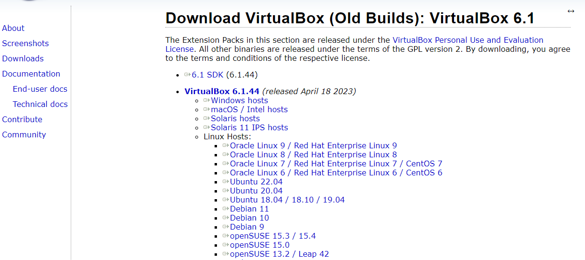

  - finalshell.exe: win 版本

  - finallshell.pgk: mac版本

    http://www.hostbuf.com/downloads/finalshell_install.pkg

## 2 MAVEN-聚合(多模块3)

### 2.1 回顾多模块2个特性

- 依赖:
  - 意义: 代码(项目工程代码)的复用
  - 特性: 具有传递性,可以去除
  - 实现: A依赖B,表示A复用B工程代码,使用dependency在A中配置B

- 继承:
  - 意义: 项目工程资源版本的统一管理
  - 实现:
    - 父工程packaging必定是pom(pom类型工程 没有jar包,没有代码)
    - 子工程使用parent标签指向父工程(找父工程pom文件)
  - 本质: pom文件的标签的复用

### 2.2 聚合

#### 2.2.1 场景

有依赖,有继承关系,已经看到maven多模块了.

一个团队开发项目时候,一定多模块管理的.多人协作开发,使用maven管理项目关系的.

假如项目结构:


a1,a2,b1,b2是项目中4个人共同并行开发的.每个项目都是一个应用的web程序,所以目的都是打成jar包,运行java启动命令

```shell
java -jar a1.jar
java -jar a2.jar
java -jar b1.jar
java -jar b2.jar
```

每个项目都要执行maven声明周期中以下几个命令

mvn clean compile 编译

mvn clean test 测试

mvn clean package 打包

**发现2个问题需要解决:**

1. 打包命令重复执行很多遍.
2. 执行相同命令时,还需要额外关心项目依赖关系.

### 2.2.2 聚合

聚合的目的,就是为了**统一执行mvn相关命令**的.而**不需要关心,依赖关系,继承关系**,聚合本身就保管了所有的多模块关系.

**如何实现聚合:**

1. 挑选一个聚合工程,聚合工程packaging类型是pom(和父工程要求是一致的)
2. 聚合工程来实现modules配置.指向被聚合的工程(idea在创建工程时,自动实现的)

maven-parent-demo 顶级父工程

```xml
<modules>
    <module>maven-child-a</module>
    <module>maven-child-b</module>
</modules>
```

maven-child-a 二级父工程

```xml
<modules>
    <module>a1</module>
    <module>a2</module>
</modules>
```

如果idea版本不同,在创建项目时,聚合的配置有所区别,有可能在顶级父工程中,聚合了所有人

配置完上述两部操作,只需要对聚合工程执行mvn命令,统一对被聚合工程执行相同的命令,而且满足依赖关系

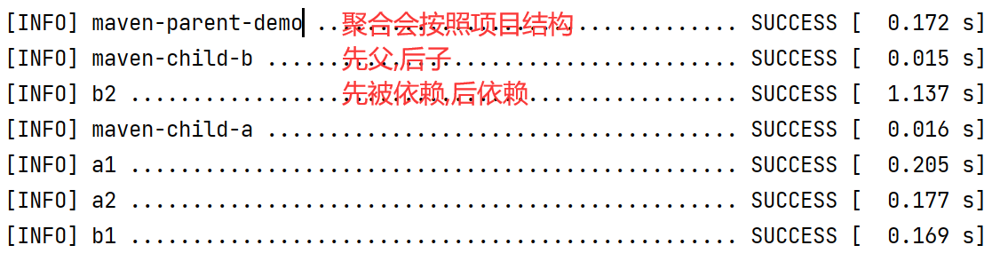

#### 2.2.3 聚合总结

- 意义: 统一多模块mvn命令和顺序的执行
- 实现: 聚合工程packaging类型pom ,指向module被聚合工程
- 本质: pom文件加载的顺序,通过modules关联起来了.

### 2.3 远程仓库

#### 2.3.1 远程仓库概念

maven作为项目管理工具,**资源**是非常丰富的. 资源存储在maven社区的中央仓库(central).下载完的资源存放到本地库(idea中使用,默认c:/User/{username}/.m2/repositories)

资源包括:

jar包(依赖使用的)

插件(site网站插件,打jar包插件)

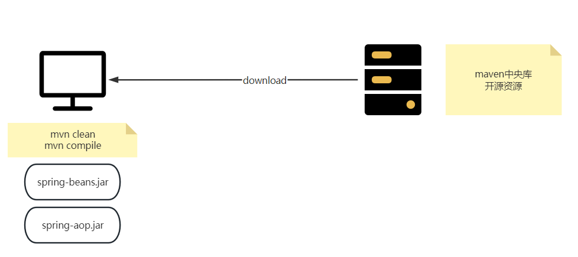

中央库服务器地址是在国外,对于个人开发者,网络连通状态不一定好.所以国内提供了大厂的镜像

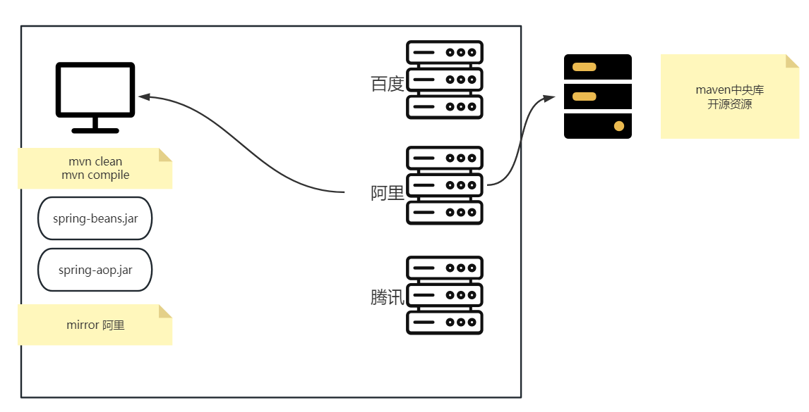

公司来讲,开发需要用到的资源,总是开源的么?引入公司私服,管理公司私有资源.

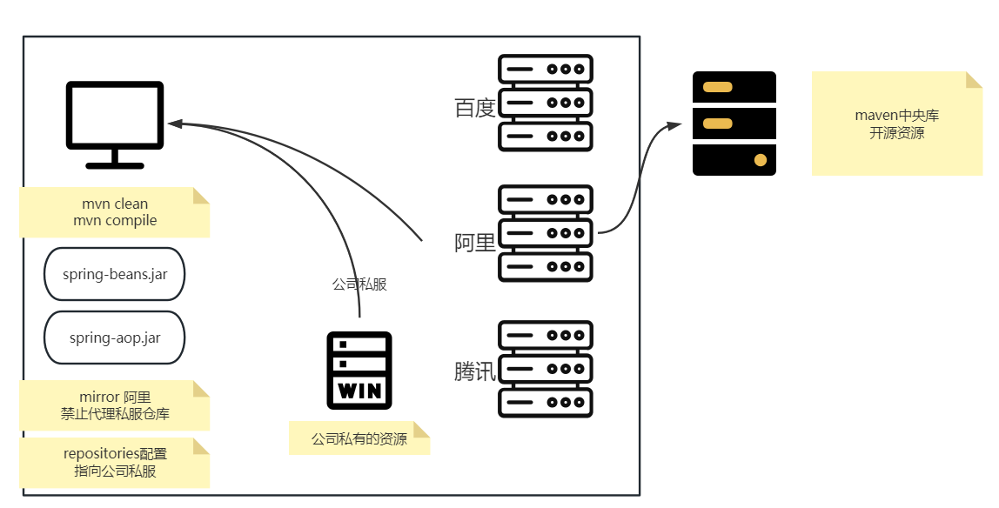

#### 2.3.2 配置settings.xml

将笔记中,resources/settings.xml. 粘贴到当前idea加载的settings.xml的文件夹,可以将原文件直接覆盖.

也可以将原文件改名,备份.

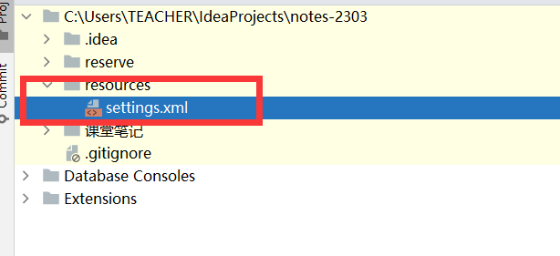

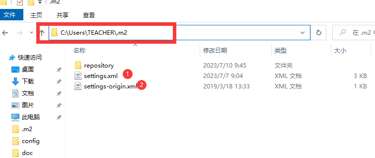

1. 笔记文件
2. 原文件备份(可以不做备份)

- server配置和repository配置关系

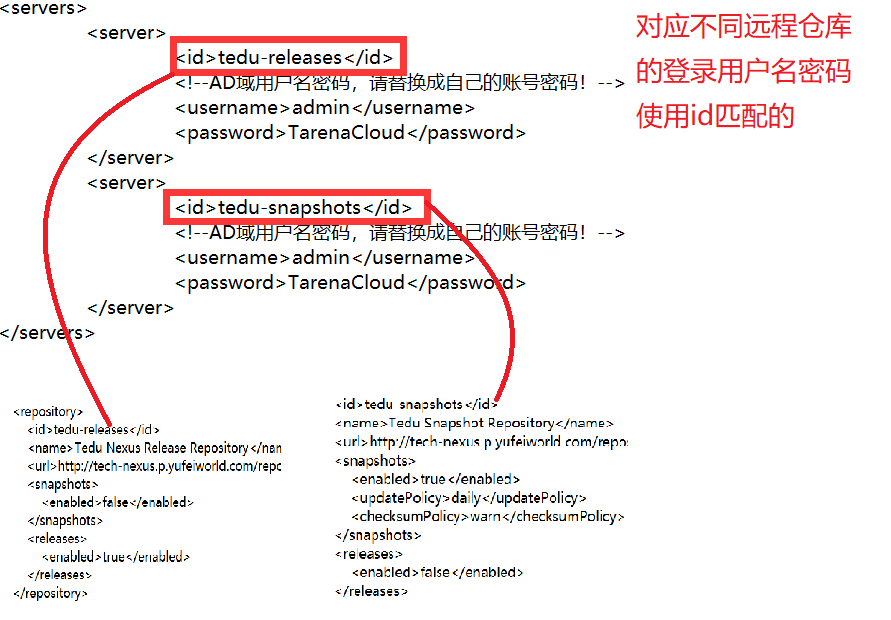

通过server的id绑定了repository的id.

所以如果使用tedu-releases admin/TarenaCloud进行授权

所以如果使用tedu-snapshot admin/TarenaCloud进行授权

- 镜像的过滤配置

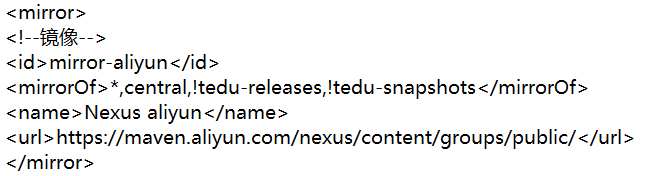

镜像配置,使用的是阿里云镜像.和之前不一样的是 mirrorOf(代理谁,用这个镜像).匹配资源远程服务器.

*: 表示 PC电脑开发端,所有资源都要使用阿里云镜像

central: 表示如果客户端使用的是maven中央内资源,就使用阿里云镜像(和* 重复了)

!tedu-releases: 镜像不代理tedu-releases

!tedu-snapshots: 镜像不代理tedu-snapshots

上述配置完成之后,对于maven项目的资源获取的途径和优先级

**idea同一个workspace-->本地库-->阿里镜像-->阿里不代理的仓库 tedu-releases和tedu-snapshots**

### 2.3.3 远程库配置注意事项

- 用户名和密码在任何情况下都不要泄露

- idea有的版本自动**拦截http协议**,导致访问私服的请求,转发到http://0.0.0.0:80这个地址

如果发现私服无法连接下载,在没有确保私服网络故障的前提下.找到idea的全局settings.xml

只要使用-X执行maven任意生命周期命令,就能看到这个全局settings.xml

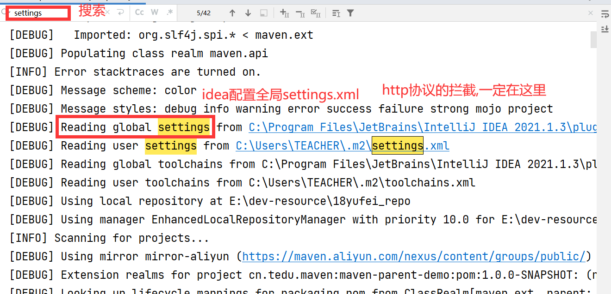

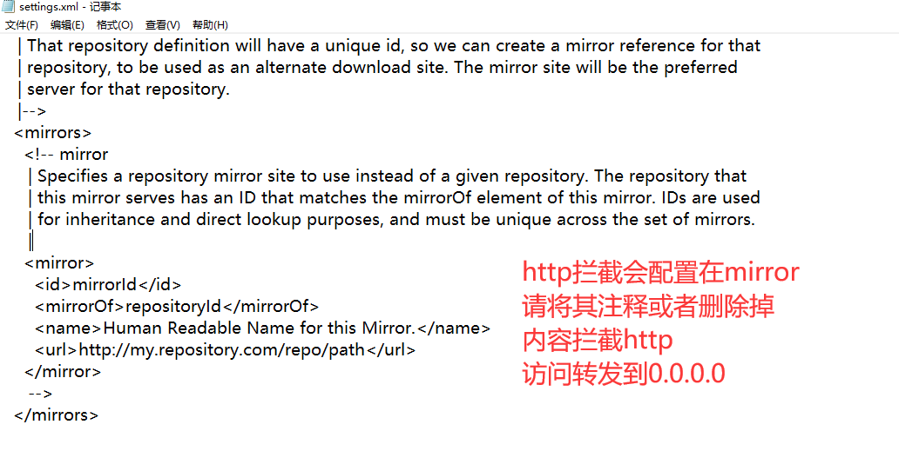

- 小问题: 如果使用的依赖版本是SNAPSHOT,表明这种jar包资源是开发版本,稳定版是RELEASE.可能持续更新的状态,使用依赖资源,maven资源的客户端工程,可以通过-U选项添加在maven命令中,强制要求更新最新版本.

例如:

```shell
mvn clean compile -U -X
```

## 3 GIT详细学习

### 3.1 本地版本控制

#### 3.1.1 git概括

```txt
在代码开发过程中，往往需要对源码进行多次的修改操作，这样一来同一份代码就产生了多个版本，在开发过程中通常需要对这些多个版本代码进行管理，以便于在需要时进行  代码回滚、多版本间比较、多人协作开发、代码分支、分支合并 等操作。

这样的需求大量的存在，而随着软件越来越复杂、代码越来越多、参与开发者越来越多，版本管理也变的越来越有难度，此时就需要专业的软件来对版本进行管理，这个过程就称之为版本控制，实现版本控制的软件就称之为版本控制软件。

```

#### 3.1.2 git历史

```shell
Linus在1991年创建了开源的Linux，从此，Linux系统不断发展，已经成为最大的服务器系统软件了。
Linus虽然创建了Linux，但Linux的壮大是靠全世界热心的志愿者参与的，这么多人在世界各地为Linux编写代码，那Linux的代码是如何管理的呢？
在2002年以前，世界各地的志愿者把源代码文件通过diff的方式发给Linus，然后由Linus本人通过手工方式合并代码！
你也许会想，为什么Linus不把Linux代码放到版本控制系统里呢？不是有CVS、SVN这些免费的版本控制系统吗？因为Linus坚定地反对CVS和SVN，这些集中式的版本控制系统不但速度慢，而且必须联网才能使用。有一些商用的版本控制系统，虽然比CVS、SVN好用，但那是付费的，和Linux的开源精神不符。
不过，到了2002年，Linux系统已经发展了十年了，代码库之大让Linus很难继续通过手工方式管理了，社区的弟兄们也对这种方式表达了强烈不满，于是Linus选择了一个商业的版本控制系统BitKeeper，BitKeeper的东家BitMover公司出于人道主义精神，授权Linux社区免费使用这个版本控制系统。
安定团结的大好局面在2005年就被打破了，原因是Linux社区牛人聚集，不免沾染了一些梁山好汉的江湖习气。开发Samba的Andrew试图破解BitKeeper的协议（这么干的其实也不只他一个），被BitMover公司发现了（监控工作做得不错！），于是BitMover公司怒了，要收回Linux社区的免费使用权。
Linus可以向BitMover公司道个歉，保证以后严格管教弟兄们，嗯，这是不可能的。实际情况是这样的：
Linus花了两周时间自己用C写了一个分布式版本控制系统，这就是！一个月之内，Linux系统的源码已经由Git管理了！牛是怎么定义的呢？大家可以体会一下。
Git迅速成为最流行的分布式版本控制系统，尤其是2008年，GitHub网站上线了，它为开源项目免费提供Git存储，无数开源项目开始迁移至GitHub，包括jQuery，PHP，Ruby等等。
历史就是这么偶然，如果不是当年BitMover公司威胁Linux社区，可能现在我们就没有免费而超级好用的Git了。
```

#### 3.1.1 本地版本控制相关命令

- 初始化仓库

针对idea中每一个项目,都是一个git仓库. 仓库中有2个区域,一个工作区,一个叫做版本库

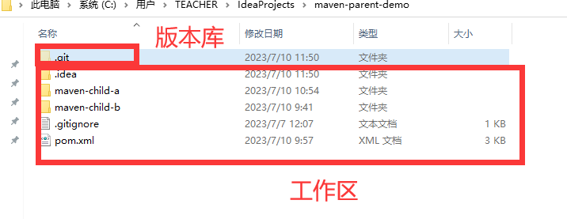

工作区和版本库,通过命令来联系.

如果想要使用git,管理idea项目,第一件事就是初始化一个项目的git仓库.

```shell
git init
```

了解命令,执行操作步骤

1. 创建idea的maven工程(有可能自动初始化)
2. 创建完,在terminal(相当于windows的cmd终端窗口,可以执行dos命令)

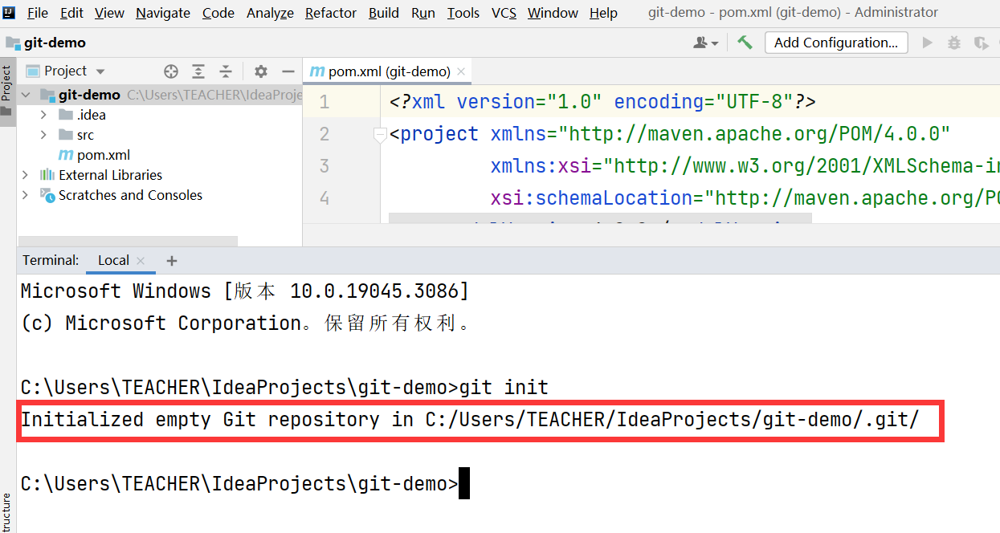

- 配置开发信息

开发人员在git中提供2个基本信息,姓名和邮箱

用户级别的配置.一个项目,对应一个开发人员信息

```shell
git config user.name
git config user.email
```

全局级别的配置. 默认使用.

```shell
git config --global user.name
git config --global user.email
```

如果要修改,只需要添加={值}

```shell
git config --global user.name 肖旭伟
```

- 添加到暂存区

在git仓库中,有2个区域,一个是工作区,一个是版本库,版本库中有暂存区和分支master.

可以利用命令add 将工作区中的文件,添加到暂存区. 

哪些文件需要新增,可以使用status查看

```shell
git status
```

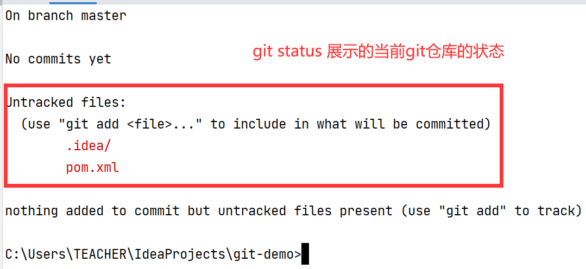

可以通过add将文件添加到暂存区,一旦添加,文件就开始被追踪.追踪的是文件的变动.

```shell
git add {path/文件名}
```

如果全部都添加到暂存区,不是一个一个文件执行 * .

```shell
git add *
```

**Idea特性**:idea管理git项目仓库,提示你是否新增的文件自动执行add追踪添加到暂存区,如果点击了add.所有新建的文件,都自动执行add.

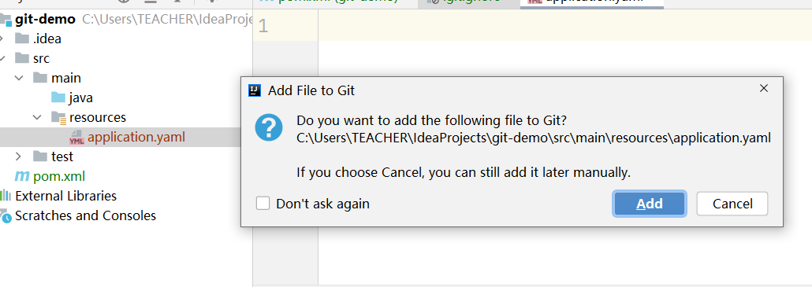

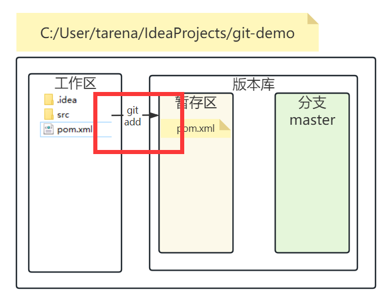

- 提交版本

添加到暂存区的文件,可以使用commit命令,提交到分支,永久存储,不在丢失,只有回滚的可能.

```shell
git commit -m '本次提交的提示信息'
```

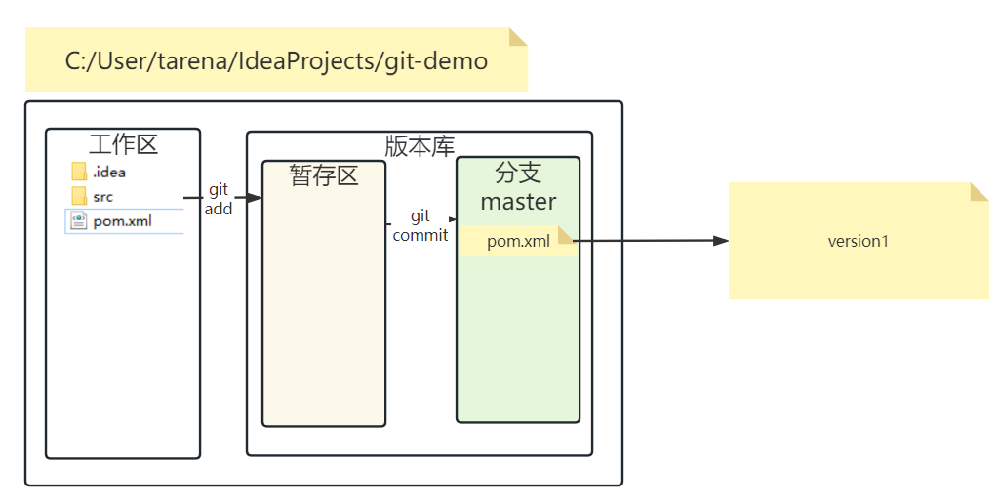

提交的信息,永久保存,git给当前提交数据,固定保存了一个版本号.

可以通过Idea的控制台git信息看到.

- 课堂穿插练习

```txt
请通过,以上学习内容,完成以下的操作
1. 初始化一个git仓库
2. 定义个人信息开发者名称,邮箱
3. 正常开发web项目
4. 提交到master分支
```

- 查看提交版本信息

提交的版本,可以使用log命令,查看当**前版本之前**的所有版本信息.

```shell
git log
```

为了让当前项目看到更多版本

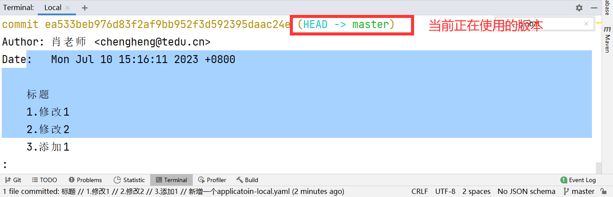

- 执行版本的回滚

可以通过git reset 命令 添加回滚的选项 --hard --soft --mixed

```shell
git reset [--hard|soft|mixed] version版本号
```

--hard表示 直接回滚到version对应的版本,本地其他文件丢失.

--soft回退的版本和当前的区别会保存在暂存区(工作区看到的文件)

--mixed(默认值)回退的版本,不会保留在暂存区,会保存在工作区.

根据上述描述,soft回退和mixed 在idea执行,效果是几乎完全一样的.

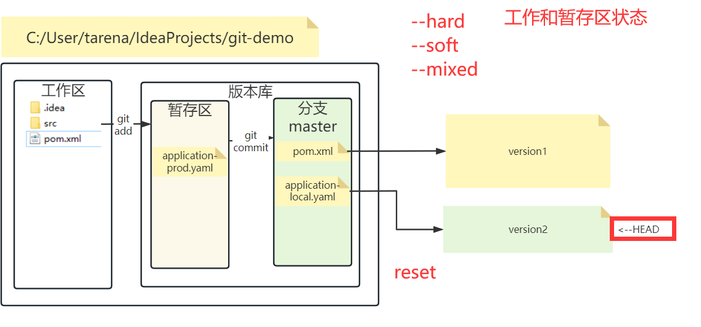

**使用q退出log的查看.**

版本维护,有时候不方便的,所以git提供了 tag标签

- 打标签

如果版本号不容易记录,可以在版本中添加标签.

```shell
git tag 标签内容 版本号
```

- 查询操作日志

如果没有对重要版本打标签,也不记得版本号,可以使用日志查询,检查对应的操作

```shell
git reflog
```

你从git init开始,记录的所有git操作的命令

### 3.2 git分支管理

#### 3.2.1 分支管理基本概念

分支,为了避免同一个仓库,多人协作开发时,重复,冗余解决文件冲突问题,引出的一个git特性.

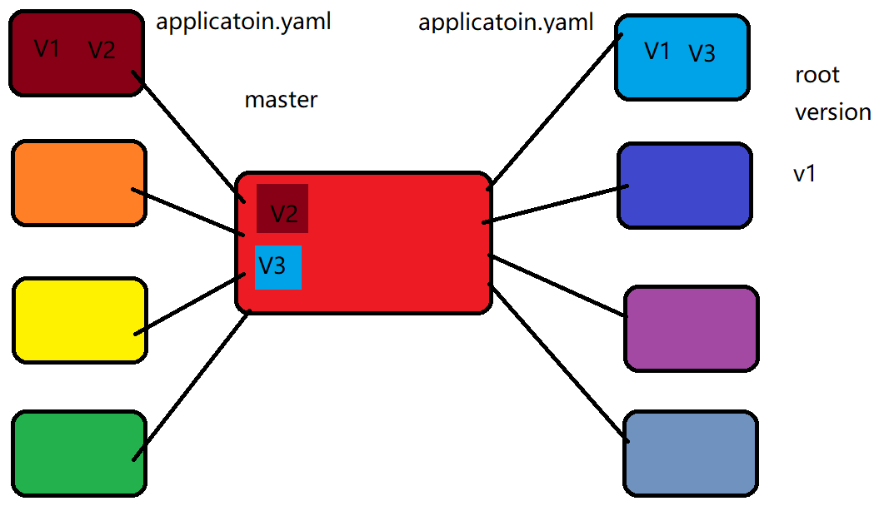

#### 3.2.2 分支管理相关命令

- 创建分支

选择一个基分支(base branch),创建多个新分支. 你执行以下命令,**所在的分支就是基分支**

```shell
git branch 新分支名称
```

基于当前版本,在master上创建b1 b2,三个分支的结构

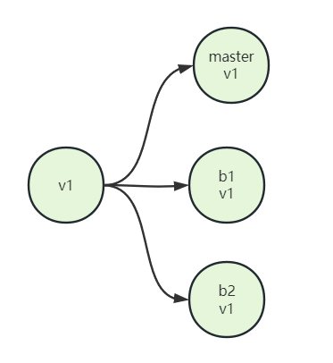

- 切换分支

使用checkout命令,可以切换分支,每个分支的切换,都会在版本库中,找到对应分支,切换完了,commit向当前分支提交,而不会提交到切换之前的分支.

```shell
git checkout 分支名称
```

- 查看分支,查看当前操作分支

```shell
git branch
```

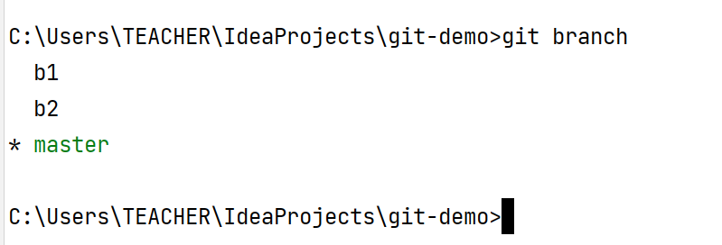

看到的返回结果 * 所在分支就是当前分支.

在b1中添加一个文件application-b1.yaml 并且提交了版本.

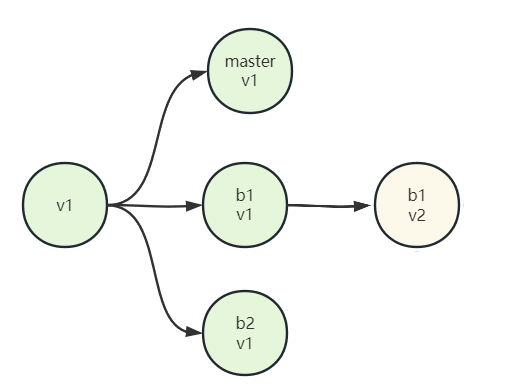

可以通过对分支的管理,实现多人协作开发过程中的,并行开发.

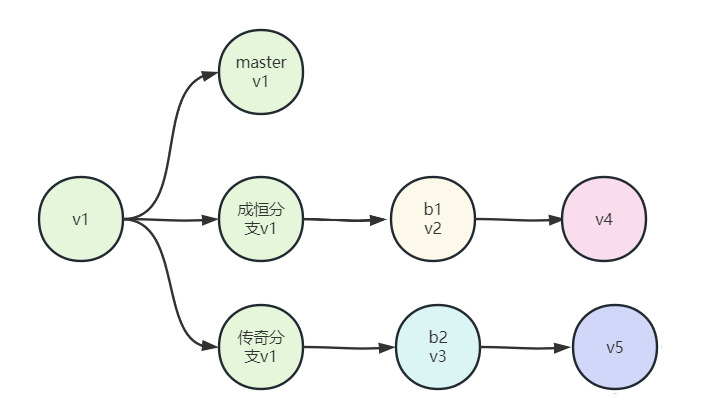

- 分支的合并

当某个功能,交给多个人员开发,并行开发结束,要进行分支的合并. merge(rebase)

```shell
git merge 目标分支
```

注意: 执行上述命令的效果,**当前分支,会合并目标分支**

按照如下步骤操作: 目的将b1的变动合并到 master 和b2

1. 确定当前分支是否是master,如果不是,就切换

```shell
git branch
```

```shell
git checkout master
```

2. 确定好所在分支,和目标分支之后,执行merge合并

```shell
git merge b1
```

经过合并,并且通过checkout和log检查,master和b1分支版本相同的.

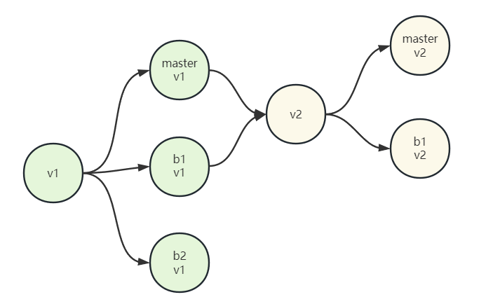

- 冲突解决

冲突条件:

1. 相同文件
2. 必须存在行冲突

本质版本基于不同的父version进行合并.

案例:

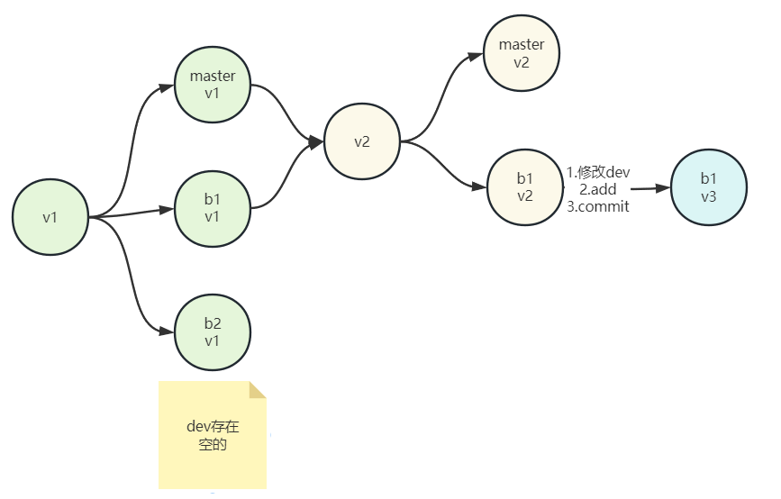

在b1前一个合并案例完成后,继续推进b1版本变动,从文件dev里改变了内容,形成v3

把b1合并到b2.

1. 切换到b2

```shell
git checkout b2
```

2. 合并目标分支

```shell
git merge b1
```

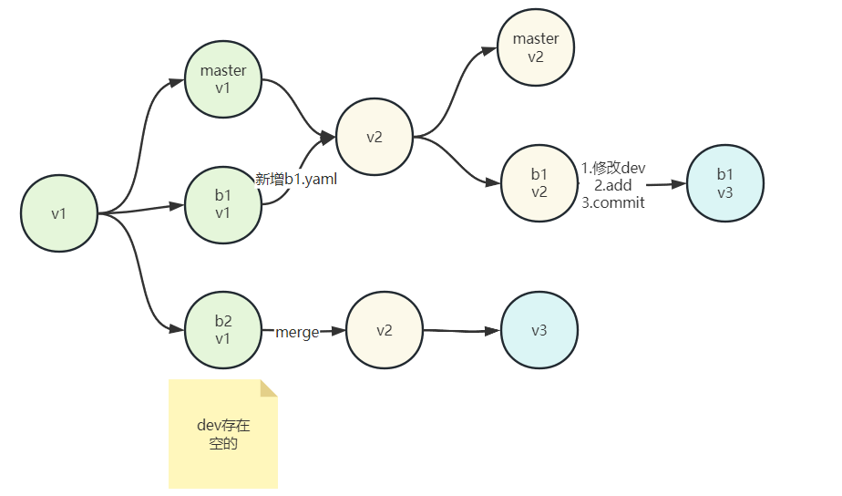

人为制造冲突

1. b2新增一个属性spring.age=18

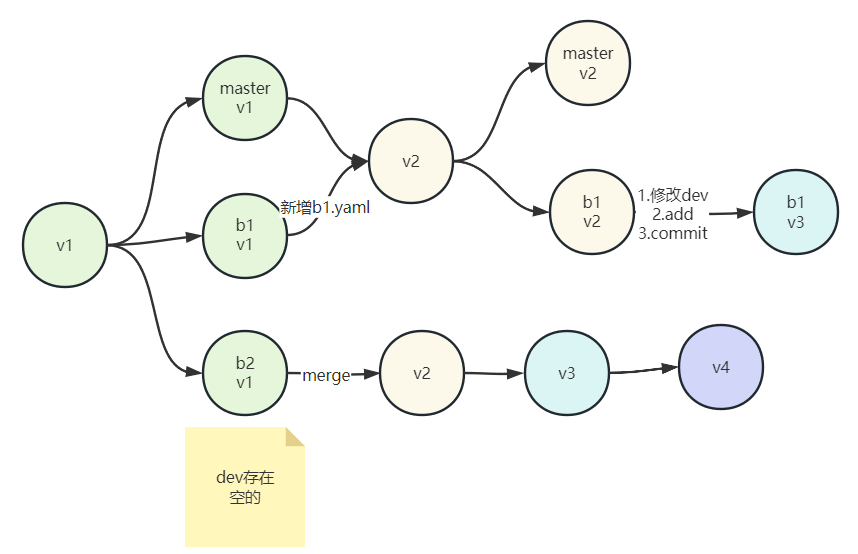

2. 切换到b1 spring.age=19

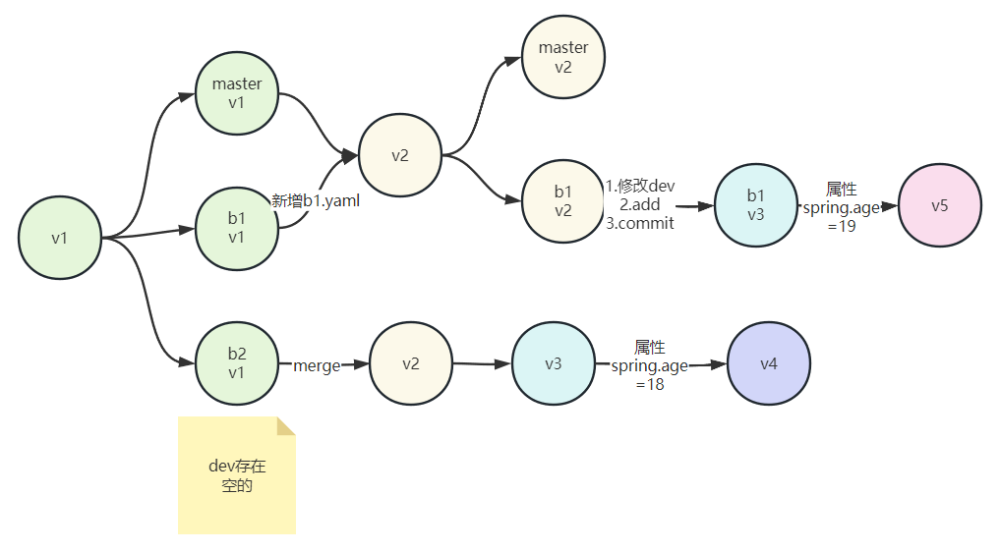

3. 把b1再次合并到b2

将两个分支合并时,提示有冲突

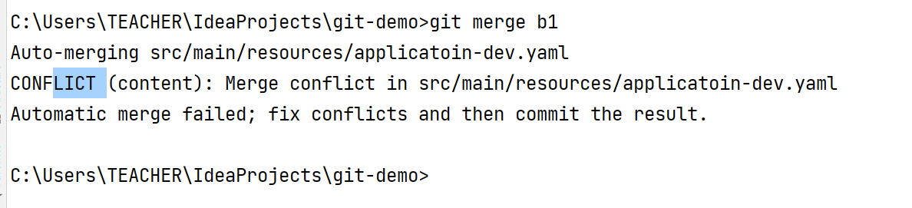

冲突的文件会被git stash(暂存标记)

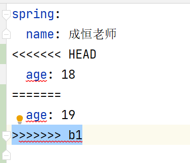

手动修改冲突,修改的冲突文件,在工作区,继续执行合并,需要先add到暂存区

```shell
git add *
```

然后执行merge --continue

```shell
git merge --continue
```

合并就结束,文件目前处在暂存区,重新提交一版.(继续合并结束,当前光标所在位置 输入 :wq 保存退出提示文本)

```shell
git commit -m "描述信息"
```

**注意**: 将目标分支合并到当前分支,目标分支的版本不变.

- merge和rebase区别

rebase相当于细致管理merge细节.将两个分支合并时,所有不相同的版本,都经历一次merge.

merge只将最终的版本合并一次.不在关心早期版本.

结果是相同的.

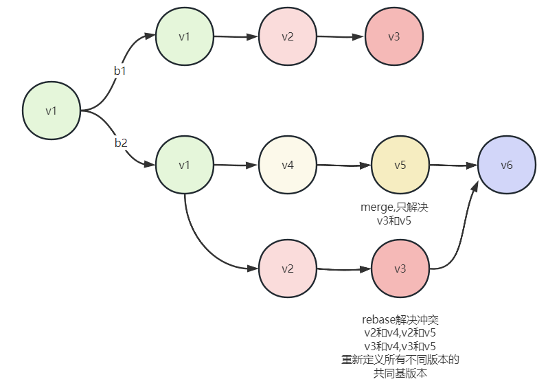

#### 3.2.3 Idea的插件操作

上述操作的git所有命令,都可以在idea中插件,通过点击按钮,实现.

- git add

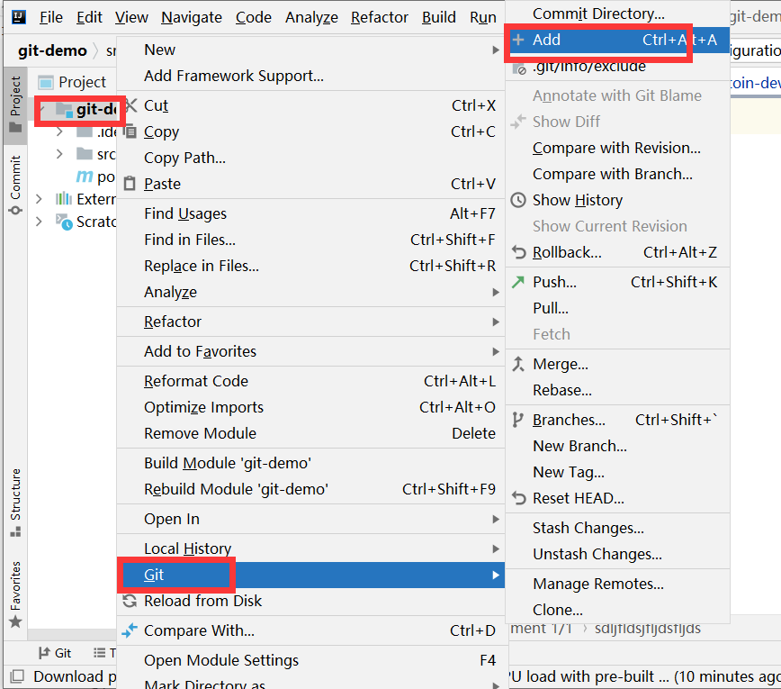

- git log

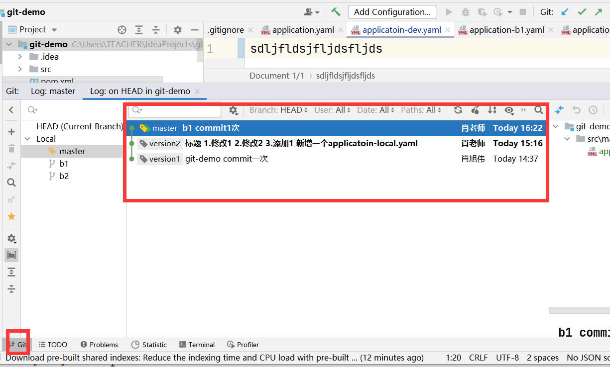

- git commit

保证在add后执行.

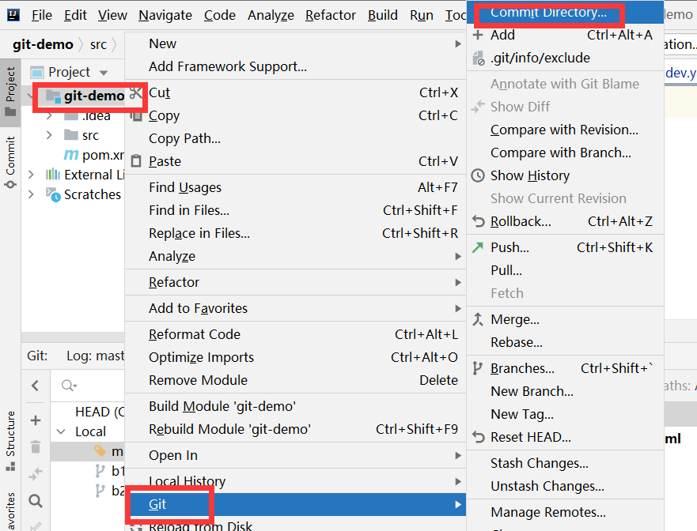

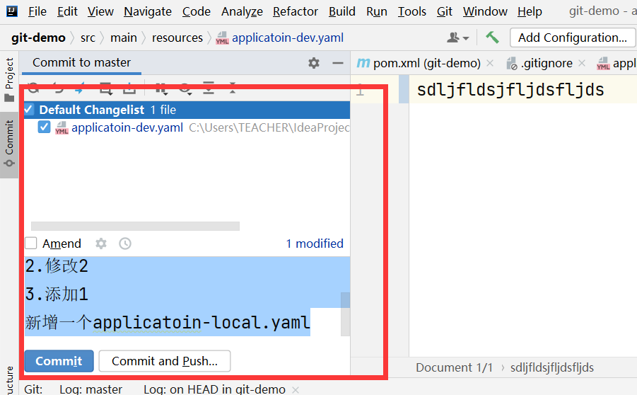

- git branch管理

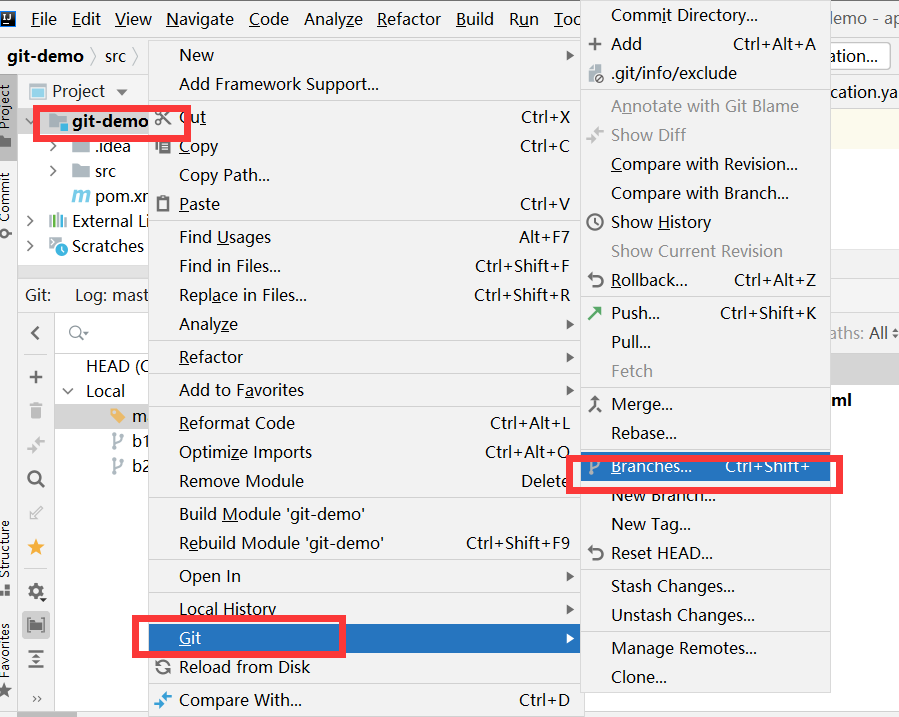

新建分支,对比分支版本和当前工作区的区别.

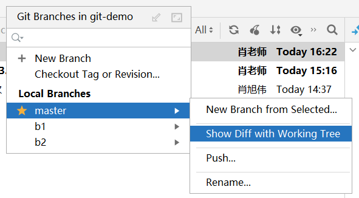

- 冲突解决

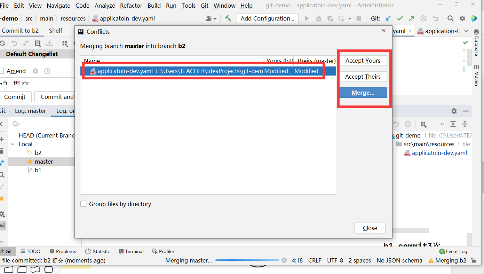

明确指出合并冲突文件有几个--1个

给3中解决方案(把master合并到b2过程)

1. 接受你的(当前分支的)
2. 接受他的(目标分支的)
3. merge(stash 暂存手动解决)

### 3.3 远程仓库(gitee)

