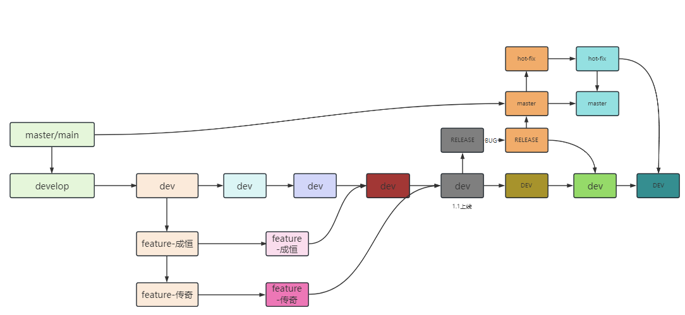
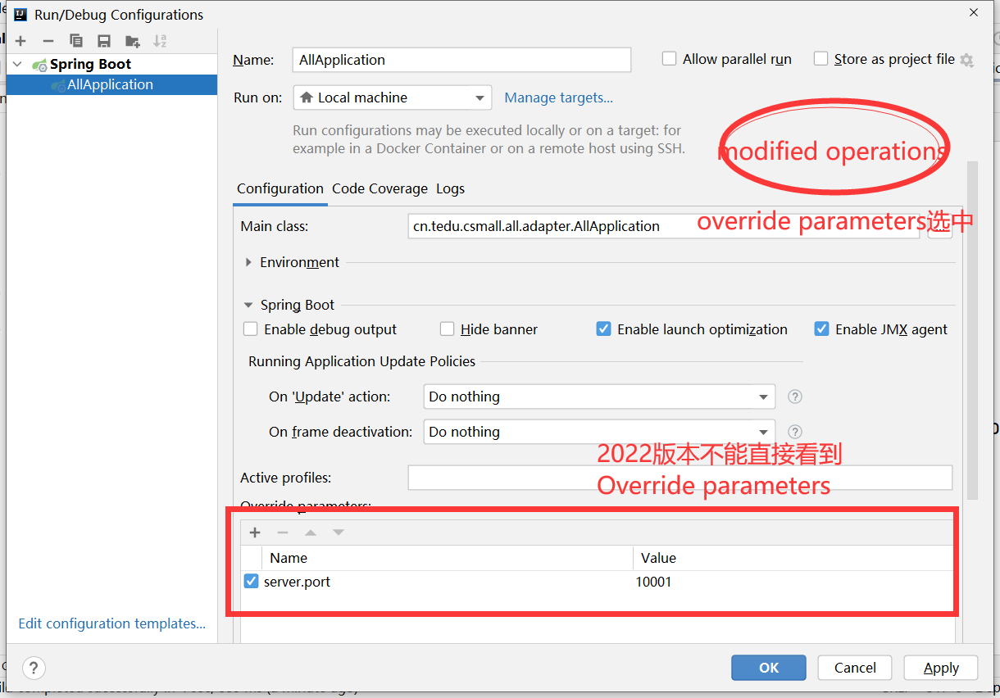

# Day03

## 1 课前解析

## 1.1 作业问题

- 提前布置,提前看,到点提交(本次作业7月11日18:00 7月13日18:00)
- 不是每天都有,但是一周至少2次,一般保持3次.

### 1.2 回顾git命令

- 本地版本控制
  - git init
  - git add
  - git commit
  - git log
  - git status
  - **git tag**
  - git reflog
  - git reset
- 分支管理
  - git branch
  - git branch b1
  - git checkout b1
  - git merge b1
  - git rebase b1

## 2 Git远程仓库

### 2.1 远程仓库概念

git 分布式的版本控制软件,同时支持去中心化.

```txt
为了方便版本的交换，通常会使用一个中心服务器，24小时连续运行，提供版本控制服务
这就有两种做法：
自己搭建中心服务器(公司内部搭建gitlab)
使用类似GitHub的代码托管网站(国内时gitee)       
目前我们更多使用代码托管的方式进行开发工作
```

登录gitee. 如何将本地代码,推送到远程,关联到远程.

### 2.2 远程仓库分支操作

- 在托管平台准备一个空仓库


- 在当前本地项目中添加远程仓库关联

使用git remote命令来添加仓库

```shell
git remote -v
```

不携带参数执行,是查询本地仓库关联的远程仓库,可以关联很多个.

使用add子命令,来添加你的目标远程仓库

```shell
git remote add {自定义仓库名称} {仓库地址*.git}
git remote add gitee-repo https://gitee.com/xiaolaoshi202
1/git-demo.git
```

- push 推送

和远程仓库关联之后,可以通过push推送. 可以先确保本地有提交的数据.

```shell
git push {仓库名称} {本地分支名称}
```

如果是第一次push或者fetch,本地要填写远程仓库用户名密码


- gitee添加团队成员


- 克隆远程仓库项目

团队其他成员,可以通过连接远程仓库,进行项目克隆

```shell
git clone {远程仓库地址} 目录名称
git clone https://gitee.com/xiaolaoshi2021/git-demo.git ./git-demo-b
```

- 远程分支概念

刚刚**克隆**的项目,只有默认分支(master),同步到了本地分支.

在当前项目由于关联的远程托管中心,分支分成了2批,第一批就是本地分支.

第二批就是远程分支.


可以像操作本地分支一样,部分命令可以操作远程分支.

- 查看并切换分支

```shell
git branch -a
```

查看当前仓库中所有的分支信息,包括远程分支.


**注意**:永远不可能在本地仓库对远程remotes分支进行修改.因为在本地看到的远程分支只是**元数据**(描述远程分支信息的数据,描述数据的数据).

可以执行分支的切换命令

```shell
git checkout {分支名称}
```

这个命令缺少必要选项,导致切换远程分支,没有创建本地分支.

1. 查询对应选项,完成命令操作
2. 使用idea的按钮切换分支checkout


**注意**: 一般情况下,多分支开发时,个人只关心自己的分支,不关心其他人分支.


- 多人协作连接远程仓库开发-对同一个分支并行开发

特点:和本地同一个分支并行开发一样的情况.


- 处理同一个分支开发的push冲突

先pull在push,绝大部分问题,都不存在了.pull的同时,自动进行合并.

有可能在pull的时候,处理冲突,没有冲突,自动合并.


多人同时开发一个分支不合理,会造成推送 下来的不便.


- 如果pull过程有文件冲突--同一个分支多人开发

只要在pull的时候有文件的冲突问题,和本地分支合并 文件冲突解决方法是一样的.

accept yours 保留本地分支版本文件

accept theris 保留远程其他分支版本文件

merge 手动处理冲突 出现以下画面


### 2.2 分支管理策略

企业开发过程中,总是满足一种比较规范的分支管理策略(所有分支操作,包括远程,都已经在上述的命令,案例中包括).

- gitflow: 最老版本,最规范的分支使用策略,满足**版本发布**特点
- githubflow: 满足持续发布
- gitlabflow: 既能满足版本发布,又能满足持续发布

版本发布: 游戏 v1.0.1  v1.1.0

持续发布: web网站 

核心都是分开开发,定义分支的意义(**gitflow**定义分支的使用规范最全)

1. 永久分支:

   1. master: 保管的永远是稳定代码版本(几乎没有bug),什么时候代码测试的差不多了,才能合并到master.
   2. develop: 开发分支,所有功能推进都基于develop进行

2. 临时分支

   1. feature-XX: 新功能分支,来自于develop,XX可以是人名,可以是功能名称,不同的开发人员开发维护不同feature分支,最终合并到develop,删除
   2. release分支: 保护分支,来自于develop,目的是测试develop不影响develop开发,如果测试有问题,修改bug,合并到deveop和master,在master做版本最终上线(合并到master意味着代码要上线),归宿一定是master,可能也会合并dev.
   3. hot-fix: 热点修复,解决线上bug,来自于master,归宿一定是master和develop

   

一版情况下,根据公司的规模,仿照这个gitflow规范,定义公司分支的管理.

大部分情况下,

1. 直接发布develop
2. 新功能也是基于develop实现的,不会使用master


### 2.3 课堂案例对比功能

老师代码照着完成,出现问题不知道哪里不同,肉眼扫描.

可以利用老师上传push的,在自己pull时候解决冲突,了解区别.

## 3 订单交易案例

### 3.1 调整项目案例环境

#### 3.1.1 克隆项目


#### 3.1.2 验证maven环境

- 观察pom内容

  - csmall-for-jsd-commons maven编译变量值 java11

  

  - csmall-for-jsd-all

  

- 运行maven compile


- settings.xml配置


settings中定义了一个本地库的地址.你的电脑没有E盘.

#### 3.1.3 数据库导入本地mysql

项目根目录doc下有个csmall_demo.sql. 

了解表格(不是真是业务的详细表格,抽取简化字段的表格).

**cart_tbl**: 每一行都表示一个**用户**的购物车**商品**.

| id         | commodity_code   | price | count          | user_id |
| ---------- | ---------------- | ----- | -------------- | ------- |
| 购物车主键 | 商品编码(商品id) | 单价  | 购物车商品数量 | 用户id  |

**order_tbl**:  每行数据,都代表一个用户的订单

| id     | user_id | commodity_code   | count    | money |
| ------ | ------- | ---------------- | -------- | ----- |
| 订单id | 用户id  | 商品编码(商品id) | 购买数量 | 总计  |

**stock_tbl**:

| id     | commodity_code | count  |
| ------ | -------------- | ------ |
| 商品id | 商品编码       | 库存数 |

#### 3.1.4 核心业务

案例中涉及内容包括购物车,包括订单,包括库存.完整下单流程.

1. 用户浏览商品
2. 看中商品添加购物车
3. 去结算,引入订单信息页面
4. **提交订单,验证库存,购物车商品删除**

#### 3.1.5 接口架构

启动以下项目 csmall-for-jsd-all-adaptor 核心流程


### 3.2 单体架构(微服务理论基础)

- 什么叫做单体架构

开发一个web应用,将所有接口功能,都集中管理开发在一个项目中,这种项目叫做单体架构.

- 有什么优点
  - 结构简单,开发成本低
  - 部署运维成本低
- 有什么缺点
  - 如果功能是不断扩展,项目代码,功能代码非常臃肿
  - 并发的木桶原则问题

随着**业务增长**,功能一定是在不断增长的.为了降低一个系统的业务成本,提供灵活**可扩展**的结构.单体架构,不在适用.


- 纵向拆分

按照**业务功能**,将单体架构中的**功能独立拆分开**,单独部署,单独开发,单独维护,每一个拆分出来的项目相互不影响---纵向拆分.


纵向拆分带来的最直接的一个问题--业务分布式系统.考虑负责的分布式环境下的各种问题.比如功能调用问题.


假设使用socket进行通信代码编写. Aservice远程通信调用Bservice.Aservice,建立客户端连接socket,Bservice建立SocketServer.

除了代码编写成本过高,目标ip:port如何获取.

实现上述问题的最终落地解决---微服务.

### 3.3 实现csmall-for-jsd-all纵向拆分

按照业务拆分,分为4个业务 business order cart stock,但是拆分之后,无法执行核心整体流程(没有完善).

#### 3.3.1 csmall-for-jsd-order系统

- 创建项目


- 创建子项目

order-adapter: 启动的web应用(springboot web应用)

order-service: adapter里业务实现**ServiceImpl 对外暴露的接口.在这个项目包中的接口类,允许外界远程调用(dubbo用到的)


- 粘贴留选代码-csmall-for-jsd-order-service


- 补充对应依赖-csmall-for-jsd-order-service


```xml
<dependencies>
    <dependency>
        <groupId>cn.tedu.csmall.demo</groupId>
        <artifactId>csmall-for-jsd-commons</artifactId>
    </dependency>
</dependencies>
```

- 粘贴代码-csmall-for-jsd-order-adapter


- 调整依赖csmall-for-jsd-order-adapter
  - spring-boot-starter-web
  - mysql-connector-java
  - mybatis-spring-boot-starter
  - csmall-for-jsd-order-service
- 删除代码,只保留订单业务功能和通用配置.
  - 代码Knife4j保留,mybatis扫描配置保留
  - controller只保留 order相关
  - service只保留order相关
  - mapper只保留order相关
  - 启动类修改名字
  - 配置yaml修改端口 20001-20004

## 4 总结通知

- 今日核心内容
  - git操作 掌握 版本变动,提交回滚的图表思路
  - 单体架构演变过程--纵向拆分(什么是单体架构,优缺点,纵向拆分的目的)

- 明天上午不上课(练习),下午上课
  - 剩余的cart,stock,business完成纵向拆分
  - 下午上课,直接pull我的代码,就是完成后的内容,有冲突,解决冲突.
- 今天我会留作业(开始时间是明天下午18:00)
  - 将all中的业务代码,自行重做一遍.体会业务逻辑.
- 昨天留的作业(简答题)
  - 提交简答内容就可以了.使用自己话术和理解,不要粘贴笔记

# 附录 补充内容

## 1 idea运行多个springboot-web应用

- 启动一个springboot应用
- 修改启动配置项


- 修改覆盖源代码中的端口号



