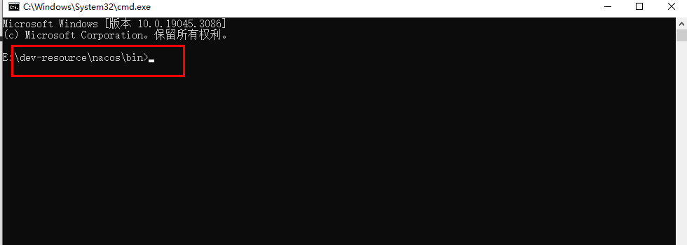

# Day04

## 1 课堂案例解析

题目: 将business order cart stock 拆分

### 1.1 删除module(删除maven项目)

1. 先删除module


2. delete删除磁盘文件,文件夹

​	右键项目 选择delete

3. 创建项目的module标签要在父工程删除


### 1.2 idea记录maven忽略

删除某个maven项目,在idea中可能会记录在maven的忽略表中

导致重新创建项目的,pom文件就**是灰色的.**


### 1.3  pull远程解决冲突


**建议**: 点击merge 挨个查看


### 1.4 git对比功能


**注意**:不代表 不一样就是有错.


### 1.5 分支使用(同步代码)

思路: 不在master跟代码,建立自己的分支,跟完当天代码,对比master提交的最终版本

## 2. 微服务

### 2.1 项目拆分最终细节调整

- 依赖关系是否正确(pom文件)


- adapter保留拆分功能,service接口包(代码删除)


- 最终效果
  - 不能运行(需要调用的业务本地没有实现类)

### 2.2 微服务概括

单体架构存在的问题,目前可以进行纵向拆分,但是依然有没解决的问题,**远程调用**.

这种问题就是拆分之后出现的新问题(拆分的结构已经是一个**分布式**结构)

这种拆分的结果,每个独立运行的项目---微服务

微:小,可以拆分的更细致

服务: 可调用的功能

**分布式**:一件事(广义的),多个进程/节点/模块 完成.都叫做分布式.

微服务结构,满足灵活扩展的.引出非常多问题,比如远程调用,比如调用失败的熔断,比如分布式事务等.

想要解决,引入微服务架构技术,比如Spring Cloud/Spring Cloud Alibaba

## 3 微服务框架

### 3.1 Spring Cloud

SpringCloud是由Spring提供的一套能够快速搭建微服务架构程序,解决分布式微服务架构中各种问题的的**框架集**.

框架集表示SpringCloud不是一个框架,而是很多框架的集合.并不需要把所有内容都学完.

### 3.2 Spring Cloud alibaba/Spring Cloud Netflix

在众多springcloud框架集中的微服务组件里,有2个知名的团队阿里巴巴和奈非,他们完成了一个微服务中需要用到的绝大多数组件的开发.


### 3.2 本阶段学习的组件总结

- nacos: 注册中心 配置中心
- dubbo: 远程调用rpc框架
- sentinel: 熔断器,限流器
- rocketmq: 异步通信队列
- spring cloud gateway: 微服务网关

所有组件使用,整合到spring cloud,spring cloud出现是基于springboot完成的.

使用学习的步骤,大三步.

1. 依赖
2. 配置yaml
3. 简单配置: 可能是配置类,可能是注解

**注意**: 只学习其中1-2个,没有全学完,有可能不能完成一个完整的微服务架构的.

## 4 Nacos

### 4.1 Naocs介绍

官网文档地址: https://nacos.io/zh-cn/docs/quick-start.html

缩写就是 Naming Configuration service，**本身nacos就是一个service服务**，这个服务的功能包括命名管理,服务**注册发现**，和**配置管理**。

```txt
Nacos 致力于帮助您**发现**、**配置**和**管理微服务**。Nacos 提供了一组简单易用的特性集，帮助您快速实现动态服务发现、服务配置、服务元数据及流量管理。
Nacos 帮助您更敏捷和容易地构建、交付和管理微服务平台。 Nacos 是构建以“服务”为中心的现代应用架构 (例如微服务范式、云原生范式) 的服务基础设施。
和spring cloud原生组件eureka是非常类似的，所以在eureka停更之后，nacos的活跃度非常高，无论从应用还是性能都是首选替代品。
```

### 4.2 Nacos功能

- 服务治理
  - 注册功能
  - 发现功能

- 配置管理

### 4.3 环境准备

- 安装包(课前资料)


将这个安装包解压到没有中文,没有空格的路径中.

- 运行nacos-server服务端

如果提示没有JAVA_HOME环境变量,制作一个.


进入到nacos家目录中bin文件夹下,打开cmd



运行命令,添加一个选项,单机运行

```shell
bin> startup.cmd -m standalone
bin> startup.sh -m standalone
```

cmd运行程序有个坑: 卡主,选中cmd enter回车

**如果出现其他问题,一定是jdk版本问题**

startup.cmd 拼接,判断最终运行了一个command命令

查看nacos启动所有问题的日志文件


- 可访问的nacos控制台页面

访问localhost:8848/nacos地址.

通过登录用户名 密码

nacos/nacos


