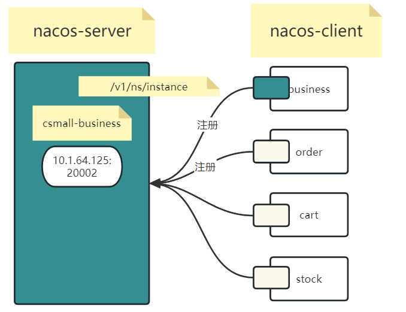

# Day05

## 1 问题解析

### 1.1 无法启动Naocs

- 命令输入错误

```shell
bin>startup.cmd -m standalone
```

- jdk环境不支持nacos

jdk1.8

- idea配置nacos启动项

1. 启动项配置界面


2. 添加新的配置项shell script


3. 填充启动配置


4. 启动脚本启动项


## 2 Nacos服务注册发现

nacos作为服务治理的组件,可以提供服务的协调管理功能包括

服务注册,服务发现.

- CURL简介

该命令可以在系统中发送一个自定义的http请求,命令格式

```shell
curl -X [请求方式] [请求路径]
```

访问百度

```shell
curl -X GET https://www.baidu.com
```

访问nacos注册

```shell
curl -X POST "http://localhost:8848/nacos/v1/ns/instance?serviceName=first-service&ip=127.0.0.1&port=8080"
```

### 2.1 Nacos运行架构

#### 2.1.1 nacos-server是一个服务进程

运行在web容器中,可以接收外界发起的请求,比如我们模拟post请求在nacos进行数据的注册


### 2.2 配置注册

#### 2.2.1 服务端客户端


#### 2.2.2 csmall-for-jsd-business-adapter 整合nacos-client

- 所有组件配置步骤-大三步
  - 依赖
  - yaml配置
  - 配置类,注解的使用(nacos客户端没有)

- 逐步完成

1. 项目中引入nacos服务治理客户端依赖


```xml
<!--nacos-注册抓取-client-->
<dependency>
    <groupId>com.alibaba.cloud</groupId>
    <artifactId>spring-cloud-starter-alibaba-nacos-discovery</artifactId>
</dependency>
```

2. yaml配置

```shell
#微服务配置
#在微服务架构中,表示微服务名字
#不同的命令表示功能不一样,相同的名字,功能接口都相同
spring:
  application:
    name: csmall-business
  #微服务cloud配置
  cloud:
    #微服务cloud中组件nacos
    nacos:
      #nacos中注册发现的功能
      discovery:
        #填写nacos的服务端地址
        server-addr: localhost:8848
```

3. 在nacos控制台出现注册信息




**配置管理(need)**: 了解学习nacos配置中心功能

**服务管理(need)**: 微服务架构中的服务治理功能,在控制台可以看到注册信息,服务状态实例的个数等

权限控制: 用户,访问的权限管理,课上一直使用nacos/nacos

**命名空间(need)**: 管理不同开发环境的配置隔离

集群管理: nacos可以配置集群.

**课堂跟踪练习**:

将cart order stock 整理nacos客户端组件,启动,连接nacos-server实现注册管理.

注意: 服务名称不同,保证启动正常.

**练习问题**:

a. 找不到nacos


nacos没启动

b.找不到nacos,nacos提供服务端路径地址错误


c. 无法解决程序启动问题

pull代码,对比不同.

#### 2.2.3 yaml详细配置

- 临时实例,永久实例

同一个服务,可以启动多个实例,形成一个服务集群.


当前启动进程是永久实例还是临时实例 true 表示临时实例 false表示永久实例

```properties
spring.cloud.nacos.discovery.ephemeral=fasle
```

永久实例:nacos永远不删除的注册信息,就是永久实例.

临时实例:暂时为某些应用,环境准备的扩容实例,就是定义为临时实例.

例如: 淘宝每一个功能都是一个服务,而且具备多个实例,平日访问是固定流量,所以使用永久实例支持,如果双11来临,流量激增,需要增加临时实例,等待11完成,删除临时实例

- 客户端实例的ip地址

服务器ip地址有多个,因为配置多个网卡,有的网卡是外部访问的,有的网卡是局域网网卡,所以客户端web实例在nacos注册希望被别人访问调用一般会考虑是内部调用还是外部调用.

为了防止springboot自动读取的ip地址未必满足实例相互调用的需求,一般情况下,认为确定到底是哪个ip地址,填充到这个属性,携带到nacos.

```properties
spring.cloud.nacos.discovery.ip=10.6.15.126
```

- 命名空间

开发过程中,使用的开发,测试,上线环境是不同.所以nacos提供隔离的环境.


默认情况下,只有public公用命名空间.


创建完新的命名空间,可以在服务列表中看到隔离的注册信息


- 分组配置

在同一个命名空间注册的服务实例,可以进行分组操作.主要功能之一--**灰度发布**.

简单介绍一下灰度发布: 开发项目,项目发布的特点两个 一个是持续发布,一个是版本发布. 持续发布特点中,有灰度发布的概念.


- 服务心跳检测

服务实例启动后,会在nacos注册一个信息.

后续服务实例和nacos服务端会保持一个心跳检测的机制.如果心跳检测结果失败,nacos就会认为这个实例不健康,会剔除实例或者保存不健康状态.

**永久实例**:故障,宕机.不会在心跳检测时,保持健康状态,但是不会剔除.

**临时实例**:故障,宕机,就会在一段时间之后,进行剔除.

```properties
spring.cloud.nacos.discovery.heart-beat-interval=5
spring.cloud.nacos.discovery.ip-delete-timeout=20
```

临时实例,主动发送心跳请求,每次请求都会更新nacos服务端记录的这个实例的时间戳.

每隔5秒发送一次.如果nacos服务端发现有某个时间点,应该心跳,但是没有更新时间戳,记录当前实例不健康,如果心跳更新时间超时20秒没更新,剔除了.

永久实例,心跳不是主动上传的,而是nacos向下探测.

#### 2.2.4 注册信息在nacos中的内存状态


**中午作业**: 将cart order stock 根据yaml配置,注册在nacos 和business是同一个命名空间(同一个运行环境),在同一个分组(版本是相同的)

#### 2.2.5 多实例注册

需求目的: 使用idea的配置启动项,让business服务,启动3个.同时注册nacos


修改配置项


#### 2.2.6 服务抓取(发现)

nacos提供了接口访问,进行数据的注册/心跳上传.

注册的数据是为了让别的服务发现,从而使用其中的ip:port进行远程调用

所以nacos还提供了,发现的接口.

```shell
curl -X GET "http://localhost:8848/nacos/v1/ns/instance/list?serviceName=csmall-business"
```

#### 2.2.7 总结nacos的服务注册发现机制

- nacos结构:
  - 角色2个: 服务端(nacos-server进程),客户端(spring cloud整合到web应用组件)
- nacos功能:
  - 服务注册: 在微服务中,服务注册目的,是为了让别的服务发现,获取当前服务信息
  - 服务发现: 为了调用别的服务,从而在nacos进行信息的抓取

### 2.3 配置中心

#### 2.3.1 应用场景

在微服务开发过程中,yaml文件 json文件 properties文件,非常多的冗余重复的内容.

不方便统一管理.

例如: 开发环境连接的redis 110.99.88.77:8999.20多个服务,全部在开发环境指向这个redis.用了2天,运维提示服务器崩溃了. redis环境换了 111.99.88.77:8999.

需求: 将重复的配置,提取到通用的管理平台-nacos

#### 2.3.2 配置中心运行结构


#### 2.3.3 远程配置案例

目的: 想将**stock**和cart order business相同的配置,全部都放到nacos.本地只看到不同的个性的内容(端口,服务名称)

**第一步**: 在本地进程添加config 依赖 和bootstrap依赖

```xml
<dependency>
    <groupId>com.alibaba.cloud</groupId>
    <artifactId>spring-cloud-starter-alibaba-nacos-config</artifactId>
</dependency>
<!--springboot版本大于2.3.X,需要引入这个依赖-->
<dependency>
    <groupId>org.springframework.cloud</groupId>
    <artifactId>spring-cloud-starter-bootstrap</artifactId>
</dependency>
```

**第二步**: 需要引入一个bootstrap.yaml文件

上面的bootstrap依赖,就是为了让springboot启动的时候加载这个bootstrap.yaml文件的.

bootstrap.yaml 能够被springboot加载,并且先于 application.yaml文件加载的.

application.yaml启动进程的参数配置.

bootstrap.yaml收集环境信息的参数配置. 读取到远程文件配置内容,放回application.yaml使用.

**如果远程读的数据和application.yaml冲突的. application.yaml会覆盖远程读取的.**

```yaml
spring:
  profiles:
    #开启不同环境配置
    active: dev

#bootstrap定义不同环境,在同一个文件bootstrap.yaml
#---区分,每个环境中定义名称
---
spring:
  config:
    activate:
      on-profile: dev
  #告诉bootstrap 远程配置中心nacos地址 和我们要读取的配置文件(先读默认的)
  application:
    #所有的application.name都是服务名称
    name: csmall-stock
  cloud:
    nacos:
      config:
        #必须配置的值
        server-addr: localhost:8848
        #文件类型 后缀 默认是properties txt json yaml xml html
        file-extension: yaml
        #前缀,默认是服务名称
        
---
spring:
  config:
    activate:
      on-profile: test
```

这种配置方式,读取文件的逻辑


通过bootstrap+nacosconfig配置,默认读取的文件格式

{spring.application.name}-{spring.profiles.active}.{file-extension}

服务名称-环境名称.文件后缀扩展

对于当前stock服务,应该在nacos中准备一个文件 **csmall-stock-dev.yaml**

没有指定具体的**命名空间**,没有指定**分组**


填写具体的文件信息


当前根据bootstrap.yaml的属性,要求默认读取的3个文件

**只有服务名称**

服务名称.后缀名

**服务名称-环境名称.后缀名,**

任何一个都可以使用.

将远程csmall-stock-dev.yaml 提取本地公用配置

```yaml
name: wang
#公共配置
mybatis:
  configuration:
    cache-enabled: false   # 不启用mybatis缓存
    map-underscore-to-camel-case: true # 映射支持驼峰命名法
    log-impl: org.apache.ibatis.logging.stdout.StdOutImpl # 将运行的sql输出到控制台
spring:
  datasource:
    url: jdbc:mysql://localhost:3306/csmall_db?useSSL=false&useUnicode=true&characterEncoding=utf-8&serverTimezone=Asia/Shanghai&allowMultiQueries=true
    username: root
    password: root
    driver-class-name: com.mysql.cj.jdbc.Driver
  cloud:
    nacos:
      #nacos中注册发现的功能
      discovery:
        #填写nacos的服务端地址
        server-addr: localhost:8848
        #当前启动进程是永久实例还是临时实力 true 表示临时实力 false表示永久实例
        #true是默认值
        ephemeral: true
        #nacos实例的ip地址
        ip: 127.0.0.1
        #命名空间
        namespace: f033ea8e-15ca-4f37-b112-127edc03de9e
        #分组
        group: 1.0
        #心跳检测的间隔时间
        heart-beat-interval: 5
        #超时心跳删除时间
        ip-delete-timeout: 20
```

#### 2.3.4 bootstrap配置nacos读取远程其他属性

```yaml
spring:
  profiles:
    #开启不同环境配置
    active: dev

#bootstrap定义不同环境,在同一个文件bootstrap.yaml
#---区分,每个环境中定义名称
---
spring:
  config:
    activate:
      on-profile: dev
  #告诉bootstrap 远程配置中心nacos地址 和我们要读取的配置文件(先读默认的)
  application:
    #所有的application.name都是服务名称
    name: csmall-stock
  cloud:
    nacos:
      config:
        #必须配置的值
        server-addr: localhost:8848
        #文件类型 后缀 默认是properties txt json yaml xml html
        file-extension: yaml
        #前缀,默认是服务名称,不想使用默认值,可以自定义
        #prefix: sdlaslkdfjsdlj
        #多环境运行的 namespace 命名空间的id
        #namespace: f033ea8e-15ca-4f37-b112-127edc03de9e
        #持续发布中,保证灰度发布 分组
        #group: 1.0
        #是否支持刷新.远程配置一旦修改,本地进程内存数据是否刷新,如果刷新,true,不需要重启
        #false 重启,内存才变动 默认也是true
        refresh-enabled: true
        #读取指定的文件
        shared-configs:
          - data-id: redis.yaml
            group: 1.0
            refresh-enable: true
          - data-id: datasource.yaml
            group: 1.0
            refresh-enable: true
          - data-id: es.yaml
            group: 1.0
            refresh-enable: true

---
spring:
  config:
    activate:
      on-profile: test
```

**课堂跟踪案例**

使用以下两个项目完成跟踪案例需求:

csmall-stock

csmall-cart

同时读取远程一个配置了datasource的属性文件,**datasource.yaml,**

同时读取远程一个配置了nacos注册信息的属性文件,**nacos.yaml**

同事读取远程mybatis配置,**mybatis.yaml**

**注意**: 如果完成了cart和stock的远程读取配置,后续就一直需要启动nacos 读取配置文件.


作业的nacos配置中心:

datasource.yaml


nacos.yaml


mybatis.yaml

