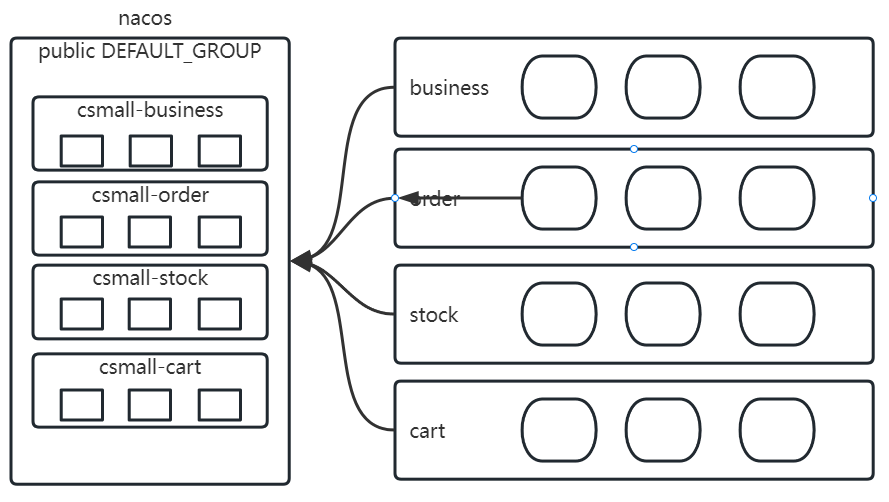
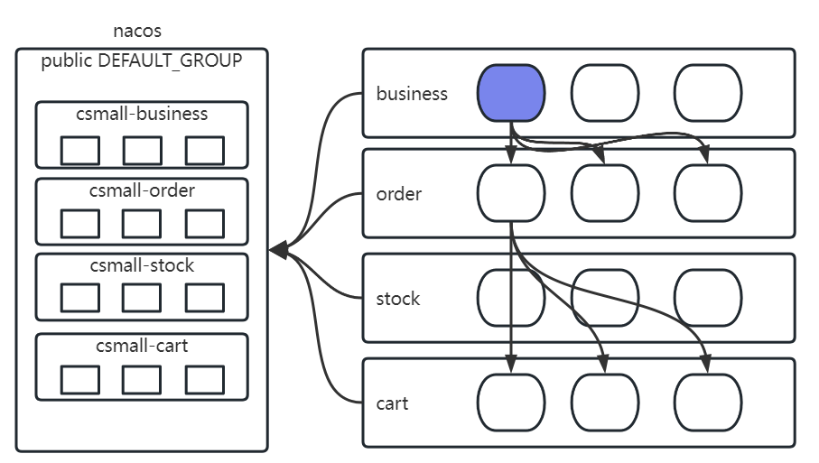
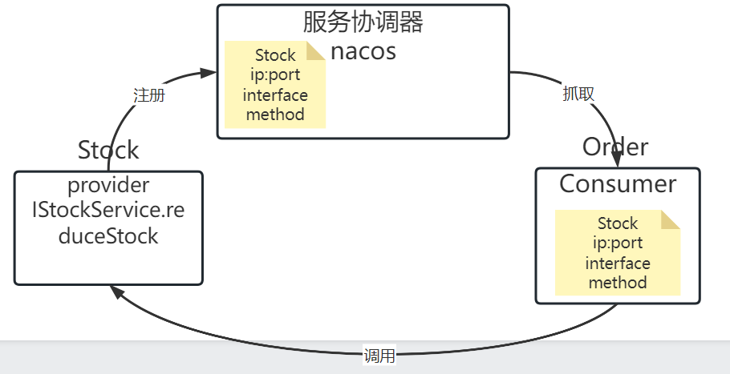
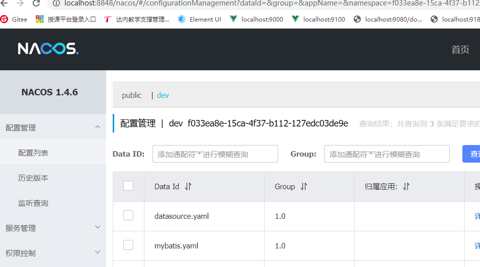
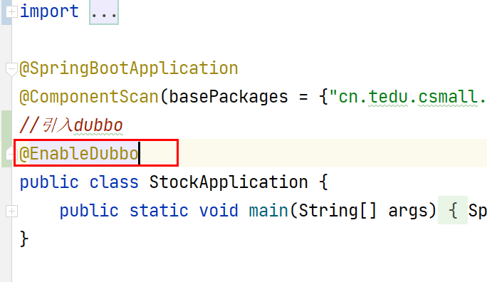
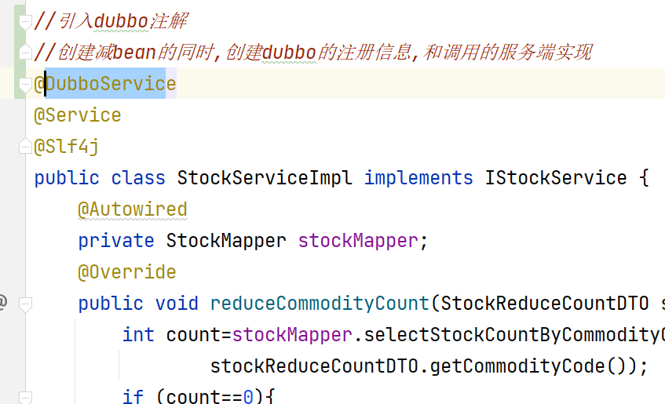
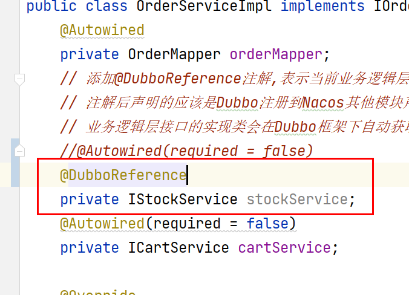
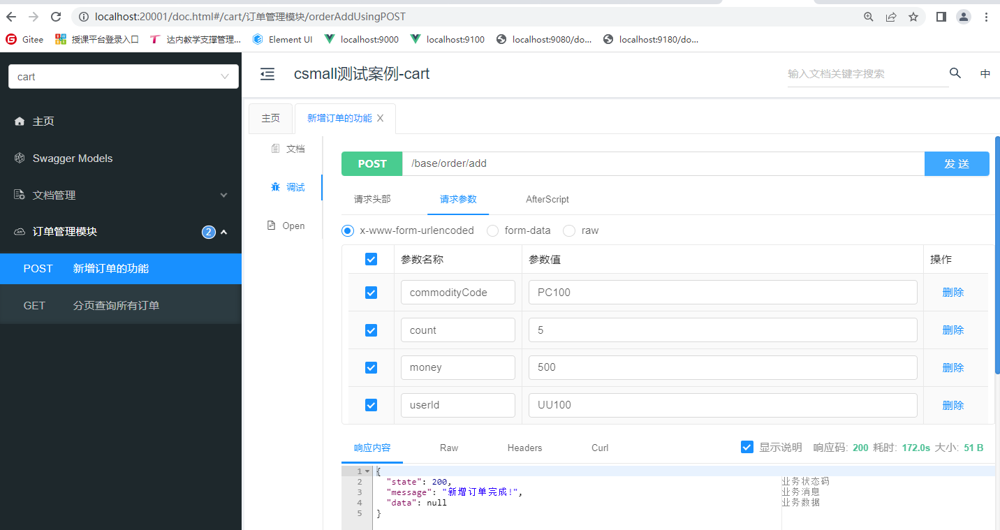
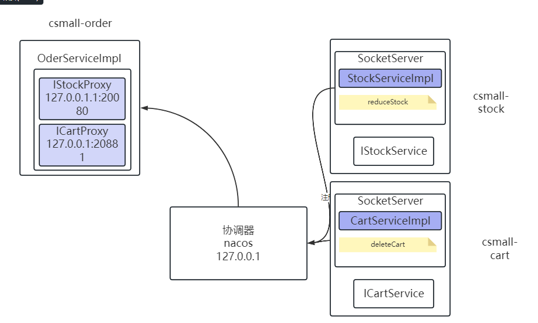

# Day06

## 1 问题解析

### 1.1 阶段性架构图



这个架构图,由于nacos的功能,可以实现服务治理(服务实例信息的管理).

需要引入新的组件,来完成服务调用.



nacos管理的服务集群中,由于业务存在调用关系,需要实现的负载均衡+远程调用.

## 2 Dubbo组件

### 2.1 远程调用

远程调用,只要走网络通信协议,http也可以实现.贴近应用层的协议,我们的微服务之间调用是内部访问,应该更关心**性能**,如果整个微服务集群对外提供功能,关注**方便**程度.

微服务落地架构,已经把内部http协议通信,换成RPC.

**对内RPC,对外HTTP.**

### 2.2 RPC概括

RPC包含2部分内容

1. 序列化过程: 是调用**传输**,**存储**过程中,从内存到内存设计的数据转化过程. 有非常多的序列化方法,序列化协议.
2. 通信过程: 端与端通信对接,选择使用的底层通信方式.(http,tcp)

### 2.3 Dubbo

dubbo是一个RPC框架. 序列化,底层通信协议,都可以已经包装好的.

官网: https://cn.dubbo.apache.org/zh-cn/index.html

Apache Dubbo 是一款高性能、**轻量级**的开源服务框架。

**提示**:错误的理解是占用的磁盘空间大小.

**轻量级:**使用方便,快捷,不会在使用和创建的过程中投入过多的时间成本,和学习成本.

**SPRING框架轻量级还是重量级**: 整体是轻量级的(尤其是在springboot出现之后).早期版本中xml配置是重量级的.

提供了六大核心能力：面向接口代理的高性能**RPC调用**，智能容错和**负载均衡**，服务自动**注册和发现**，高度可扩展能力，运行期流量调度，可视化的服务治理与运维。

### 2.4 Dubbo调用案例

#### 2.4.1 调用业务选择和dubbo角色

dubbo需要一些概念的支持

- provider(服务提供者): 远程调用的被调用的服务实例
- consumer(服务消费者): 远程调用的调用发起的服务实例
- 注册中心(服务协调者):dubbo支持很多不同种类的注册中心,比如zookeeper,redis,**nacos**

  

#### 2.4.2 环境准备

1. 启动nacos



2. 确定两个角色的服务实例

​	csmall-stock: 能否正常启动

​	csmall-order: 能否正常启动

3. 对两个工程挨个引入dubbo组件,引入步骤 依赖,yaml配置,注解+配置类

**第一步** 依赖

```xml
<dependency>
    <groupId>com.alibaba.cloud</groupId>
    <artifactId>spring-cloud-starter-dubbo</artifactId>
</dependency>
```

**第二步** yaml

```yaml
spring:
  application:
    name: csmall-stock
dubbo:
  application:
    #dubbo客户端 在nacos注册,携带的服务名称
    name: ${spring.application.name}
  protocol:
    #port表示dubbo底层通信协议使用的端口 -1 自增的端口号
    #20880开始,查看当前服务,哪个没有被占用
    port: -1
    name: dubbo
  registry:
    #告诉dubbo注册中心类型和地址
    address: nacos://localhost:8848
    #禁止dubbo在nacos中自动创建一些无效的配置文件
    use-as-config-center: false
    use-as-metadata-center: false
  cloud:
    #明确当前服务,订阅的其他服务,如果需要调用其他服务,用多个服务拼接,
    #不配置这个属性,会导致当前的dubbo客户端默认订阅nacos所有服务
    # 不给值,订阅空
    subscribed-services: 
  consumer:
    #如果当前程序 有consumer的角色,不会在启动时检查provider是否存在
    #如果当前程序不是consumer,这个配置没有任何作用
    check: false
```

**第三步** 配置类+注解

在项目启动类中,添加dubbo配置导入. @Enable***



在业务层,使用dubbo注解,提供注册信息携带数据.



根据上述步骤完成provider配置之后,使用dubbo整合order

和provider不同的在于注解的使用.调用远程service实现的引入bean对象的注解不再使用@Resource @Autowired



**建议**: 明确调用关系(business->order,order->stock,order->cart),避免频繁启动,停止,造成调用混乱.每次启动,从被调用者开始启动,保证调用者启动时,有可用的调用实例.

测试入口 就是OrderController 使用前段接口文档页面 localhost:20001/doc.html




#### 2.4.3 dubbo远程调用原理




