# Day07

## 1 问题解析

### 1.1 作业实现

参考master中DAY07-AM-02

### 1.2 dubbo和nacos 

- NACOS功能
  - 注册中心
  - 配置中心
- dubbo功能
  - RPC远程调用框架: PROVIDER提供者 CONSUMER消费者 注册协调(NACOS/ZOOKEEPER/REDIS/其他)
- 客户端2种类型,互不干扰
  - nacos客户端
    - 共同点
      - 注册在nacos
      - springboot自动配置
    - 区别
      - 注册,调用的http协议的接口(v1/ns/instance,v1/ns/instance/list)
      - 注册的信息是外界调用的入口
  - dubbo客户端
    - 共同点
      - 注册在nacos
      - springboot自动配置
    - 区别
      - 注册,调用的rpc支持的接口
      - 注册的信息是内部调用

## 2 Dubbo负载均衡

### 2.1 负载均衡介绍

负载均衡: 

​	负载: 并发,流量,请求等被程序处理的任务,都可以称为负载.微服务中指的一般是流量和并发.

​	均衡: 集群分布式环境下,将负载平衡的分配给处理负载的任务单元.

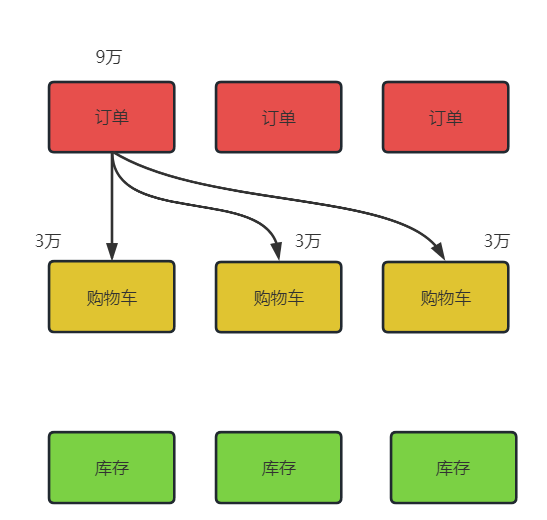

### 2.2 准备一个负载均衡的环境

订单调用购物车,将购物车实现多实例启动集群环境.

- [x] 复制启动配置项
- [x] 修改启动项端口覆盖的值(20004 20014 20024 20034)
- [x] 在调用方法中deleteUserCart打桩,区分调用的路径

结论,Dubbo的负载均衡,默认的策略是 随机负载均衡计算.

### 2.3 Dubbo负载均衡策略

- random: 随机分配负载均衡
- roundRobin: 轮训分配负载均衡,挨个访问
- leastactive: 最小活跃分配负载均衡,越闲,分配的越多.**使用相应数量在单位时间处理的越多的,越闲**

### 2.4 配置负载均衡的方式

- 注解使用(局部配置)

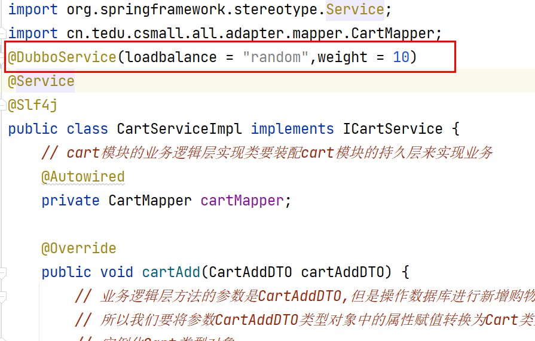

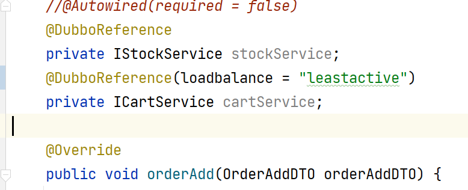

- 配置yaml(全局配置)

  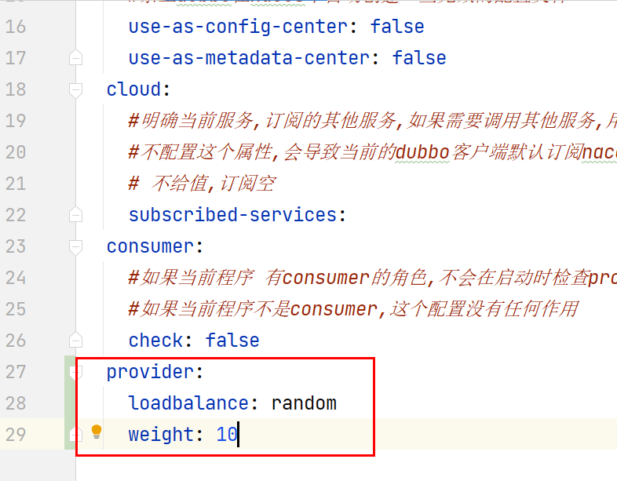

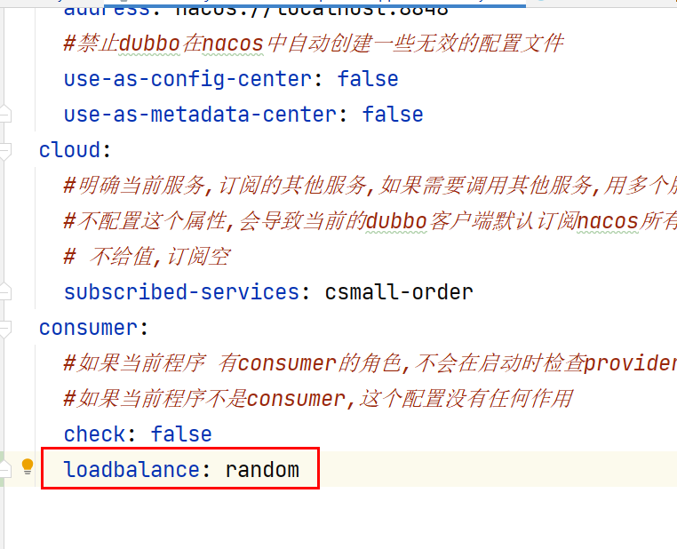

### 2.5dubbo配置负载均衡优先级

- 全局和局部

  **局部优先级**>**全局优先级**

- provider和consumer

  **provider优先级**>**consumer优先级**

局部provider>全局provider>局部consumer>全局consumer

### 2.6 微服务阶段性架构

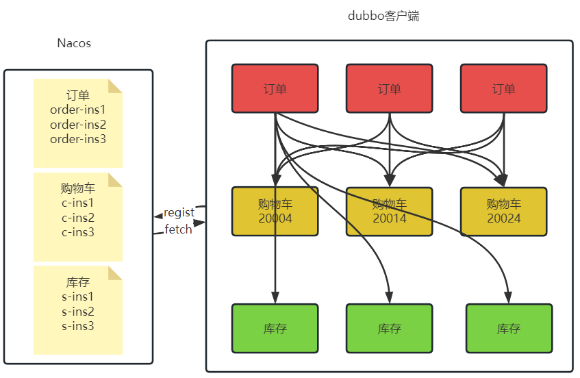

## 3 Spring Boot Starter自定义配置

到目前看到的很多现象都是和springboot自动配置有关的,减少了很多配置相关工作,**自动实现**需要的功能,比如nacos自动配置,dubbo自动配置.

- [x] 通过这一章节的学习理解springboot自动配置原理
  - [ ] 核心注解: 三个组合的作用
  - [ ] 启动记载EnableAutoConfiguration流程
- [x] 通过对springboot自动配置理解,实现自定义starter
  - [ ] 会应用
  - [ ] 理解其中注解的作用: configuration bean import componentScan **Conditional衍生注解** 阅读springboot大量自动配置源码

### 3.1 准备一个starter案例项目

- 名字: csmall-for-jsd-spring-boot-starter

- 依赖: 
  - spring-boot-starter
  - junit

```xml
<dependency>
    <groupId>org.springframework.boot</groupId>
    <artifactId>spring-boot-starter</artifactId>
</dependency>
<dependency>
    <groupId>junit</groupId>
    <artifactId>junit</artifactId>
    <scope>test</scope>
</dependency>
```

### 3.2 Spring框架版本迭代

- SPRING1.X 时代

大量编写xml配置文件的节点,spring框架开发应用程序,每个xml中都会使用大量bean标签,来实现SPRING容器的IOC  DI功能.**不存在注解** @Autowired  @Component @Service @Controller @Repository

- SPRING2.X时代

java出现了jdk1.5,新特性**注解**,**反射**,枚举等功能.SPRING随之推出了基于java5的注解功能的新特性,IOC容器的注解,使得扫描注解能够构造bean对象,@Component  @Service @Controller @Repository DI注入 @Qualifier @Autowired.让在1.x时代编写大量的xml配置文件的工作减少了很多很多.

什么情况下使用注解:业务层使用注解(Controller Service)

什么#情况下使用xml配置:引入的技术 redis,mysql,等使用xml配置

- **SPRING3.X时代**

基于java5的注解功能上,spring扩展了大量的功能注解,比如@Configuration @Bean  @ComponentScan等等,他们可以让在2.x时代残留的那种xml配置,彻底的消失了,从xml配置完全转化成为代码注解的编写;

趋势:**配置越来越简单**

- **SPRING4.X**/5.X

都是在基于这个趋势,实现更多注解的扩展,让代码的功能变得更强,开发的效率变得更高,出现了很多组合注解,@RestController

4.X时代，spring提供了一个叫做**条件注解的@Conditional**，springboot能够做到0  xml配置文件是springboot功劳吗?本质不是,spring就支持不需要配置文件xml了.

### 3.3 案例学习3.X/4.X重要注解

#### 3.3.1 @Configuration

这个注解在spring3.0出现,作用是一个配置类,一般用来声明一个或者多个bean对象,通过使用内部的方法注解@Bean,交给容器管理.作为配置类.和2.X版本相比,取代XML的作用.一个xml配置,相当于一个配置类.

- 案例读取xml

**第一步**: 准备好一个文件

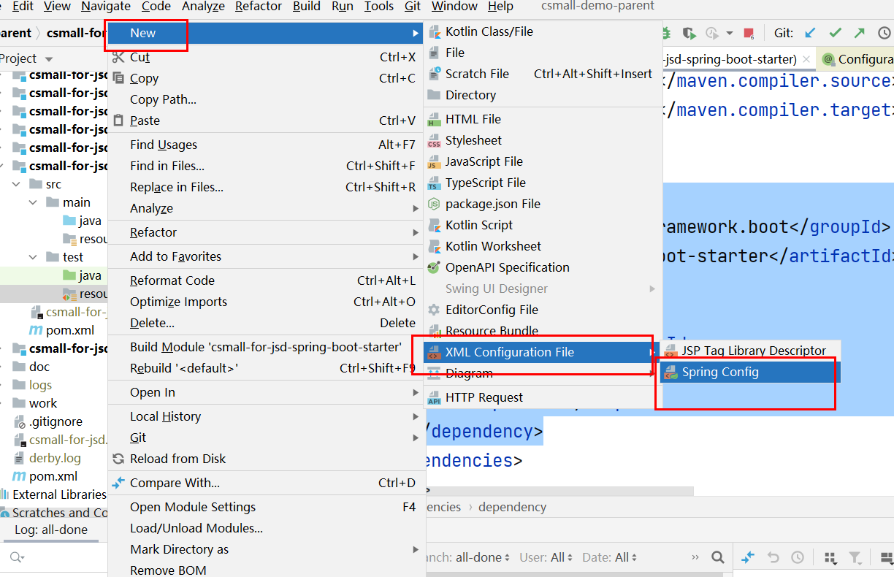


**第二步**: 通过测试代码,可以加载spring应用的元数据xml配置文件.

根据xml配置内容,读取到后,管理spring容器的内存数据.

```java
@Test
public void loadXML(){
    //准备加载的文件路径
    String filePath="classpath:demo01.xml";
    //对应加载spring应用的上下文类型
    ClassPathXmlApplicationContext
            application=new ClassPathXmlApplicationContext(filePath);
}
```

**第三步**: xml中准备bean标签,创建一个容器bean对象,需要对应一个测试Bean01的类

```java
package com.tarena.csmall.starter.test.beans;

/**
 * @author java@tedu.cn
 * @version 1.0
 */
public class Bean01 {
    public Bean01() {
        System.out.println("Bean01被容器加载了");
    }
}
```

修改xml

```xml
<?xml version="1.0" encoding="UTF-8"?>
<beans xmlns="http://www.springframework.org/schema/beans"
       xmlns:xsi="http://www.w3.org/2001/XMLSchema-instance"
       xsi:schemaLocation="http://www.springframework.org/schema/beans http://www.springframework.org/schema/beans/spring-beans.xsd">
<!--这个文件作为配置基础,有很多标签-->
<bean id="bean01" class="com.tarena.csmall.starter.test.beans.Bean01"/>
</beans>
```

**第四步**: @Configuration所属的类,是一个配置类,可以代替xml使用.

```java
package com.tarena.csmall.starter.test.configs;

import org.springframework.context.annotation.Configuration;

/**
spring应用的配置类定义,必须添加@Configuration注解
 */
@Configuration
public class MyConfiguration01 {
    
}
```

- 案例读取Configuration配置类

```java
/**
 * 通过配置类加载spring应用
 */
@Test
public void loadConfig(){
    //对应加载spring应用的上下文类型
    AnnotationConfigApplicationContext
    application= new AnnotationConfigApplicationContext
            (MyConfiguration01.class);
}
```


#### 3.3.2 @Bean

常见使用在方法上的注解,作用是配合一个配置类,或者是一个spring可以加载扫描的类例如@Component,使得方法的返回值作为bean对象被容器管理. 效果和一个xml中的bean标签一样

```java
package com.tarena.csmall.starter.test.configs;

import com.tarena.csmall.starter.test.beans.Bean01;
import org.springframework.context.annotation.Bean;
import org.springframework.context.annotation.Configuration;

/**
spring应用的配置类定义,必须添加@Configuration注解
 */
@Configuration
public class MyConfiguration01 {
    /**
     * @Bean注解创建bean01
     */
    @Bean(name="bean01")
    public Bean01 bean01(){
        //可以实现对Bean01对象的初始化
        Bean01 bean01=new Bean01();
        return bean01;
    }
}
```

#### 3.3.3 @ComponentScan

配合一个配置类@Configuration实现类注解的扫描.扫描@Controller  @Service @Componet @Autowired @Configuration等.

- xml实现注解的扫描

```xml
<?xml version="1.0" encoding="UTF-8"?>
<beans xmlns="http://www.springframework.org/schema/beans"
       xmlns:xsi="http://www.w3.org/2001/XMLSchema-instance"
       xmlns:context="http://www.springframework.org/schema/context"
       xsi:schemaLocation="
       http://www.springframework.org/schema/beans
       http://www.springframework.org/schema/beans/spring-beans.xsd
       http://www.springframework.org/schema/context
       http://www.springframework.org/schema/beans/spring-context.xsd">
    <!--这个文件作为配置基础,有很多标签-->
    <bean id="bean01" class="com.tarena.csmall.starter.test.beans.Bean01"/>
    <!--包扫描-->
    <context:component-scan base-package="com.tarena.csmall.starter.test.beans"/>
    <!--<context:component-scan base-package=""/>-->
</beans>
```

- 准备Bean02

```java
package com.tarena.csmall.starter.test.beans;

import org.springframework.stereotype.Component;

/**
 * @author java@tedu.cn
 * @version 1.0
 */
@Component
public class Bean02 {
    public Bean02() {
        System.out.println("Bean02被容器加载了");
    }
}
```

- 配置类添加注解

```java
package com.tarena.csmall.starter.test.configs;

import com.tarena.csmall.starter.test.beans.Bean01;
import org.springframework.context.annotation.Bean;
import org.springframework.context.annotation.ComponentScan;
import org.springframework.context.annotation.Configuration;

/**
spring应用的配置类定义,必须添加@Configuration注解
 */
@Configuration
//什么属性都不加,会默认扫描当前配置类所在的包
@ComponentScan(basePackages ={"com.tarena.csmall.starter.test.beans"} )
public class MyConfiguration01 {
    /**
     * @Bean注解创建bean01
     */
    @Bean(name="bean01")
    public Bean01 bean01(){
        //可以实现对Bean01对象的初始化
        Bean01 bean01=new Bean01();
        return bean01;
    }
}
```

#### 3.3.4 @Import

在xml编写的时候,不会将所有的xml逻辑,都集中在一个xml中.

为了易读,将文件分开.导入的总是一个入口(demo01.xml).

在spring项目中,无论是自己编写还是已经提供的配置类,都会存在大量的配置类叫做**Configuration.被容器加载的入口配置类可以通过引入这个注解,导入其它想要生效的配置类.也要配合配置类注解使用Import.

- demo02.xml

```xml
<?xml version="1.0" encoding="UTF-8"?>
<beans xmlns="http://www.springframework.org/schema/beans"
       xmlns:xsi="http://www.w3.org/2001/XMLSchema-instance"
       xmlns:context="http://www.springframework.org/schema/context"
       xsi:schemaLocation="
       http://www.springframework.org/schema/beans
       http://www.springframework.org/schema/beans/spring-beans.xsd
       http://www.springframework.org/schema/context
       http://www.springframework.org/schema/context/spring-context.xsd">
    <!--加载一个bean03-->
    <bean id="bean03" class="com.tarena.csmall.starter.test.beans.Bean03"/>
</beans>
```

- 通过demo01加载demo02

可以使用import标签.

```xml
<?xml version="1.0" encoding="UTF-8"?>
<beans xmlns="http://www.springframework.org/schema/beans"
       xmlns:xsi="http://www.w3.org/2001/XMLSchema-instance"
       xmlns:context="http://www.springframework.org/schema/context"
       xsi:schemaLocation="
       http://www.springframework.org/schema/beans
       http://www.springframework.org/schema/beans/spring-beans.xsd
       http://www.springframework.org/schema/context
       http://www.springframework.org/schema/context/spring-context.xsd">
    <!--这个文件作为配置基础,有很多标签-->
    <bean id="bean01" class="com.tarena.csmall.starter.test.beans.Bean01"/>
    <!--包扫描-->
    <context:component-scan base-package="com.tarena.csmall.starter.test.beans"/>
    <!--<context:component-scan base-package=""/>-->
    <!--导入demo02-->
    <import resource="demo02.xml"/>
</beans>
```

- 补充配置类

```java
package com.tarena.csmall.starter.test.configs;

import com.tarena.csmall.starter.test.beans.Bean01;
import com.tarena.csmall.starter.test.beans.Bean03;
import org.springframework.context.annotation.Bean;
import org.springframework.context.annotation.ComponentScan;
import org.springframework.context.annotation.Configuration;

/**
spring应用的配置类定义,必须添加@Configuration注解
 */
@Configuration
public class MyConfiguration02 {
    @Bean(name="bean03")
    public Bean03 bean03(){
        //可以实现对Bean01对象的初始化
        Bean03 bean03=new Bean03();
        return bean03;
    }
}
```

- 导入当前spring应用

```java
package com.tarena.csmall.starter.test.configs;

import com.tarena.csmall.starter.test.beans.Bean01;
import org.springframework.context.annotation.Bean;
import org.springframework.context.annotation.ComponentScan;
import org.springframework.context.annotation.Configuration;
import org.springframework.context.annotation.Import;

/**
spring应用的配置类定义,必须添加@Configuration注解
 */
@Configuration
//什么属性都不加,会默认扫描当前配置类所在的包
@ComponentScan(basePackages ={"com.tarena.csmall.starter.test.beans"} )
//可以导入两种值
//第一种直接导入配置类
//第二种导入选择器,导入的类非常非常多 100多个200多个...
//springboot中使用的第二种导入方式
@Import(value ={MyConfiguration02.class} )
public class MyConfiguration01 {
    /**
     * @Bean注解创建bean01
     */
    @Bean(name="bean01")
    public Bean01 bean01(){
        //可以实现对Bean01对象的初始化
        Bean01 bean01=new Bean01();
        return bean01;
    }
}
```

对应标签和注解的关系,转化,还有很多.

#### 3.3.5 @PropertySource

导入自定义的配置文件properties.

比如自定义 jdbc.properties

```properties
csmall.user=wangcuihua
csmall.password=123456
```

也会读入内存,可以使用@Value使用

```java
package com.tarena.csmall.starter.test.configs;

import com.tarena.csmall.starter.test.beans.Bean01;
import org.springframework.beans.factory.annotation.Value;
import org.springframework.context.annotation.*;

/**
spring应用的配置类定义,必须添加@Configuration注解
 */
@Configuration
//什么属性都不加,会默认扫描当前配置类所在的包
@ComponentScan(basePackages ={"com.tarena.csmall.starter.test.beans"} )
//可以导入两种值
//第一种直接导入配置类
//第二种导入选择器,导入的类非常非常多 100多个200多个...
//springboot中使用的第二种导入方式
@Import(value ={MyConfiguration02.class} )
@PropertySource("classpath:jdbc.properties")
public class MyConfiguration01 {
    /**
     * @Bean注解创建bean01
     */
    @Bean(name="bean01")
    public Bean01 bean01(){
        //可以实现对Bean01对象的初始化
        Bean01 bean01=new Bean01();
        return bean01;
    }
}
```

#### 3.3.6 @ImportResource

通过这个注解,允许启动spring应用中,元数据(配置类和配置xml都看成是元数据)可以来自配置类的同时,也来自配置xml文件.

这个注解可以作用在配置上,读取额外的配置xml文件.

- 准备Bean04

```java
package com.tarena.csmall.starter.test.beans;

/**
 * @author java@tedu.cn
 * @version 1.0
 */
public class Bean04 {
    public Bean04() {
        System.out.println("Bean04被容器加载了");
    }
}
```

- demo03.xml

```xml
<?xml version="1.0" encoding="UTF-8"?>
<beans xmlns="http://www.springframework.org/schema/beans"
       xmlns:xsi="http://www.w3.org/2001/XMLSchema-instance"
       xmlns:context="http://www.springframework.org/schema/context"
       xsi:schemaLocation="
       http://www.springframework.org/schema/beans
       http://www.springframework.org/schema/beans/spring-beans.xsd
       http://www.springframework.org/schema/context
       http://www.springframework.org/schema/context/spring-context.xsd">
    <!--加载一个bean03-->
    <bean id="bean04" class="com.tarena.csmall.starter.test.beans.Bean04"/>
</beans>
```

- 修改入口配置类

```java
package com.tarena.csmall.starter.test.configs;

import com.tarena.csmall.starter.test.beans.Bean01;
import org.springframework.beans.factory.annotation.Value;
import org.springframework.context.annotation.*;

/**
spring应用的配置类定义,必须添加@Configuration注解
 */
@Configuration
//什么属性都不加,会默认扫描当前配置类所在的包
@ComponentScan(basePackages ={"com.tarena.csmall.starter.test.beans"} )
//可以导入两种值
//第一种直接导入配置类
//第二种导入选择器,导入的类非常非常多 100多个200多个...
//springboot中使用的第二种导入方式
@Import(value ={MyConfiguration02.class} )
@PropertySource("classpath:jdbc.properties")
@ImportResource("classpath:demo03.xml")
public class MyConfiguration01 {
    /**
     * @Bean注解创建bean01
     */
    @Bean(name="bean01")
    public Bean01 bean01(){
        //可以实现对Bean01对象的初始化
        Bean01 bean01=new Bean01();
        return bean01;
    }
}
```

### 3.4 springboot自动配置原理

核心在于启动类的注解@SpringBootApplication;

#### 3.4.1 debug工具

- debug运行

代码中,定好断点,debug运行.

- debug工具和视图

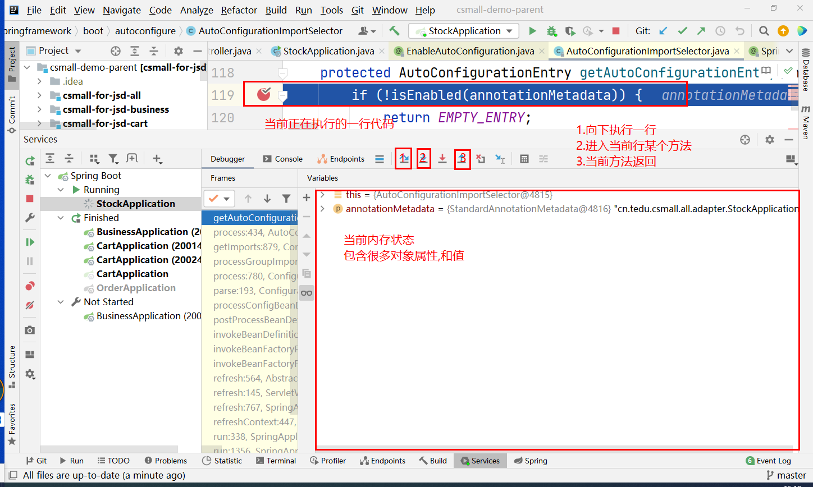

#### 3.4.2 springboot原理详解

核心注解

- springboot利用spring注解功能编写整理的一个组合注解

  - SpringApplicationConfiguration: 包装了一个@Configuration的注解,所以有这个注解的类本身就是一个配置类(**启动类是个配置**).
  - ComponentScan: 扫描 自定义的各种注解所在的包,比如service controller 全局异常捕获(**加载和扫描我们自己的业务逻辑**).
  - EnableAutoConfiguration: 开启自动配置加载

- 步骤:

  - 导入一个选择器: 执行一个核心方法selectImports

  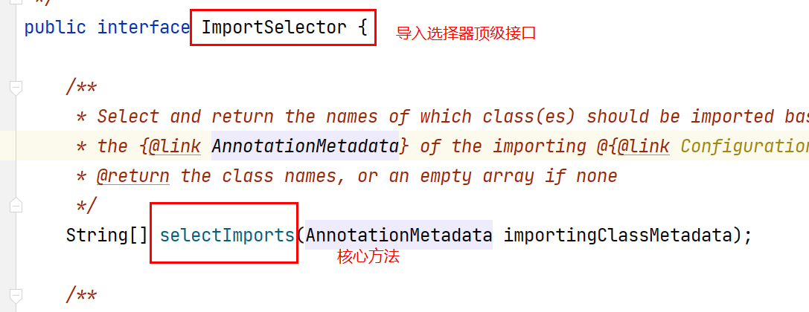

  方法返回结果是一个数组String[] ,元素是自动**配置类**全路径名称.

  ```txt
  {"com.aa.a.**AutoConfiguration","com.aa.b.**AutoConfiguration"..}
  ```

  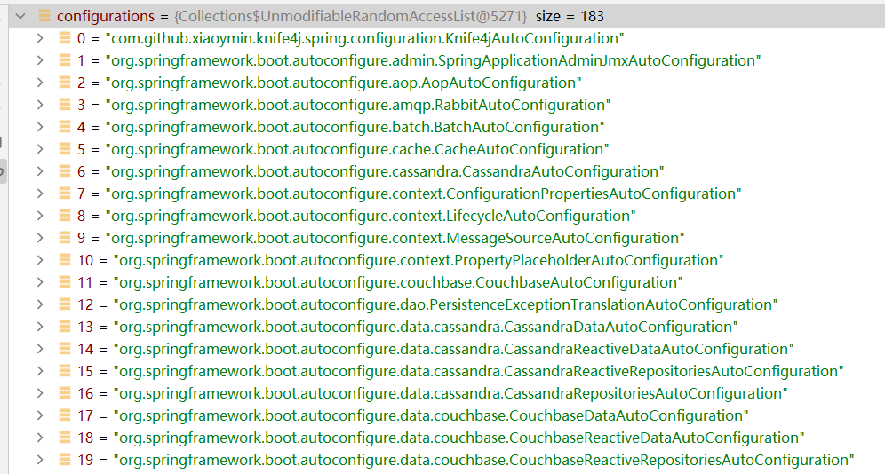

  - Import导入注解,获取这些字符串数组元素,就会执行导入功能

  对比import另一种导入方式,直接导入配置类的反射对象.这里只多了一步,解析全路径名称,获取反射对象.

  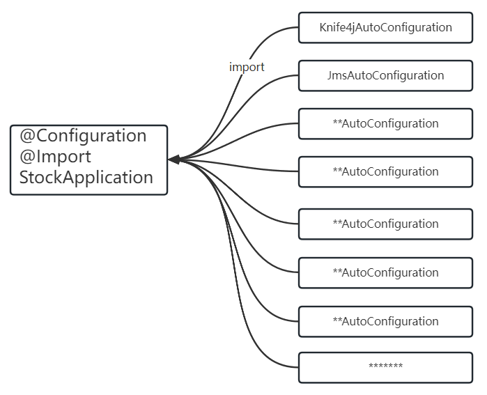

**问题**:如此多的配置类,不可能在一个项目中全部使用.

要进行过滤和筛选,哪些有效,哪些无效.

#### 3.4.3 条件注解@Conditional

在众多的自动配置类中,就需要满足一定条件,才能加载.这个功能是spring提供的条件注解,在springboot做了衍生.

满足条件,配置类才加载,不满足条件,配置类不加载的.

一个springboot工程启动,如果观察哪些配置满足条件,可以使用debug模式,对应root范围.

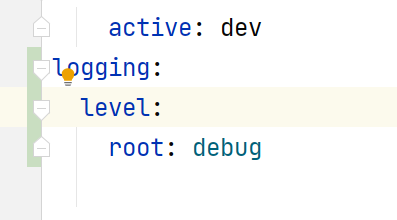

会在日志中出现提示

matched configuration

unmatched configuration:

提示哪些条件没有满足.

- @ConditionalOnClass

类注解和方法注解,条件满足类加载,方法加载.条件不满足,则不加载.

指定class必须在依赖环境中存在.**存在则满足,不存在则不满足**

- @ConditionalOnMissingClass

与上面的条件逻辑是相反的.存在则不满足,不存在则满足

- @ConditionalOnBean

类注解和方法注解, 某个限定条件的bean对象在容器中存在 则满足,不存在则不满足

- @ConditionalOnMissingBean

与上面条件逻辑相反.一般是留给自定义扩展的

- @ConditionalOnProperty

根据条件对属性的描述,判断满足还是不满足,可以提供属性存在,属性值是否指定,属性值是否未命中等逻辑.

#### 3.4.4 条件配置类案例

测试@ConditionalOnMissingClass和@ConditionalOnProperty

- 准备一个被扫描的配置类MyConditionalConfiguration01

```java
package com.tarena.csmall.starter.test.condition;

/**
 * @author java@tedu.cn
 * @version 1.0
 */

import org.springframework.boot.autoconfigure.condition.ConditionalOnProperty;
import org.springframework.context.annotation.Bean;
import org.springframework.context.annotation.Configuration;

/**
 * 测试一个注解@ConditionalOnProperty
 */
@Configuration
/**
 * 如果内存中有个csmall.password=123456
 * 则条件满足
 * jwt.rsa.pwd=678
 */
@ConditionalOnProperty
        (prefix = "csmall",value ="password",havingValue ="123456")
public class MyConditionalConfiguration01 {
    public MyConditionalConfiguration01() {
        System.out.println("条件配置类01,条件满足,加载");
    }
}
```

ConditionalOnProperty 描述

属性有csmall.password=123456 的属性数据 条件则满足,没有,或者值不是123456都不满足

- 使用入口配置类扫描这个测试

```java
package com.tarena.csmall.starter.test.configs;

import com.tarena.csmall.starter.test.beans.Bean01;
import org.springframework.beans.factory.annotation.Value;
import org.springframework.context.annotation.*;

/**
spring应用的配置类定义,必须添加@Configuration注解
 */
@Configuration
//什么属性都不加,会默认扫描当前配置类所在的包
@ComponentScan(basePackages ={
        "com.tarena.csmall.starter.test.beans",
        "com.tarena.csmall.starter.test.condition"} )
//可以导入两种值
//第一种直接导入配置类
//第二种导入选择器,导入的类非常非常多 100多个200多个...
//springboot中使用的第二种导入方式
@Import(value ={MyConfiguration02.class} )
@PropertySource("classpath:jdbc.properties")
@ImportResource("classpath:demo03.xml")
public class MyConfiguration01 {
    /**
     * @Bean注解创建bean01
     */
    @Bean(name="bean01")
    public Bean01 bean01(){
        //可以实现对Bean01对象的初始化
        Bean01 bean01=new Bean01();
        return bean01;
    }
}
```

- @ConditionalOnClass/ConditionalOnMissingClass

```java
package com.tarena.csmall.starter.test.condition;

import org.springframework.boot.autoconfigure.condition.ConditionalOnClass;
import org.springframework.boot.autoconfigure.condition.ConditionalOnMissingClass;
import org.springframework.context.annotation.Configuration;
import redis.clients.jedis.Jedis;


@Configuration
//jedis是redis的一个java客户端. redisTemplate底层在使用的就有可能是jedis
@ConditionalOnMissingClass({"redis.clients.jedis.dfgdsf"})
public class MyConditionalConfiguration02 {
    public MyConditionalConfiguration02() {
        System.out.println("条件配置类02,条件满足,加载");
    }
}
```

#### 3.4.5 导入的配置类在哪

通过selector导入String[], String[]哪来的? springboot如果将其写死.没有扩展的空间了.

springboot提供了自动配置的导入逻辑,需要准备一个META-INF/spring.factories的文件,这个文件的格式,可以参考spring-boot-autoconfigure中的内容.

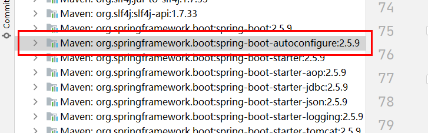

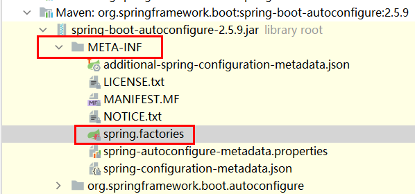

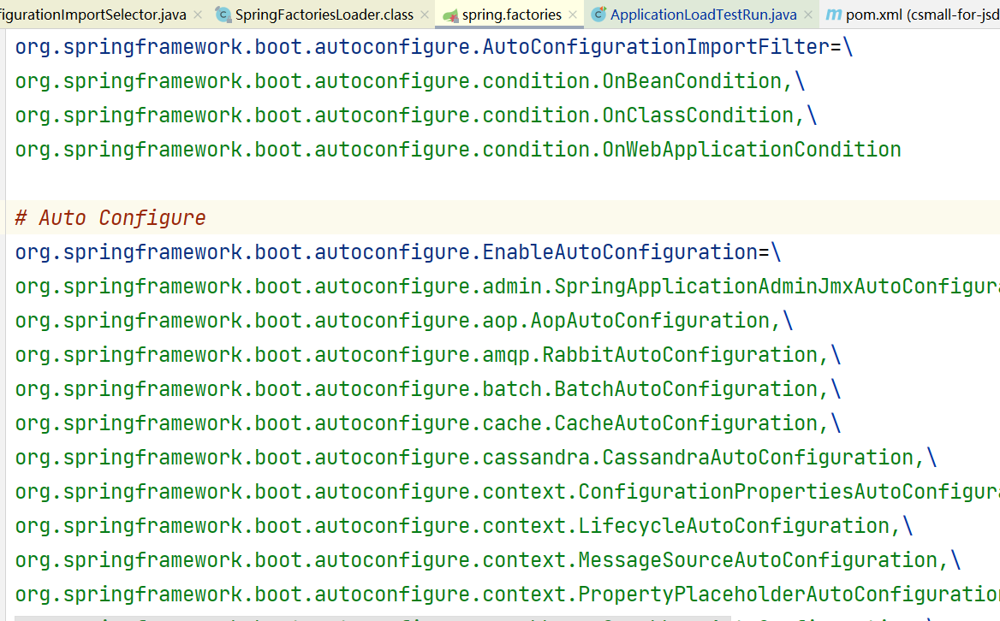

加载自动配置的逻辑全部介绍完了.

1. 启动类的核心注解(EnableAutoConfiguration)
2. 叫Enable的注解都在导入
3. Import注解导入一个selector选择器(返回一堆配置类的全路径名称String[])

4. 并不是所有的自动配置类都加载,需要满足条件注解
5. 这些String[] 来自于一个META-INF/spring.factories的文件,通过注解作为key值,读取数据

#### 3.4.6 阅读当前autoconfigure

**-srping-boot-starter,必定包含autoconfigure

mybatis-spring-boot-starter:mybatis-spring-boot-autoconfigure

dubbo-spring-boot-starter:dubbo-spring-boot-autoconfigure

### 3.5 自定义starter

需求描述:

使用stock 依赖自定义starter 定义一个配置,不需要stock扫描,也不需要手动导入,使用自动配置扩展逻辑配置在spring.factories文件中,使用属性 csmall.user.enable开启自动配置逻辑(条件).

#### 3.5.1 准备一个自动配置类

```java
package com.tarena.spring.boot.starter.config;

import com.tarena.spring.boot.starter.po.User;
import lombok.extern.slf4j.Slf4j;
import org.springframework.boot.autoconfigure.condition.ConditionalOnProperty;
import org.springframework.context.annotation.Bean;
import org.springframework.context.annotation.Configuration;

/**
 * @author java@tedu.cn
 * @version 1.0
 */
@Configuration
@Slf4j
public class UserAutoConfiguration {
    //创建一个user对象,但是是否创建取决于属性条件
    @Bean
    @ConditionalOnProperty
            (prefix = "csmall",value = "enable",havingValue = "true")
    public User initUser(){
        log.debug("条件满足,user创建容器bean对象");
        User user=new User();
        return user;
    }
}
```

只要**加载**配置类,条件满足,容器user bean对象就创建了,**条件**不满足,user不创建.

#### 3.5.2 准备spring.factories

在自定义的starter项目中,准备一个文件resources/META-INF/spring.factories

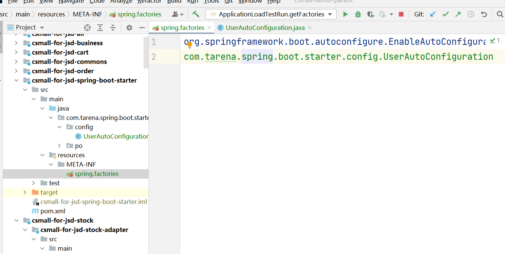

```factories
org.springframework.boot.autoconfigure.EnableAutoConfiguration=\
com.tarena.spring.boot.starter.config.UserAutoConfiguration
```

#### 3.5.3  属性的读取

//TODO


