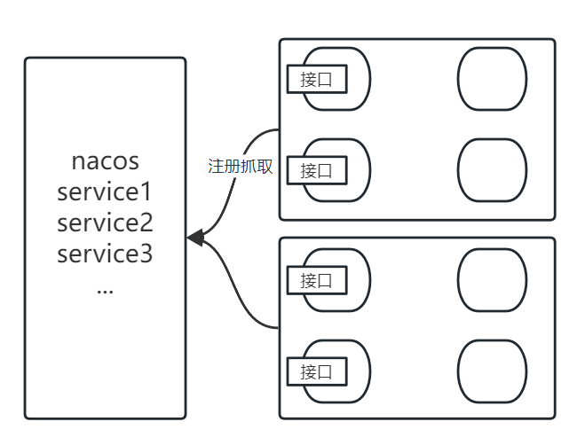
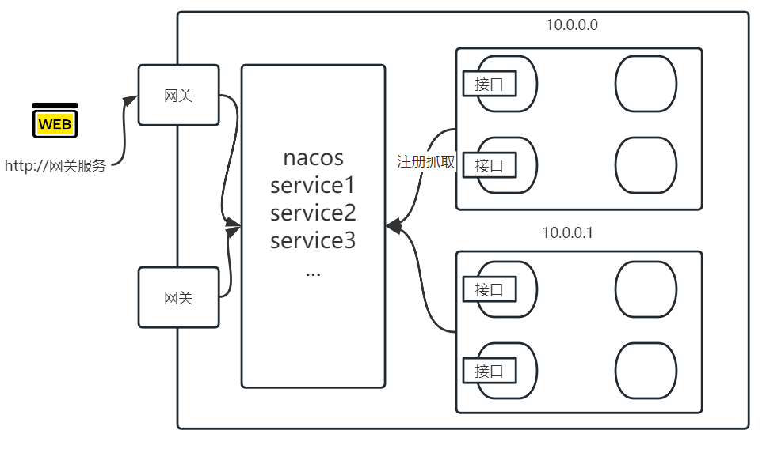
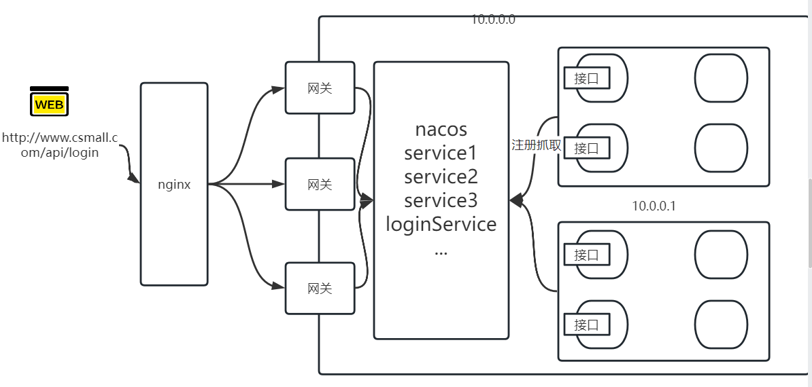
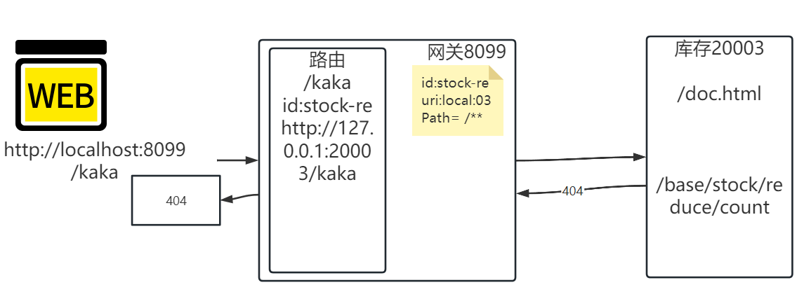
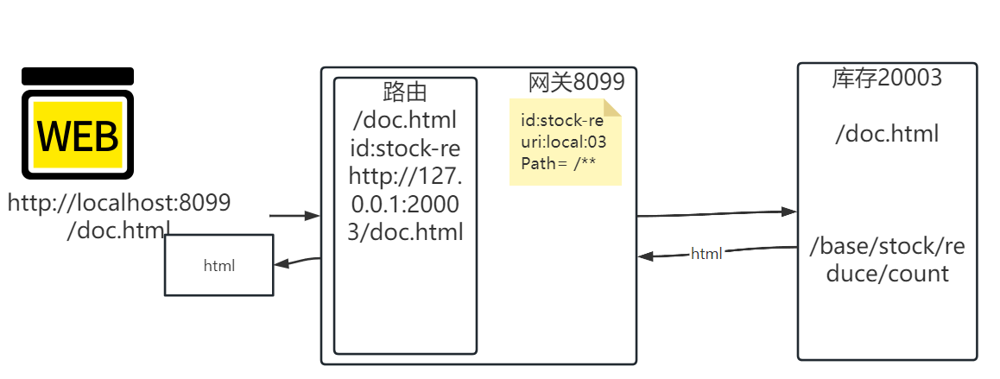
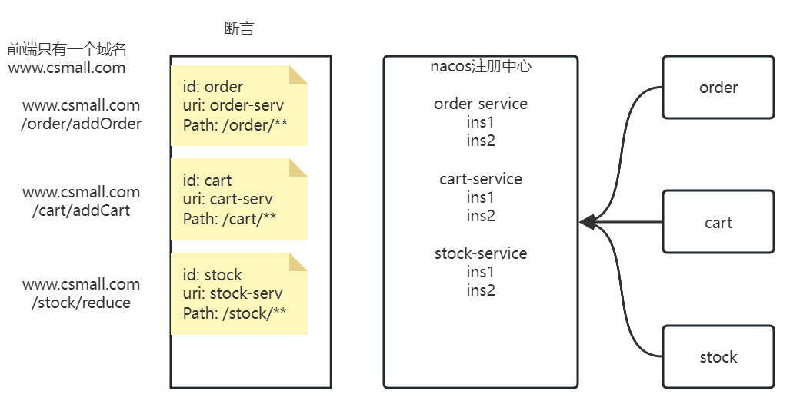
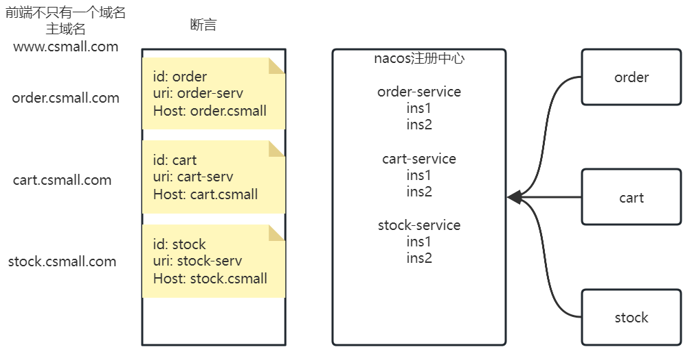
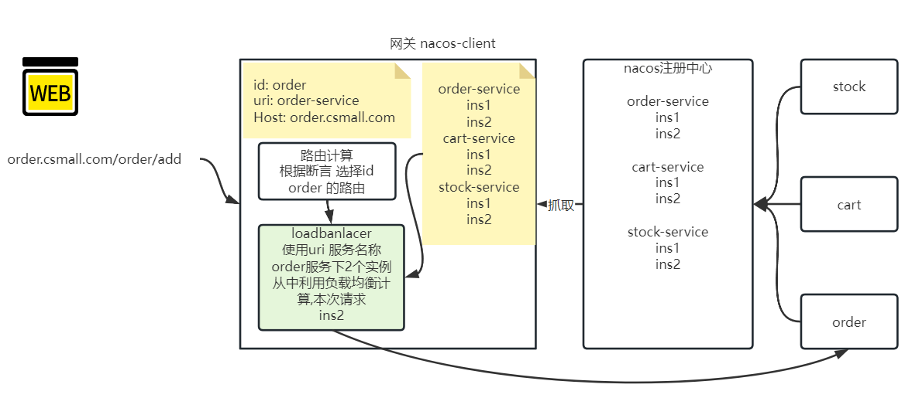
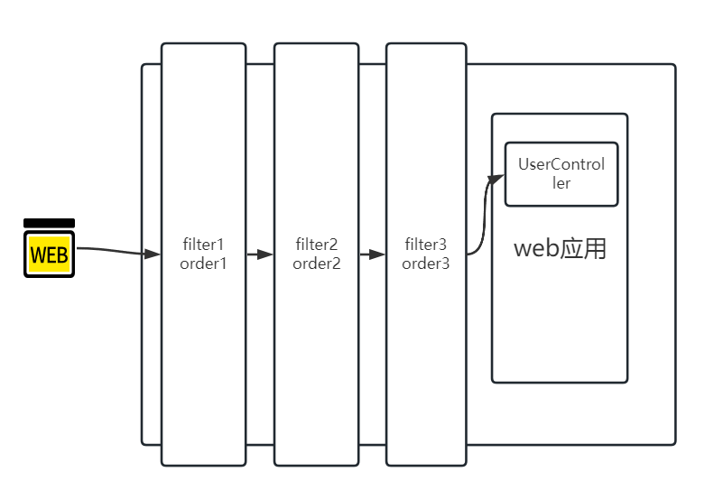
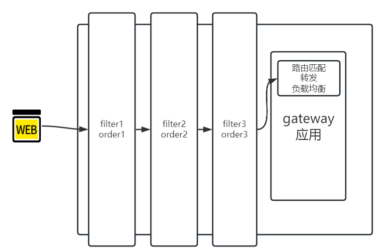

# Day08

## 1 内容回顾

### 1.1 学习内容目的

- [x] springboot自动配置原理
- [x] 实现自定义starter(未完善)

### 1.2 自动配置原理

1. 核心注解: SpringBootApplication
2. 组合3个注解: 扫描(ComponentScan) 配置(SpringBootConfiguration) 自动配置(EnableAutoConfiguration)
3. 自动配置注解的逻辑: 在启动类的基础上,导入了springboot的大量自动配置类,以至于自己不用关心配置实现过程(约定大于配置)
4. 导入配置类的细节:

所有的自动配置类都是springboot完成的? 不是,有第三方扩展的

mybatis-spring-boot-starter: mybatis-spring-boot-autoconfigure

dubbo-spring-boot-starter: dubbo-spring-boot-autoconfigure

knife4j-spring-boot-starter:knife4j-spring-boot-autoconfigure

所有的自动配置类都需要加载? 不是,加载不加载取决于条件注解是否满足

@ConditionalOnClass

@ConditionalOnMissingClass

@ConditionalOnBean

@ConditionalOnMissingBean

@ConditionalOnProperty 注解属性

prefix 前缀

name/value 属性名

havingValue 是否有值并且相等

**matchIfMissing 如果没有这个属性,是否匹配**

| 下: 是否存在属性 右: matchIfMissing 中间: 条件是否满足 | true | false  |
| ------------------------------------------------------ | ---- | ------ |
| 存在                                                   | 满足 | 满足   |
| 不存在                                                 | 满足 | 不满足 |

这些配置类如何导入的?

Spring提供了一个SpringFactories功能(SPI),读取固定文件META-INF/spring.factories,按照格式配置的内容会被加载,对应EnableAutConfiguration就是springboot要使用的自动配置类.

交给一个导入的Selector,通过类的全路径名称,实现配置类的加载,通过条件的判断,筛选满足的配置类.


SPI-API:一对类似的概念. 

API: application programming interface

SPI: service provider interface

共同点: 接口 提供方定的.

区别点: API 实现,是提供方定的, SPI实现,是调用方定的.(**只要提到SPI ,一般都会看到一个固定的文件,配置自己的实现**)

### 1.3 自定义Starter

- 编写了一个有条件的自动配置类
- 准备了一个spring.factories文件
- 其他项目依赖,根据条件是否满足,其他项目springboot启动时会选择是否加载当前starter中自动配置类

### 1.4 属性配置问题

@ConfigurationProperties

配合读取配置文件properties中,yaml中有层级关系的属性,赋值给bean对象.

@EnableConfigurationProperties

配合上述注解,引入读取的逻辑,让读取实现.

```java
package com.tarena.csmall.starter.test.beans;

import lombok.Data;
import org.springframework.boot.context.properties.ConfigurationProperties;
import org.springframework.boot.context.properties.EnableConfigurationProperties;
import org.springframework.stereotype.Component;

/**
 * @author java@tedu.cn
 * @version 1.0
 */
@Data
@Component
@ConfigurationProperties(prefix = "csmall")
@EnableConfigurationProperties
public class Bean05 {
    /**
     * 当前程序启动,Bean05一旦被扫描,
     * 由于属性读取注解生效,name属性,会自动读取 properties文件中
     * csmall.name
     * csmall.age
     */
    private String name;
    private Integer age;
}
```

这种读取属性注入到bean中的方式和@Value的区别在于,注入的底层原理不同

@Value反射赋值的,没有set方法也可以

@ConfigurationProperties是使用的setter方法

同时后一种方法,提供多级属性赋值


如果可以在bean对象使用这些注解实现属性的读取,初始化就方便极了.但是一般这种bean对象是自定义的,可以这样实现,要是第三方的代码.没法改源码实现第三方bean的初始化属性注入的.

使用方式是:

1. **Properties类 在类中添加@ConfigurationProperties
2. EnableConfigurationProperties注解放到一个配置类中,在注解属性里导入这个**Properties,使这个类称为一个容器bean对象

3. 如果在idea中要实现智能提示.需要在starter中添加一个springboot的依赖

## 2 网关组件SpringCloud Gateway

### 2.1 网关架构



当前架构可以实现服务注册抓取,实现内部的功能调用,但是无法解决外部调用问题



### 2.2 微服务网关介绍

微服务网关是一个用于**管理**和**监控**微服务的**入口**，用于转发和路由来自客户端的请求。微服务网关可以将来自客户端的请求转发给后端的多个微服务，同时也可以处理**跨域**、**身份验证**、**限流**、**缓存**、**流量控制**等一系列与微服务相关的功能，从而简化了微服务架构的服务开发的复杂度。

总结网关功能,需求:

- 集中管理:微服务很多,接口api也很多,所以通过网关为所有的微服务api接口提供统一管理维护的功能
- 安全考虑:为了安全考虑,几乎绝大部分微服务都需要认证授权,和访问控制,网关可以提前完成这个任务,为微服务提供保障.
- 流量控制限流:从网关层面对入口流量进行监控管理,一旦超出预计的请求数量,直接限制访问,防止后端微服务宕机.每一个微服务也要自行管理流量控制(sentinel)

网关有多少中落地方案:

1. **Spring Cloud Gateway**: Spring Cloud Gateway 是由 Spring Cloud 社区提供的一种基于 Spring 框架的全新微服务网关解决方案，它致力于为 Spring Boot 微服务应用提供简单、高效、可靠的路由服务。
2. **Netflix Zuul**: Netflix Zuul 是一个轻量级的微服务网关，它能够为微服务应用提供负载均衡、路由、过滤等功能。Zuul 和 Eureka 之间的协作能够让 Zuul 帮助微服务应用自动处理负载均衡和服务发现。
3. **Kong**: Kong 是一个企业级微服务 API 网关，它能够帮助开发者轻松创建、部署和管理微服务，同时提供灵活的路由、负载均衡、限流、监控、安全等功能。
4. **Istio**: Istio 是一个开源的服务网格平台，它能够集成多种微服务网关、负载均衡、服务发现、流量控制等功能，以实现微服务之间的高效通信和流量管理。
5. **Nginx**: Nginx 是一个轻量级的反向代理和负载均衡服务器，它可以充当微服务网关的角色。通过 Nginx 提供的路由和负载均衡功能，开发者可以为微服务提供一种快速、可靠的访问方式。



### 2.3 Spring Cloud Gateway(技术选型)

SSM框架有什么优势: 开源 热度高 使用方便 springboot简化配置 缺点简化配置 封装了原理和底层逻辑.难以学透.

一切技术选型都来自: 需求.

1. 技术栈更加完善。

Spring Cloud Gateway 是基于 **Spring Boot 和 Spring Cloud** 构建的微服务网关，和 Spring Cloud Alibaba 等一些组件相结合可以构建完整的微服务架构体系。同时，它还支持集成 Spring Cloud Config、Spring Security、Spring Cloud Sleuth 和 Spring Cloud Stream 等组件，为微服务应用提供更加全面的技术支持。

2. 高性能。

Spring Cloud Gateway 整合了 Reactor 和 Netty 技术，提供了高效的异步转发能力，支持 WebFlux 进行**非阻塞式**处理，**避免了潜在的 I/O 瓶颈**，提高了请求响应效率。

3. 易于扩展和定制。

Spring cloud Gateway内置了很多现成的路由，负载均衡，过滤器的配置逻辑，易于上手使用。

同时提供扩展的接口，和非常简便的整合的配置方式，提供多种不同过滤器供开发者选择和使用。

### 2.4 网关转发入门案例

#### 2.4.1 明确案例需求

开发一个网关工程: http://localhost:8099/uri地址

开发这个网关实现一个转发的功能,转发给stock.

前提是,stock得具备这个请求的处理能力.

#### 2.4.2 实现案例

- 创建网关工程(maven新项目)
- 提供依赖资源
  - starter-web: web应用开发,但是没有使用其中携带的tomcat默认web容器
  - gateway: 网关核心依赖
  - loadbalancer: 网关默认的负载均衡组件
  - nacos-discovery: 后续案例中整合nacos实现服务调用的负载均衡,发现服务作用

```xml
<dependency>
    <groupId>org.springframework.boot</groupId>
    <artifactId>spring-boot-starter-web</artifactId>
</dependency>
<dependency>
    <groupId>com.alibaba.cloud</groupId>
    <artifactId>spring-cloud-starter-alibaba-nacos-discovery</artifactId>
</dependency>
<!--网关发现服务后,进行负载均衡的转发调用-->
<dependency>
    <groupId>org.springframework.cloud</groupId>
    <artifactId>spring-cloud-starter-loadbalancer</artifactId>
</dependency>
<!--网关核心依赖-->
<dependency>
    <groupId>org.springframework.cloud</groupId>
    <artifactId>spring-cloud-starter-gateway</artifactId>
</dependency>
```

- 启动类(常规启动类)

- yaml配置(包含gateway相关配置,实现转发的功能)

  ```yaml
  server:
    port: 8099
  spring:
    application:
      name: csmall-gateway
    #由于gateway底层不是tomcat 和mvc有冲突的
    main:
      web-application-type: reactive
    #配置cloud gateway 逻辑,实现转发需求
    cloud:
      gateway:
        #路由转发配置 路由逻辑可以配置多个
        routes:
          # 一个- 是一个路由信息,配置一个路由的对象属性
          # id表示唯一的标识
          - id: stock-redirect
            # 目的地请求地址
            uri: http://127.0.0.1:20003
            # 断言,assert,判断进入网关的请求,哪些符合这个路由匹配
            # 所有请求都到网关转发给stock
            # /** 匹配所有请求 ** 代表多级路径,且每一级都可以是任意长度字符串
            # ant匹配规范 * ? **
            predicates:
              - Path=/**
  ```

- 启动测试
  - stock 真正处理请求的人
  - gateway启动,做转发

**注意**: 我们访问的资源,经过gateway,由stock处理的.所以必须访问stock有的资源.

1. http://localhost:8099/kaka



2. http://localhost:8099/doc.html



Path断言案例:

```
predicates:
  - Path=/abc
```

表示请求进入到网关的路径必须等于/abc 这个路由才处理

http://localhost:8099/kaka访问

网关接收请求,路由计算,没有路由匹配

网关直接返回404

http://localhost:8099/abc访问

网关接收请求,路由计算,匹配到id=stock-redirect路由

转发 http://127.0.0.1:20003/abc

stock处理请求,没有资源,返回404

```
predicates:
  - Path=/abc/*
```

http://localhost:8099/kaka-->网关返回404,没有路由匹配

http://localhost:8099/abc/aa-->stock返回404,stock接收资源路径/abc/aa,没有处理资源

- ant匹配规范

| 符号使用 | 符号含义                   | 举例说明                                |
| -------- | -------------------------- | --------------------------------------- |
| ?        | 匹配一级一个字符           | /?,可以匹配的值有/a,/b,不能匹配/ab,/a/b |
| *        | 匹配一级一个字符串         | /*, 可以匹配/abc,/a,不可以匹配/a/b      |
| **       | 匹配任意多级任意长度字符串 | /**,表示匹配所有                        |

- 问题path匹配

如果path有包含关系,或者有冲突,目前的情况网关单独管理,单独转发的.没有顺序的概念,没有优先级的概念.

断言不仅仅包含Path 还包含很多其他的内置断言.

比如Host断言等.

```
predicates:
  - Path=/**
  - Host=localhost:8099
```

断言作用: 匹配进入到网关的请求,是否满足这个路由,满足,这个路由规则就会处理请求,不满足就不管,如果一个请求进入网关,没有任何路由能够匹配上,就返回404

上述案例添加Host断言,表示,请求路径满足/**,请求头Host

请求分析:

http://localhost:8099/doc.html 进入网关

断言匹配 Path 匹配了 /doc.html /**

断言匹配 Host 匹配了 

转发给uri http://127.0.0.1:20003/doc.html


http://127.0.0.1:8099/doc.html 进入网关

断言匹配 Path 匹配了 /doc.html /**

断言匹配 Host 匹配了 请求Host 127.0.0.1:8099 断言Host localhost:8099

不匹配,没有路由处理请求 404

中午,将上述的请求流程,重新捋一遍.

### 2.5 断言详细介绍

springCloud gateway 内置很多断言规则. Path Host使用的比较多的.

微服务做网关配置,做匹配的时候,2种情况的匹配.

Path路径,Host域名.



域名只有一个,请求路径可以以不同的服务约定的起始,做Path断言.



除了主域名,还有二级,三级域名,可以使用host区分转发访问的微服务功能.

内置的Path Host以外还有一些断言可以使用,但是不太常用

- After

使用时间匹配路由,在指定时间之后的请求,才会匹配到.

```yaml
spring:
  cloud:
    gateway:
      routes:
      - id: after_route
        uri: https://example.org
        predicates:
        - After=2017-01-20T17:42:47.789-07:00[America/Denver]
```

- Before

和After相反,在指定时间之前,才能匹配

```yaml
spring:
  cloud:
    gateway:
      routes:
      - id: before_route
        uri: https://example.org
        predicates:
        - Before=2017-01-20T17:42:47.789-07:00[America/Denver]
```

- Between

在两个时间点之间,才能匹配路由

```yaml
spring:
  cloud:
    gateway:
      routes:
      - id: between_route
        uri: https://example.org
        predicates:
        - Between=2017-01-20T17:42:47.789-07:00[America/Denver], 2017-01-21T17:42:47.789-07:00[America/Denver]
```

等价于

```yaml
spring:
  cloud:
    gateway:
      routes:
      - id: between_route
        uri: https://example.org
        predicates:
        - After=2017-01-20T17:42:47.789-07:00[America/Denver]
        - Before=2017-01-21T17:42:47.789-07:00[America/Denver]
```

- Cookie

使用cookie断言可以通过请求携带cookie值实现匹配的逻辑计算

```yaml
spring:
  cloud:
    gateway:
      routes:
      - id: cookie_route
        uri: https://example.org
        predicates:
        - Cookie=name,wanglaoshi
```

请求request 携带的cookie中 key1=value1;key2=value2 有没有name=wanglaoshi,有则匹配,没有则不匹配.

- Method

根据http请求,判断是否满足

```yaml
spring:
  cloud:
    gateway:
      routes:
      - id: method_route
        uri: https://example.org
        predicates:
        - Method=GET,POST
```

案例中,要求request请求是get或者是post.

- Path

```yaml
spring:
  cloud:
    gateway:
      routes:
      - id: path_route
        uri: https://example.org
        predicates:
        - Path=/red/{segment},/blue/{segment}
```

通过路径匹配,/red/{segment} 变量, 匹配的判断和/red/*是一样的 

- Query

通过请求中的参数做断言

```yaml
spring:
  cloud:
    gateway:
      routes:
      - id: query_route
        uri: https://example.org
        predicates:
        - Query=green
```

请求参数中,必须有一个参数名叫做green

http://localhost:8099/doc.html?green=12321

```yaml
spring:
  cloud:
    gateway:
      routes:
      - id: query_route
        uri: https://example.org
        predicates:
        - Query=red, gree.
```

支持正则表达式判断参数的值的格式 gree. 以gree开始 后面有一个字符. greet green

上述案例要求 请求携带red参数,值满足 gree.正则

- [ ] http://localhost:8099/doc.html?red=haha
- [x] http://localhost:8099/doc.html?red=green

- Remote

根据请求 远程ip地址格式,判断匹配

```yaml
spring:
  cloud:
    gateway:
      routes:
      - id: remoteaddr_route
        uri: https://example.org
        predicates:
        - RemoteAddr=192.168.1.1/24
```

- [x] 远程ip地址 192.168.1.100 
- [x] 远程ip地址 192.168.1.101
- [ ] 远程ip地址 192.168.2.101

- Weight

权重断言,包含2个参数 - Weight=groupx,y,groupx表示分组x,y数字表示权重

```yaml
spring:
  cloud:
    gateway:
      routes:
      - id: weight_high
        uri: https://weighthigh.org
        predicates:
        - Path=/**
        - Weight=group1, 8
      - id: weight_low
        uri: https://weightlow.org
        predicates:
        - Path=/**
        - Weight=group1, 2
```

同一分组的意思是,功能相同,路由指向的后端服务,功能完全一样的.按照8:2权重比例,分配请求.

### 2.6 整合nacos

demo案例中,转发一个指定的目标服务实例,微服务中需要负载均衡访问服务集群的.需要gateway整合nacos.实现负载均衡调用.

#### 2.6.1 整合逻辑

流程和逻辑



如果实现nacos整合,网关整体进程就可以看成是一个nacos的客户端,启动时候抓取了服务信息.

请求进入网关,网关的路由配置uri不再指向一个具体的服务实例地址,而是使用服务名称.

断言匹配路由,进行路由计算之后,再进入负载均衡计算,从抓取的服务信息中,先获取信息实例集群,在计算负载逻辑.最终转发出去,由本次计算的实例处理请求.

- 问题1: uri配置的服务名称找不到,配置错误,或者没抓到
- 问题2: 请求资源在实例中不存在 404

#### 2.6.2 nacos整合网关案例

- 依赖(nacos-discovery)
- 修改yaml配置(还是用stock测试)

```yaml
server:
  port: 8099
spring:
  application:
    name: csmall-gateway
  #由于gateway底层不是tomcat 和mvc有冲突的
  main:
    web-application-type: reactive
  #配置cloud gateway 逻辑,实现转发需求
  cloud:
    nacos:
      #nacos中注册发现的功能
      discovery:
        #填写nacos的服务端地址
        server-addr: localhost:8848
        #命名空间
        namespace: f033ea8e-15ca-4f37-b112-127edc03de9e
        #分组
        group: 1.0
    gateway:
      #路由转发配置 路由逻辑可以配置多个
      routes:
        # 一个- 是一个路由信息,配置一个路由的对象属性
        # id表示唯一的标识
        - id: stock-redirect
          # 负载均衡的访问服务名称csmall-stock
          uri: lb://csmall-stock
          # 断言,assert,判断进入网关的请求,哪些符合这个路由匹配
          # 所有请求都到网关转发给stock
          # /** 匹配所有请求 ** 代表多级路径,且每一级都可以是任意长度字符串
          # ant匹配规范 * ? **
          predicates:
            - Path=/**
            - Host=localhost:8099
```

修改uri 配置负载均衡的访问 csmall-stock服务.

前提是网关要到对应的namespace和group,抓取csmall-stock.nacos也要配置.

请求流程分析过程:

**http://localhost:8099/doc.html --> 进入网关 --> 使用路由断言匹配 --> Path匹配 Host匹配 --> uri转发 --> lb://csmall-stock --> loadbalancer 获取nacos抓取信息 -->  csmall-stock注册信息 127.0.0.1:20003 --> 负载均衡访问 --> http://127.0.0.1:20003/doc.html**

#### 2.6.3 课堂案例

需求: 使用网关访问csmall-cart服务,要求,利用你已知的断言规则,将请求分开处理,访问不同的服务.

提示: 配置2个路由,一个指向csmall-cart 一个指向csmall-stock. 成功访问到资源.

答案不唯一:

如果使用路径Path断言,要注意前后端的交互要流畅,保证前端访问请求,是按照断言进入的,后端要对应编写代码接收地址.

如果使用Host头断言,要配置多个服务的域名.当前不具备使用网络dns服务器,等实现多域名的条件,但是可以使用hosts文件,模拟.

C:\Windows\System32\drivers\etc(windows 11未知)

```txt
127.0.0.1 cart.csmall.com:20003
127.0.0.1 stock.csmall.com
```

#### 2.6.4 动态路由

在网关中,我们可以通过上述对路由转发的学习,实现微服务集群的各种服务的路由匹配routes的配置.Gateway中,提供了一种动态路由配置服务的方式.根据服务名称自动拼接url地址,实现路由功能,要想使用,需要满足一定访问条件.

```yaml
server:
  port: 8099
spring:
  application:
    name: csmall-gateway
  #由于gateway底层不是tomcat 和mvc有冲突的
  main:
    web-application-type: reactive
  #配置cloud gateway 逻辑,实现转发需求
  cloud:
    nacos:
      #nacos中注册发现的功能
      discovery:
        #填写nacos的服务端地址
        server-addr: localhost:8848
        #命名空间
        namespace: f033ea8e-15ca-4f37-b112-127edc03de9e
        #分组
        group: 1.0
    gateway:
      #动态路由
      discovery:
        locator:
          enabled: true
```

spring.cloud.gateway.discovery.locator.enabled=true 属性值开启发现动态路由逻辑.

会根据抓取的服务名称,配置Path=/{服务名称}/** 同时转发的时候,将一级路径过滤掉

按照当前服务逻辑 相当于人为配置路由

```yaml
routes:
 - id: stock
   uri: lb://csmall-stock
   predicates:
   - Path=/csmall-stock/**
   filters:
   #会在转发时,去掉拼接的1级路径
   - StrimFilter = 1
 - id: cart
   uri: lb://csmall-cart
   predicates:
   - Path=/csmall-cart/**
   filters:
   #会在转发时,去掉拼接的1级路径
   - StrimFilter = 1
```


当前服务有2个,动态路由内部有2个路由配置.

http://localhost:8099/{服务名称}/{资源路径}.按照这个逻辑,以下几个演示案例,可以预测结果:

1. - [x] http://localhost:8099/csmall-stock/doc.html --> 进入网关 -->匹配动态路由-->负载均衡计算-->拼接服务实例ip:port-->过滤掉一级路径 -->转发访问--> http://127.0.0.1:20003/doc.html

2. - [x] http://localhost:8099/csmall-cart/doc.html --> 进入网关 --> 匹配动态路由-->负载均衡计算-->拼接服务实例ip:port-->过滤掉一级路径 -->转发访问--> http://127.0.0.1:20014/doc.html

3. - [x] http://localhost:8099/csmall-stock/base/stock/reduce/count 

总结动态路由:

- 访问网关
- 访问网关的资源路径,第一级必须是服务名称
- 除了服务名称剩下的路径,一定保证服务可以处理的请求

### 2.7 过滤器

网关除了路由匹配功能意外,为了微服务集群访问安全考虑,还需要实现管理入口流量,身份校验的问题(解析JWT).

网关提供了过滤器功能.

#### 2.7.1 过滤器介绍

每一个web应用,都可以使用过滤器和拦截器.springmvc中可以提供的.

网关本身也是一个web应用.可以引入过滤器来实现一些功能.比如 路由计算,本质是路由计算的过滤器(内置的功能).

过滤器使用的特点:



在网关中保护的内容是服务调用,路由的转发



#### 2.7.2 过滤器使用案例1

网关中使用编写过滤器代码

1. 创建过滤器类
2. 实现网关过滤器的接口和顺序接口
3. spring容器的bean对象

```java
package cn.tedu.csmall.gateway.filters;

import org.springframework.cloud.gateway.filter.GatewayFilterChain;
import org.springframework.cloud.gateway.filter.GlobalFilter;
import org.springframework.core.Ordered;
import org.springframework.web.server.ServerWebExchange;
import reactor.core.publisher.Mono;

/**
 * @author java@tedu.cn
 * @version 1.0
 */
public class MyFilter01 implements GlobalFilter, Ordered {
    @Override
    public Mono<Void> filter(ServerWebExchange exchange, GatewayFilterChain chain) {
        return null;
    }

    @Override
    public int getOrder() {
        return 0;
    }
}
```

1. getOrder(): 返回值是个整数,定义当前过滤器的执行顺序,数字越小,执行顺序越靠前
2. filter(exchange,chain): 方法可以决定当前请求是继续访问,还是拦截,还是阻断(代码编写有逻辑问题),exchange包含了请求的request对象和response,绝大多数过滤器处理的过滤逻辑,都要使用exchange对象.chain,表示当前过滤连,是继续访问,还是阻断,都要使用过滤连处理.

需求:在过滤器中打印日志,表明请求进入过滤器,放行.

```java
package cn.tedu.csmall.gateway.filters;

import org.springframework.cloud.gateway.filter.GatewayFilterChain;
import org.springframework.cloud.gateway.filter.GlobalFilter;
import org.springframework.core.Ordered;
import org.springframework.stereotype.Component;
import org.springframework.web.server.ServerWebExchange;
import reactor.core.publisher.Mono;

/**
 * @author java@tedu.cn
 * @version 1.0
 */
@Component
public class MyFilter01 implements GlobalFilter, Ordered {
    @Override
    public Mono<Void> filter(ServerWebExchange exchange, GatewayFilterChain chain) {
        System.out.println("当前请求经过了MyFilter01过滤器");
        //当前过滤逻辑结束,过滤链继续执行后续的过滤逻辑
        Mono<Void> filter = chain.filter(exchange);
        return filter;
    }

    @Override
    public int getOrder() {
        return 0;
    }
}
```

#### 2.7.3 过滤器使用案例2

当前网关中,创建第二个过滤器,观察过滤器执行顺序.

getOrder方法返回值如果是0,排序是按照过滤器类名字计算的.

```java
package cn.tedu.csmall.gateway.filters;

import org.springframework.cloud.gateway.filter.GatewayFilterChain;
import org.springframework.cloud.gateway.filter.GlobalFilter;
import org.springframework.core.Ordered;
import org.springframework.stereotype.Component;
import org.springframework.web.server.ServerWebExchange;
import reactor.core.publisher.Mono;

/**
 * @author java@tedu.cn
 * @version 1.0
 */
@Component
public class MyFilter02 implements GlobalFilter, Ordered {
    @Override
    public Mono<Void> filter(ServerWebExchange exchange, GatewayFilterChain chain) {
        System.out.println("当前请求经过了MyFilter02过滤器");
        //当前过滤逻辑结束,过滤链继续执行后续的过滤逻辑
        Mono<Void> filter = chain.filter(exchange);
        return filter;
    }

    @Override
    public int getOrder() {
        return -5;
    }
}
```

#### 2.7.4 过滤器使用案例3

过滤器处理逻辑中,使用最多的就是请求和响应对象.

请求对象的参数,头,可以称为网关过滤器的验证数据(JWT Authorization)

响应对象,可以控制输出内容,修改响应头.

pre post的概念.

```java
package cn.tedu.csmall.gateway.filters;

import org.springframework.cloud.gateway.filter.GatewayFilterChain;
import org.springframework.cloud.gateway.filter.GlobalFilter;
import org.springframework.core.Ordered;
import org.springframework.http.HttpHeaders;
import org.springframework.http.MediaType;
import org.springframework.http.server.RequestPath;
import org.springframework.http.server.reactive.ServerHttpRequest;
import org.springframework.http.server.reactive.ServerHttpResponse;
import org.springframework.stereotype.Component;
import org.springframework.util.MultiValueMap;
import org.springframework.web.server.ServerWebExchange;
import reactor.core.publisher.Mono;
import java.net.URI;
import java.sql.SQLOutput;
import java.util.List;

/**
 * @author java@tedu.cn
 * @version 1.0
 */
@Component
public class MyFilter01 implements GlobalFilter, Ordered {
    @Override
    public Mono<Void> filter(ServerWebExchange exchange, GatewayFilterChain chain) {
        System.out.println("当前请求经过了MyFilter01过滤器");
        //获取请求和响应对象
        ServerHttpRequest request = exchange.getRequest();
        //拿到请求路径
        URI uri = request.getURI();
        System.out.println("uri:"+uri);
        RequestPath path = request.getPath();
        System.out.println("requestPath:"+path);
        //拿到请求参数 ?name=wang&age=18
        MultiValueMap<String, String> queryParams = request.getQueryParams();
        //拿到请求头 Accept Host Cache-Control等
        HttpHeaders headers = request.getHeaders();
        List<String> hosts = headers.get("Host");
        String host = hosts.get(0);
        List<MediaType> accept = headers.getAccept();
        System.out.println(accept.size());
        ServerHttpResponse response = exchange.getResponse();
        Mono<Void> filter = chain.filter(exchange);
        return filter;
    }

    @Override
    public int getOrder() {
        return 0;
    }
}
```

通过请求,做校验,没有通过,response只做一件事: 在过滤器中直接返回响应.

```java
package cn.tedu.csmall.gateway.filters;

import org.springframework.cloud.gateway.filter.GatewayFilterChain;
import org.springframework.cloud.gateway.filter.GlobalFilter;
import org.springframework.core.Ordered;
import org.springframework.core.io.buffer.DataBuffer;
import org.springframework.http.HttpHeaders;
import org.springframework.http.MediaType;
import org.springframework.http.server.RequestPath;
import org.springframework.http.server.reactive.ServerHttpRequest;
import org.springframework.http.server.reactive.ServerHttpResponse;
import org.springframework.stereotype.Component;
import org.springframework.util.MultiValueMap;
import org.springframework.web.server.ServerWebExchange;
import reactor.core.publisher.Mono;

import java.net.URI;
import java.nio.charset.StandardCharsets;
import java.sql.SQLOutput;
import java.util.List;
import java.util.function.Supplier;

/**
 * @author java@tedu.cn
 * @version 1.0
 */
@Component
public class MyFilter01 implements GlobalFilter, Ordered {
    @Override
    public Mono<Void> filter(ServerWebExchange exchange, GatewayFilterChain chain) {
        System.out.println("当前请求经过了MyFilter01过滤器");
        //获取请求和响应对象
        ServerHttpRequest request = exchange.getRequest();
        //拿到请求路径
        URI uri = request.getURI();
        System.out.println("uri:"+uri);
        RequestPath path = request.getPath();
        System.out.println("requestPath:"+path);
        //拿到请求参数 ?name=wang&age=18
        MultiValueMap<String, String> queryParams = request.getQueryParams();
        //拿到请求头 Accept Host Cache-Control等
        HttpHeaders headers = request.getHeaders();
        List<String> hosts = headers.get("Host");
        String host = hosts.get(0);
        List<MediaType> accept = headers.getAccept();
        System.out.println(accept.size());
        ServerHttpResponse response = exchange.getResponse();
        //响应在浏览器解析,使用utf-8,contentType app/json;charset=utf-8
        response.getHeaders().setContentType(MediaType.APPLICATION_JSON);
        //response直接输出响应 DataBuffer 包装了一个写出的数据对象
        Mono<Void> customResult = response.writeWith(Mono.fromSupplier(new Supplier<DataBuffer>() {
            @Override
            public DataBuffer get() {
                String responseStr = "你好啊,你被拦截了";
                return response.bufferFactory().wrap(responseStr.getBytes(StandardCharsets.UTF_8));
            }
        }));
        return customResult;
    }

    @Override
    public int getOrder() {
        return 0;
    }
}
```

**课堂跟踪练习**

需求: 请通过过滤器编写,判断请求是否携带了name参数,如果携带了,并且值=token. 请求放行,否则,直接拦截返回json格式的字符串

{"status":401,"msg":"您没有认证登录","data":null}

