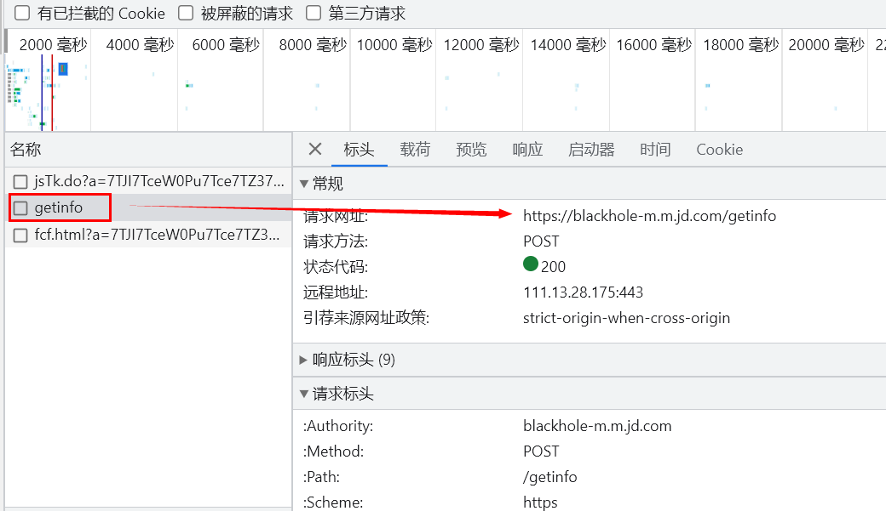
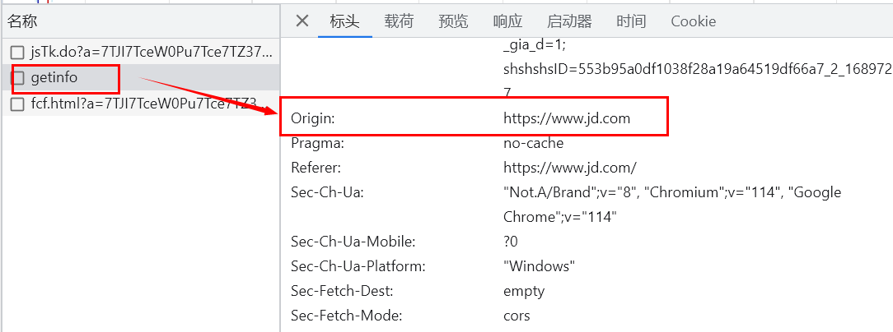
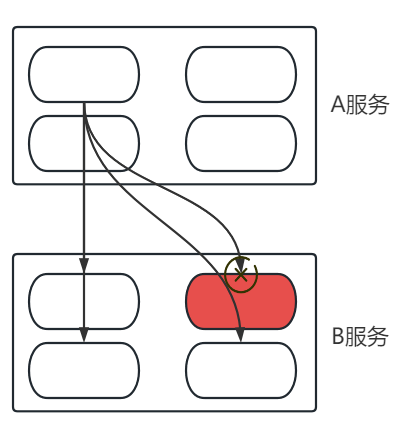
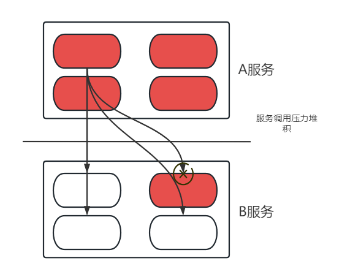
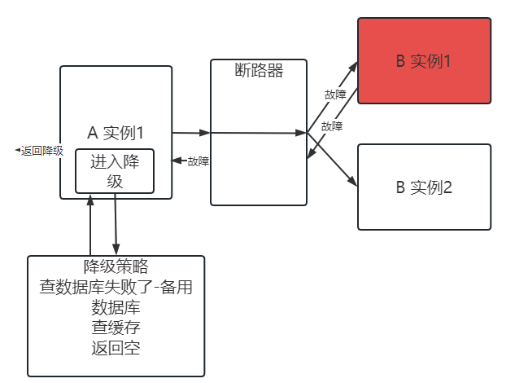
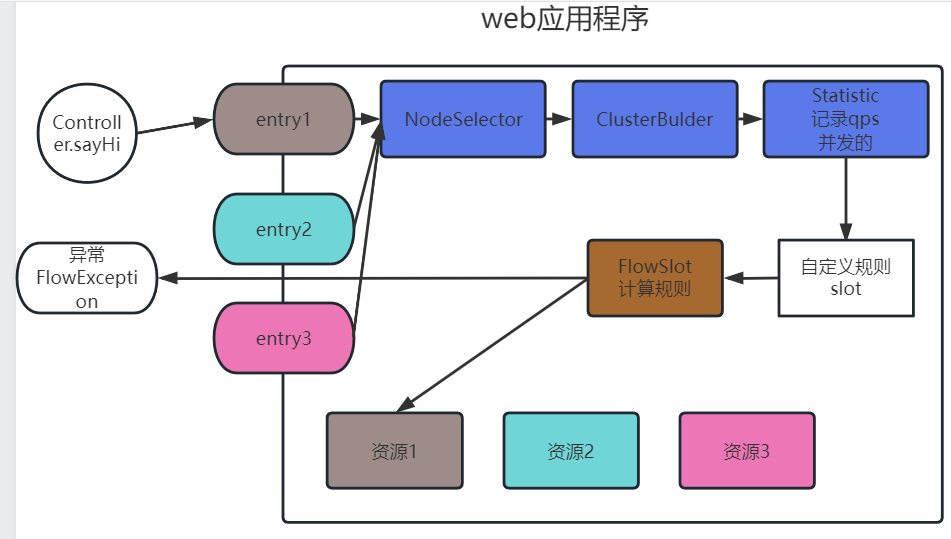
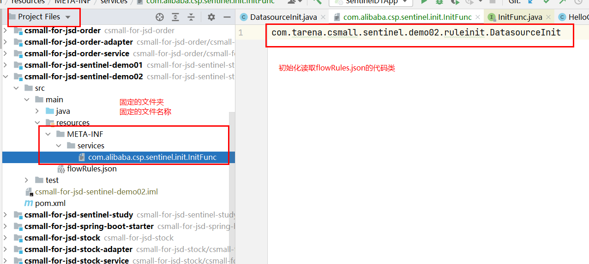
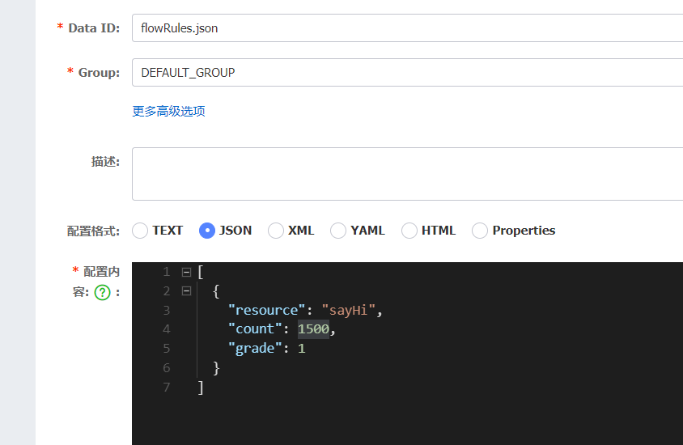

# Day09

## 1 网关Gateway跨域的问题

Path Host断言都可以实现多服务网关入口.

Path做断言没有跨域问题的(路径断言 域名和端口统一的)

跨域: 只要资源访问请求原始域和目标域其中域名和端口有一个不一样,就叫做跨域.

http://localhost:8099 发起资源请求

http://127.0.0.1:8099 资源目标


http://www.csmall.com/ 发起资源请求

http://order.csmall.com/ 资源目标

以京东首页为例,理解cors 首页有一个ajax请求 访问getInfo



资源访问服务https://blackhole-m.m.jd.com/getinfo



```yaml
server:
  port: 8099
spring:
  application:
    name: csmall-gateway
  #由于gateway底层不是tomcat 和mvc有冲突的
  main:
    web-application-type: reactive
  #配置cloud gateway 逻辑,实现转发需求
  cloud:
    nacos:
      #nacos中注册发现的功能
      discovery:
        #填写nacos的服务端地址
        server-addr: localhost:8848
        #命名空间
        namespace: f033ea8e-15ca-4f37-b112-127edc03de9e
        #分组
        group: 1.0
    gateway:
      #动态路由
      discovery:
        locator:
          enabled: true
      globalcors:
        #解决options请求被拦截的问题
        add-to-simple-url-handler-mapping: true
        cors-configurations:
          #对那些路径请求,通过gateway网关管理跨域 /**
          '[/**]':
            #允许的跨域原地址 匹配范围
            allowedOriginPatterns: "*"
              #- "http://**.csmall.com"
              #- "http://*.baidu.com"
            #允许跨域原地址 具体的值
            #allowedOrigins: "http://www.csmall.com"
            allowedHeaders: "*"
              #- "Accept"
              #- "Cache-Enabled"
            allowedMethods: "*"
              #- "POST"
              #- "GET"
              #- "PUT"
              #- "DELETE"
              #- "OPTIONS"
            #是否允许携带凭证 比如jwt token等
            allowCredentials: true
            #预检测请求Options成功之后,有效时长,超过时长,再次预检测
            maxAge: 7200
```

## 2 熔断限流组件sentinel

### 2.1 微服务场景

微服务架构中,切分的服务越多,调用关系就越复杂.

如果在多个服务调用过程中,由于某个服务的实例故障,导致调用失败,延迟,等待.

需要不需要对这种调用失败的问题进行处理,如果不处理会不会有重大影响?



如果不及时解决这个问题,会导致A服务中所有服务实例,访问B服务这个宕机故障节点等待排队,压力向上传递了,积累到一定程度,A服务也会有不可访问的危险.



最终A作为调用者,瘫痪,整个服务调用链路压力上传,全部瘫痪.

### 2.2 熔断降级

上述场景,由调用者处理调用失败,影响导致全部链路瘫痪的问题,要使用的策略叫做熔断降级.

- 熔断

牺牲局部,保存全局,就是熔断.(局部就是故障的实例)

在现有熔断机制中,都是采用**断路器**的规则.像一个开关一样,一旦发现调用出现临界阈值(故障).断路器将会处在**断开**状态,实例之间就不可以相互访问,**过一段时间**,断路器**半开**状态,允许部分请求访问,如果访问成功,说明故障解除,回归到**闭合**状态,如果不成功,继续断开状态,循环这个流程.

短路器的三种状态: 闭合,断开,半开


1. 发现调用失败,统计失败次数,次数达到断路器断开的要求-- 断开
2. 断开一段时间之后-- 半开
3. 半开请求成功执行-- 闭合
4. 半开的请求没有成功-- 断开

- 降级

在服务,功能不可用的时候,采用退而求其次的数据,进行用户请求的响应. 前提条件是 **业务组成部分,当前故障的数据,不是必要数据**(查询商品的时候,价钱,库存,商品信息是必要数据,但是评论缺少部分,全部缺少 并不影响)



### 2.3 限流降级

目的: 限流的目的,防止服务接收超过上限的请求,导致崩溃.

根据服务器性能,配置,所有的实例都有上限访问量,比如 4C8G 运行的一个tomcat软件,承受的**并发**200-500,占用cpu线程50个左右. 不可能无上限的承受访问,为了防止**访问雪崩**,冲垮服务进程,要对程序做限流处理,超出流量上限的,直接拒绝,或者排队等待,目的是保护服务进程.

访问雪崩: 功能服务集群(微服务),某个实例宕机,并发请求没有消失,压力,转给了其他人.

流量计算中的一些概念和公式: RT qps 并发 日pv量.

- RT: Reaction Time 表示一次请求,服务器处理时长.

  - 服务器没有连接任何工具,mysql,redis,es,rocketmq. SS框架. 请求10ms内(时间花费90%都在网络上)

  - 如果有第三方工具(redis),10ms左右
  - 如果有第三方工具(mysql数据库),30-50ms,考虑表格的具体数据量大小,考虑表格的优化.

- QPS: web应用中,每秒访问的请求次数.
- 并发: web应用中,同时在服务器中存在的请求数据量(线程处理的请求). 服务器实例,web实例的并发是有上限的(很大一部分程度取决于CPU,另一部分取决于代码设计,系统调优)
- 日pv(page view)量: pv 表示一次请求(静态数据 js css html json, 动态数据),和QPS有紧密的关系. 需要通过pv计算QPS.

​	**QPS=并发/RT 一般计算上限使用的公式.**

​	日pv=2亿 能计算平均qps 2300/s,不是最高QPS. **计算原则: 2/8原则**, 20%时间段产生80%pv量.	

​	2亿\*0.8/(24\*0.2*3600)=9000/s 如果每个服务3000/s 需要3台

​	假设问的问题: 集群什么规模,qps最高多少 pv多少?

	1. 日pv=10个亿 (RT预估80ms tomcat并发100 单台qps1250) 总qps上限 5万 40台.
	1. 数据库规模 redis规模(运维负责搭建集群 mysql 2000/s(**10个左右**) redis 1万/s(6个左右))

## 3 sentinel学习案例

### 3.1 sentinel介绍

随着微服务的流行，服务和服务之间的稳定性变得越来越重要。Sentinel 是面向分布式、多语言异构化服务架构的流量治理组件，主要以流量为切入点，从流量路由、**流量控制**、流量整形、**熔断降级**、系统自适应过载保护、热点流量防护等多个维度来帮助开发者保障微服务的稳定性。

### 3.2 重要的核心概念

**资源**

资源是 Sentinel 的关键概念。它可以是 Java 应用程序中的任何内容，例如，由应用程序提供的服务，或由应用程序调用的其它应用提供的服务，甚至可以是一段代码。在接下来的文档中，我们都会用资源来描述代码块。

只要通过 Sentinel API 定义的代码，就是资源，能够被 Sentinel 保护起来。大部分情况下，可以使用方法签名，URL，甚至服务名称作为资源名来标示资源。

**规则**

围绕资源的实时状态设定的规则，可以包括流量控制规则、熔断降级规则以及系统保护规则。所有规则可以动态实时调整。

### 3.3 准备一个测试的工程

- 创建项目(略)
- 父工程添加demo案例的依赖
  - spring-boot-starter-web
  - spring-cloud-starter-alibaba-sentinel

```xml
<dependencies>
    <dependency>
        <groupId>org.springframework.boot</groupId>
        <artifactId>spring-boot-starter-web</artifactId>
    </dependency>
    <dependency>
        <groupId>com.alibaba.cloud</groupId>
        <artifactId>spring-cloud-starter-alibaba-sentinel</artifactId>
    </dependency>
</dependencies>
```

- 创建子工程(略)
- 测试代码的环境:编写一个controller调用service的应用功能

| 要素                      | 内容          | 备注             |
| ------------------------- | ------------- | ---------------- |
| 请求资源地址              | /hello        | 请求地址         |
| 请求方式                  | GET           |                  |
| 请求参数(头类型,数据格式) | String name   | ?name=王老师     |
| 返回数据                  | String result | 问好: 王老师你好 |

HelloController

- 方法: sayHi(String name)
- 返回值:String

HelloService

- 方法: sayHi(String name),完成问好字符串拼接返回给controller.

### 3.4 定义资源

硬编码的方式,定义代码中某个代码片段为资源.

```java
package com.tarena.csmall.sentinel.demo01.controller;

import com.alibaba.csp.sentinel.Entry;
import com.alibaba.csp.sentinel.SphU;
import com.alibaba.csp.sentinel.slots.block.BlockException;
import com.tarena.csmall.sentinel.demo01.service.HelloService;
import org.springframework.beans.factory.annotation.Autowired;
import org.springframework.web.bind.annotation.GetMapping;
import org.springframework.web.bind.annotation.RestController;

/**
 * @author java@tedu.cn
 * @version 1.0
 */
@RestController
public class HelloController {
    @Autowired
    private HelloService helloService;
    @GetMapping("/hello")
    public String sayHi(String name) throws BlockException {
        //准备资源的入口 entry
        Entry entry=null;
        //对资源赋值,定义资源的名字
        entry= SphU.entry("sayHi");
        String result=helloService.sayHi(name);
        //释放资源
        if (entry!=null){
            entry.exit();
        }
        return result;
    }
}
```

### 3.5 定义规则

如果sentinel可以控制熔断和限流的逻辑,本质就是控制资源,控制资源里包裹的代码,服务等.

如何控制,取决于我们在项目程序中植入的规则.

入门案例的规则需求定义: 限流规则.

在启动类中,定义规则内容.每秒钟qps 超过1个,就对sayHi资源做限流控制,一旦限流,sentinel会在调用资源时抛出异常.

```java
package com.tarena.csmall.sentinel.demo01;

import com.alibaba.csp.sentinel.slots.block.degrade.DegradeRule;
import com.alibaba.csp.sentinel.slots.block.flow.FlowRule;
import com.alibaba.csp.sentinel.slots.block.flow.FlowRuleManager;
import org.springframework.boot.SpringApplication;
import org.springframework.boot.autoconfigure.SpringBootApplication;

import java.util.ArrayList;
import java.util.List;

/**
 * @author java@tedu.cn
 * @version 1.0
 */
@SpringBootApplication
public class SentinelD1App {
    public static void main(String[] args) {
        SpringApplication.run(SentinelD1App.class,args);
        //启动类,定义限流规则,熔断规则,每个规则,都针对自己的资源设置
        List<FlowRule> rules=new ArrayList<>();
        FlowRule flowRule=new FlowRule();
        //告诉这个流量控制规则,你限制的资源是谁
        flowRule.setResource("sayHi");
        //设置规则 qps上限是1/s count是上限阈值
        flowRule.setCount(1000);
        //设置count类型 1=qps 0=并发
        flowRule.setGrade(1);
        rules.add(flowRule);
        //注册在sentinel组件中
        FlowRuleManager.loadRules(rules);
    }
}
```

### 3.6 sentinel运行原理



1. 定义的每个entry,都在执行Sphu.entry方法时,进入到一个slot链中.链执行完了,才会执行你保护的资源.
2. slot分2种类型,第一种就是必定经过的slot node cluster statistic. 他们会全盘扫描,全盘记录,全盘分析
3. 第二种slot就是根据我们的规则定义的slot,定义的规则越多,slot就越多.根据第一种slot统计分析记录结果,计算当前规则是否违反,如果违反,抛异常,没有违反任何一个规则的slot才能真正调用最终的资源

### 3.7 本地文件定义规则

资源定义的很多,规则也很多.当前读取规则的方式,不灵活,不能动态读取.

SPI: sentinel提供 spi的方式,读取本地配置文件的规则.

API: 提供方定义接口,提供方定义实现.

**SPI: 提供方定义接口,调用方定义实现.**

- 定义一个规则json格式文件
- 读取json格式的文件,创建一个读取文件的类
- SPI加载当前项目中

flowRules.json

```json
[
  {
    "resource": "sayHi",
    "count": 1,
    "grade": 1
  }
]
```

创建编写DatasourceInit类

```java
package com.tarena.csmall.sentinel.demo02.ruleinit;

import com.alibaba.csp.sentinel.datasource.Converter;
import com.alibaba.csp.sentinel.datasource.FileRefreshableDataSource;
import com.alibaba.csp.sentinel.datasource.ReadableDataSource;
import com.alibaba.csp.sentinel.init.InitFunc;
import com.alibaba.csp.sentinel.slots.block.degrade.DegradeRuleManager;
import com.alibaba.csp.sentinel.slots.block.flow.FlowRule;
import com.alibaba.csp.sentinel.slots.block.flow.FlowRuleManager;
import com.alibaba.fastjson.JSON;

import java.net.URL;
import java.util.List;

/**
 * 通过spi方式，读取这个DatasourceInit类
 * 从而加载自定义的规则
 */
public class DatasourceInit implements InitFunc {
    @Override
    public void init() throws Exception {
        // 找到文件路径,读取文件二进制,文件内容,转化成flowRule 注册在sentinel
        ClassLoader classLoader = DatasourceInit.class.getClassLoader();
        URL resource = classLoader.getResource("flowRules.json");
        //需要文件的全路径名称
        String filePath = resource.getFile();
        //sentinel提供了现成的方法,将文件读取,转化成flowRule
        ReadableDataSource<String,List<FlowRule>> rulesDatasource=
                new FileRefreshableDataSource<List<FlowRule>>(filePath, new Converter<String, List<FlowRule>>() {
                    @Override
                    public List<FlowRule> convert(String s) {
                        //file里包含的json字符串
                        return JSON.parseArray(s,FlowRule.class);
                    }
                });
        //将数据源注册到sentinel
        FlowRuleManager.register2Property(rulesDatasource.getProperty());
    }
}
```

定义一个读取的SPI文件

1. 文件路径和名称固定文件META-INF/services/com.alibaba.csp.sentinel.init.InitFunc

2. 文件内容就是我们实现类的全路径名称



- 启动测试

通过测试,http://localhost:8080/hello?name=wanglaoshi 触发sentinel限流.

**问题**: 并没有因为当前文件中count值的修改,导致sentinel重新加载规则对象,重新计算限流. 

因为没有文件变化推送逻辑.

### 3.8 整合nacos实现规则的远程读取

sentinel从1.4版本,没支持数据源的多种读取方式,比如file,nacos,数据库等.

nacos配置中心可以成为sentinel规则文件的数据源.

demo03项目整合nacos实现这个案例

- [x] 创建demo03测试项目(只保留controller和service)
- [x] nacos准备好这个配置文件



- [x] sentine整合nacos读取文件数据源依赖

```xml
<dependency>
    <groupId>com.alibaba.csp</groupId>
    <artifactId>sentinel-datasource-nacos</artifactId>
</dependency>
```

- [x] yaml配置

```yaml
spring:
  cloud:
    sentinel:
      datasource:
        #定义一个数据源的名称
        key1:
          nacos:
            #数据源具体属性 nacos address namespace group-id 文件名称
            server-addr: localhost:8848
            #public DEFAULT_GROUP
            data-id: flowRules.json
            data-type: json
            #如果sentinel版本高于1.7 必须配置nacos用户名密码
            username: nacos
            password: nacos
```

### 3.9 规则的内容详解

- 流量控制规则flow
- 熔断规则degrade

### 3.10 注解实现资源的定义

课堂练习目标:

1. demo01-demo03能成功实现sentinle限流规则
2. 请在business中使用entry定义 business.buy()为资源.设置限流规则,访问business的buy()