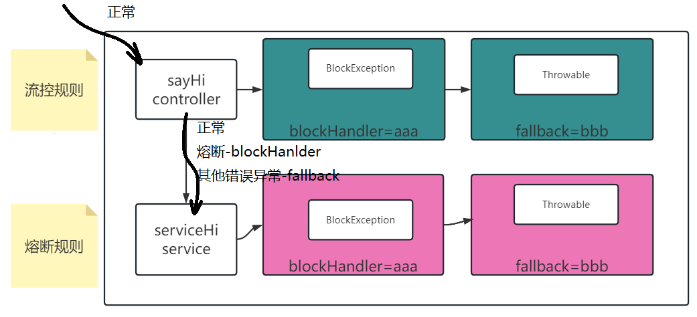

# Day10

## 1 规则详解

### 1.1 限流的规则

- resource: 定义当前规则绑定限制的资源id 名称

- count: 限流的阈值,grade=1 表示qps上限,grade=0 表示并发上限 

- grade: 1 qps类型的限流 0 并发类型限流

- strategy: 限流策略.以哪种方案和逻辑来限流 0直接 1关联 2链路 

- limitApp: 流控针对的调用来源,默认default不区分调用来源,配合strategy=1的是后和2的时候使用.

- controlBehavior: 限流效果(0直接拒绝,1Warm up,2排队)

```json
[
    {
       "resource":"addOrder",
       "count":"1",
       "grade":"1",
       "strategy":"1",
       "limitApp":"queryOrder",
       "controlBehavior":"0"
    }
]
```

strategy:

0 直接限制,针对当前定义资源,限制访问

1 关联,和limitApp有关系,如果当前资源流量,超过限流规则,限制limitApp定义的资源.


2 链路 决定限制流量的时候,先判断一下链路的入口,和limitApp有关,表示入口的资源


### 1.2 熔断规则

- 规则示例

```json
[
  {
    "resource": "sayHiService",
    "count": 1,
    "grade": 2,
    "timeWindow": 10,
    "minRequestAmount": 1,
    "slowRatioThreshold": 0.5,
    "statIntervalMs": 10000
  }
]
```

和流控规则使用区别在于,流控规则对象FlowRule,读取文件类型flow,熔断加载创建独享DegradeRule,文件规则类型,degrade.分开文件配置熔断规则,程序读取2个文件(2个数据源)

- 提供测试环境

1. demo03 测试 ,对原有资源,流控不要限制
2. 熔断(牺牲局部保存全局),出了毛病之后,对资源做断路访问. 定义一个测试熔断的资源

```java
package com.tarena.csmall.sentinel.demo03.service;
@Service
public class HelloService {
    public String sayHi(String name) throws BlockException {
        Entry entry=null;
        try{
            entry= SphU.entry("serviceHi");
            String result="你好啊!"+name;
            return result;
        }catch(DegradeException e){
            //捕获异常之后,编写降级的逻辑
            return "对不起,资源现在断路状态";
        }catch (BlockException e){
            //捕获异常之后,编写降级的逻辑
            return "对不起,您的请求,被blocked";
        }finally {
            //释放资源
            if (entry!=null){
                entry.exit();
            }
        }
    }
}
```

3. nacos配置一个熔断规则

```json
[
  {
    "resource": "serviceHi",
    "count": 1,
    "grade": 0,
    "timeWindow": 10,
    "minRequestAmount": 1,
    "slowRatioThreshold": 0.5,
    "statIntervalMs": 10000
  }
]
```

- count: 熔断触发的阈值(不再调用这个资源,而是访问降级策略),如果grade=0 count表示慢调用临界RT(响应时间单位毫秒),超过这个数字,就记录一次慢调用.grade是1,count值应该是>0小于1的小数,表示异常比例,grade=2 count配置整数,表示异常出现的次数

- slowRatioThreshold: 慢调用比例,在grade=0时生效.当满足count记录成慢调用时,达到这个阈值,触发熔断.
- minRequestAmount: 最少统计的请求数量.没达到最少数量,不会触发熔断
- statIntervalMs: 统计时长,在同一个统计时长之内的数据,才能触发熔断.单位毫秒数.

- timeWindow: 如果触发熔断,持续时间,单位秒
- grade: 熔断类型 0 默认值 慢调用比例 1 异常比例 2异常数

当前熔断规则定义:

在10秒钟之内,最少达到1次请求前提下,超过1毫秒的资源处理时间记录为慢调用,如果所有调用请求的慢调用比例达到50%,则资源会熔断,熔断持续时间10秒,10秒后,断路器半开,尝试访问资源,再次计算熔断规则.

4. 项目配置nacos读取熔断数据源.

```yaml
spring:
  cloud:
    sentinel:
      datasource:
        #定义一个数据源的名称
        key1:
          nacos:
            #数据源具体属性 nacos address namespace group-id 文件名称
            server-addr: localhost:8848
            data-id: flowRules.json
            data-type: json
            #namespace: f033ea8e-15ca-4f37-b112-127edc03de9e
            #每一个数据源的规则类型必须配置
            rule-type: flow
            #如果sentinel版本高于1.7 必须配置nacos用户名密码
            username: nacos
            password: nacos
        key2:
          nacos:
            #数据源具体属性 nacos address namespace group-id 文件名称
            server-addr: localhost:8848
            data-id: degradeRules.json
            data-type: json
            #namespace: f033ea8e-15ca-4f37-b112-127edc03de9e
            #每一个数据源的规则类型必须配置
            rule-type: degrade
            #如果sentinel版本高于1.7 必须配置nacos用户名密码
            username: nacos
            password: nacos
```

测试一下上述熔断规则中的异常数.

```json
[
  {
    "resource": "serviceHi",
    "count": 1,
    "grade": 2,
    "timeWindow": 10,
    "minRequestAmount": 1,
    "slowRatioThreshold": 0.5,
    "statIntervalMs": 10000
  }
]
```

上述表示内容: 10秒内统计异常数的熔断策略,如果最小请求达到1,并且异常数超过1,进入熔断持续时间10秒.

## 2 注解形式定义资源

try{}catch{}finally{} 硬编码组织管理生成resource资源.只能做代码片段的管理.

对业务侵入性比较强.sentinel提供了注解的形式,并且实现底层aop切面来完成资源的定义.

### 2.1 修改当前serviceHi案例为注解

- 修改HelloService

```java
@SentinelResource(value = "serviceHi")
public String sayHi(String name){
    String result="你好啊!"+name;
    try {
        Thread.sleep(100);
    } catch (InterruptedException e) {
        e.printStackTrace();
    }
    //int a=1/0;
    return result;
}
```

- 修改HelloController

```java
@GetMapping("/hello")
@SentinelResource(value="sayHi")
public String sayHi(String name){
    String result=helloService.sayHi(name);
    return result;
}
```

测试思路:

针对限流和熔断,不同的规则配置,测试的两个资源方法 HelloController.sayHi

HelloService.sayHi.

无论是限流还是熔断,现在保护的都是方法的调用,出现其中任意一种规则的限制,都会在调用方法时,不进入方法,直接抛对应异常.

### 2.2 blockhandler

blockhandler在**本类**,准备一个自定义名字的方法,来处理sentinel抛出的BlockException异常,包含各种类型规则的异常.

保证方法的特点:

1.入参和资源方法一致

2.出参合资源方法一致

3.参数多一个异常参数BlockException

```java
package com.tarena.csmall.sentinel.demo03.service;

import com.alibaba.csp.sentinel.Entry;
import com.alibaba.csp.sentinel.SphU;
import com.alibaba.csp.sentinel.annotation.SentinelResource;
import com.alibaba.csp.sentinel.slots.block.BlockException;
import com.alibaba.csp.sentinel.slots.block.degrade.DegradeException;
import com.alibaba.csp.sentinel.slots.block.flow.FlowException;
import org.springframework.stereotype.Service;

import java.io.IOException;

/**
 * @author java@tedu.cn
 * @version 1.0
 */
@Service
public class HelloService {
    //定义一个方法为sentinel资源使用的注解
    //value 定义资源名称
    //blockhandler 会在本类中,寻找一个同名的方法,做降级的处理 要求
    //方法参数和方法返回值要和当前目标方法一致,并且要求添加一个异常对象的参数
    //fallback
    public String blockError(String name,BlockException e){
        //异常 BlockException 有可能是所有不同规则对应的异常类型
        //DegradeException
        return "sorry,sayHi方法熔断了,"+name;
    }
    @SentinelResource(value = "serviceHi",blockHandler="blockError")
    public String sayHi(String name){
        System.out.println("进入到service的saiHi");
        String result="你好啊!"+name;
        try {
            Thread.sleep(100);
        } catch (InterruptedException e) {
            e.printStackTrace();
        }
        int a=1/0;
        return result;
    }
}
```

### 2.3 fallback

注解的另一个属性,处理逻辑和blockHanlder逻辑完全相同.

不同点在于,他可以管理blockHanlder不处理的异常.

```java
package com.tarena.csmall.sentinel.demo03.service;

import com.alibaba.csp.sentinel.Entry;
import com.alibaba.csp.sentinel.SphU;
import com.alibaba.csp.sentinel.annotation.SentinelResource;
import com.alibaba.csp.sentinel.slots.block.BlockException;
import com.alibaba.csp.sentinel.slots.block.degrade.DegradeException;
import com.alibaba.csp.sentinel.slots.block.flow.FlowException;
import org.springframework.stereotype.Service;

import java.io.IOException;

/**
 * @author java@tedu.cn
 * @version 1.0
 */
@Service
public class HelloService {
    //定义一个方法为sentinel资源使用的注解
    //value 定义资源名称
    //blockhandler 会在本类中,寻找一个同名的方法,做降级的处理 要求
    //方法参数和方法返回值要和当前目标方法一致,并且要求添加一个异常对象的参数
    //fallback
    public String aaa(String name,BlockException e){
        //异常 BlockException 有可能是所有不同规则对应的异常类型
        //DegradeException
        return "sorry,sayHi方法熔断了,"+name;
    }
    public String bbb(String name,Throwable e){
        return "sorry,sayHi出现了异常,"+name;
    }
    @SentinelResource(
            value = "serviceHi",
            blockHandler="aaa",
            fallback = "bbb")
    public String sayHi(String name){
        System.out.println("进入到service的saiHi");
        String result="你好啊!"+name;
        try {
            Thread.sleep(100);
        } catch (InterruptedException e) {
            e.printStackTrace();
        }
        int a=1/0;
        return result;
    }
}
```


### 2.4 类的静态方法

上述两种降级,都是在本类中实现的,如果降级逻辑相同的,比如不中的业务降级,只处理日志的记录.

为了减少业务代码类中,降级处理逻辑的代码繁杂,提供了简化,静态方法提取.


sentinel允许我们将降级逻辑的代码方法,放到指定的类中,提供静态方法调用.

节省本类代码,看起来更整洁.




### 2.5 订单新增中应用sentinel应用

限流目的: 根据预估/压测的数据 实现并发或者qps设置,保护服务器


熔断目的: 在保证主要业务功能成功实现前提下,附属,不重要的业务,可以做降级处理,避免他们问题影响主要业务功能.

结合业务实现降级策略:


**第一步**: order-adapter中实现熔断降级sentinel整合. sentinel 依赖

```xml
<!--整合熔断策略-->
<dependency>
    <groupId>com.alibaba.cloud</groupId>
    <artifactId>spring-cloud-starter-alibaba-sentinel</artifactId>
</dependency>
<!--sentinel整合nacos的数据源-->
<dependency>
    <groupId>com.alibaba.csp</groupId>
    <artifactId>sentinel-datasource-nacos</artifactId>
</dependency>
```

**第二步:** 修改代码 准备调用的类

```java
package cn.tedu.csmall.all.adapter.service.impl;

import cn.tedu.csmall.all.service.ICartService;
import cn.tedu.csmall.commons.pojo.order.dto.OrderAddDTO;
import com.alibaba.csp.sentinel.annotation.SentinelResource;
import com.alibaba.csp.sentinel.slots.block.BlockException;
import lombok.extern.slf4j.Slf4j;
import org.apache.dubbo.config.annotation.DubboReference;
import org.springframework.stereotype.Component;

/**
远程调用时,和cart购物车有关的方法
 单独封装一个bean对象
 */
@Component
@Slf4j
public class DubboCartService {
    @DubboReference
    private ICartService cartService;

    /**
     * 熔断降级的资源方法
     * @param orderAddDTO
     */
    @SentinelResource(
            value="cartDelete",
            blockHandler ="cartDeleteBlock" ,
            fallback = "cartDeleteFallback")
    public void cartDelete(OrderAddDTO orderAddDTO){
        cartService.deleteUserCart(orderAddDTO.getUserId(), orderAddDTO.getCommodityCode());
    }
    public void cartDeleteBlock(OrderAddDTO orderAddDTO, BlockException e){
        log.error("熔断规则生效,断路器打开状态,orderAddDTO:{},异常信息e:{}",orderAddDTO,e.getMessage());
    }
    public void cartDeleteFallback(OrderAddDTO orderAddDTO,Throwable e){
        log.error("业务调用异常,orderAddDTO:{},异常信息e:{}",orderAddDTO,e.getMessage());
    }
}
```

**第三步**: OrderServiceImpl代码修改

```java
@Autowired
private DubboCartService cartService;
@Override
public void orderAdd(OrderAddDTO orderAddDTO) {
    // 1.先减去订单中商品的库存数(调用Stock模块减少库存的方法)
    // 库存减少方法需要参数类型是StockReduceCountDTO,我们需要先实例化它
    StockReduceCountDTO countDTO=new StockReduceCountDTO();
    countDTO.setCommodityCode(orderAddDTO.getCommodityCode());
    countDTO.setReduceCount(orderAddDTO.getCount());
    // 利用Dubbo调用stock模块减少库存的业务逻辑层方法实现功能
    stockService.reduceCommodityCount(countDTO);
    // 2.从购物车中删除用户选中的商品(调用Cart模块删除购物车中商品的方法)
    // 利用dubbo调用cart模块删除购物车中商品的方法实现功能
    Order order=new Order();
    BeanUtils.copyProperties(orderAddDTO,order);
    // 下面执行新增
    orderMapper.insertOrder(order);
    log.info("新增订单信息为:{}",order);
    cartService.cartDelete(orderAddDTO);
}
```

**第四步**: 针对cartDelete资源形成熔断规则创建(nacos远程配置文件)

- 准备好远程nacos配置文件

```json
[
  {
    "resource": "cartDelete",
    "count": 100,
    "grade": 0,
    "timeWindow": 10,
    "minRequestAmount": 1,
    "slowRatioThreshold": 0.3,
    "statIntervalMs": 10000
  },
  {
    "resource": "cartDelete",
    "count": 3,
    "grade": 2,
    "timeWindow": 10,
    "minRequestAmount": 1,
    "statIntervalMs": 10000
  }
]
```

- YAML配置

```yaml
spring:
  application:
    name: csmall-order
  cloud:
    sentinel:
      datasource: 
        orderdb:
          nacos:
            server-addr: localhost:8848
            data-id: orderDegradeRules.json
            rule-type: degrade
            #1.7以上sentinel必须配置的
            username: nacos
            password: nacos
```

- nacos对应位置准备好文件


- 启动测试

启动order 启动 stock **cart 暂时不启动**

结论: 访问调用新增订单,库存能够扣减成功,订单可以新增成功,购物车调用每次都失败,抛出异常,异常到达熔断规则限制条件,删除购物车不在调用.

### 2.6 业务场景分析

新增订单案例. 在哪里实现性能,RT时间缩短的优化.


需要学习MQ消息队列技术--RocketMQ(rabbitmqMQ kafka)

## 3 RocketMQ

### 3.1 介绍

- 官网

https://rocketmq.apache.org/zh/

### 3.2 运行rocketmq的进程

核心进程2个：

- nameserver
- broker

视图进程1个：

- rocketmq-dashboard

### 3.3 启动nameserver

- 解压压缩包


- 环境变量配置ROCKETMQ_HOME


- 运行启动nameserver

rocketmq家目录中bin文件夹,打开cmd,

```shell
mqnamesrv.cmd
```

mac系统

```shell
mqnamesrv.sh
```

- 启动问题


原因: nameserver占用默认端口9876 已经被占用了 

解决方法: 查询出占用9876的端口进程pid号,直接taskkill杀死

- 启动成功


### 3.4 启动broker

- 启动命令

bin文件夹,打开cmd 

```shelL
mqbroker.cmd -n localhost:9876
```

- 启动成功


### 3.5 rocket-dashboard

rocketmq团队提供了一个查询rocket状态数据的仪表盘系统.

- 找到jar包


- 打开cmd

**提示**: 最好将jar包移动到没有空格,没有中文的路径,再运行cmd 粘贴命令

```shell
java -jar rocketmq-dashboard-1.0.1-SNAPSHOT.jar --server.port=8080 --rocketmq.config.namesrvAddr=localhost:9876 
```


- 访问仪表盘


### 3.6 修改rocketmq启动占用内存的问题

默认占2G,如果因为内存问题,需要修改调小.

nameserver对应runserver.cmd

broker对应runbroker.cmd


### 3.7 JAVA_HOME

当前系统的JAVA_HOME环境变量,保证是1.8

java -version 版本提示,和JAVA_HOME 是不是1.8没有太大关系.


**课堂作业:**

请在business中,提供sentinel 对buy方法资源的熔断

考虑远程调用orderService 需要不需要组织成新资源.

# 附录


