# Day 11

## 1 问题解析

### 1.1 JAVA_HOME作用

- 创建一个demo项目 spring web应用

- package 对项目打包

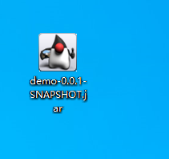

```Maven
<build>
    <plugins>
        <plugin>
            <groupId>org.springframework.boot</groupId>
            <artifactId>spring-boot-maven-plugin</artifactId>
        </plugin>
    </plugins>
</build>
```

- java命令运行这个jar包

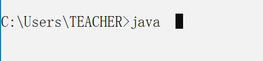

他是从环境变量Path中找到对应命令脚本所在的文件夹,从而运行.

电脑中安装了其他版本java,可以利用绝对路径找到运行java命令.

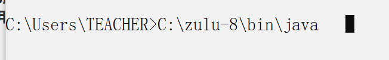

```shell
java -jar C:\Users\TEACHER\Desktop\demo-0.0.1-SNAPSHOT.jar
```

运行java命令时,可以添加选项 -Xmx128m -Xms128m.

- nacos

编辑打开,观察文件内容,实际上,nacos运行的是一个java -jar *** 的命令,需要找到java的命令java.exe文件,他是通过JAVA_HOME环境变量找到的,所以如果JAVA_HOME指向java版本,不支持当前nacos运行.

可以修改startup.cmd文件 使用的JAVA_HOME环境变量.

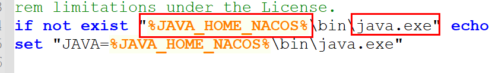

- ROCKETMQ

cmd脚本格式,逻辑,JAVA_HOME作用和nacos一样的.

## 2 RocketMQ案例

### 2.1 MQ基本结构

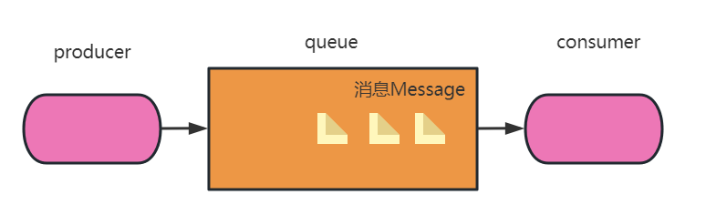

message: 消息数据对象

product: 程序代码,生成消息,发送消息到队列

consumer: 程序代码,监听(绑定)队列,获取消息,执行消费代码

queue: Rocketmq rabbitmq kafka这些消息队列中间件软件.

### 2.2 常见应用场景

- 短信
  - producer: 手机短信进程,就是生产者
  - message: 包含了编辑的文本短信信息的消息对象
  - consumer: 能够接收到消息的手机短信进程
- 邮件
  - producer: 发邮件用户的电脑中邮件进程
  - consumer: 收邮件用户的电脑中邮件进程
  - message: 包含了邮件主题消息的邮件对象

- 抢红包
  - producer: 发红包的用户手机客户端进程
  - message: 红包个数 封装的已经包含金额的消息对象
  - consumer: 抢红包用户手机客户端进程中,通过点击开红包,触发的代码片段

### 2.3 入门案例工程

#### 2.3.1 创建一个测试项目csmall-for-jsd-rocketmq-study

- 创建项目工程

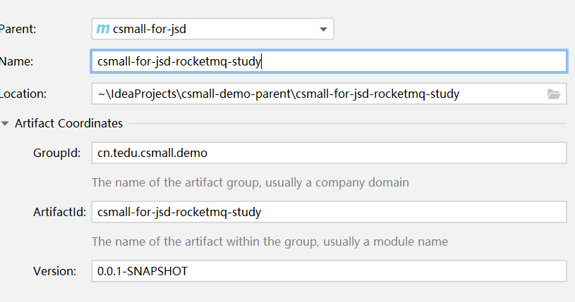

- 添加依赖

```xml
<dependency>
    <!--2.2.2底层rocketmq客户端4.9.1-->
    <groupId>org.apache.rocketmq</groupId>
    <artifactId>rocketmq-spring-boot-starter</artifactId>
    <version>2.2.2</version>
</dependency>
<dependency>
    <!--测试包-->
    <groupId>junit</groupId>
    <artifactId>junit</artifactId>
    <scope>test</scope>
</dependency>
```

#### 2.3.2 测试功能

- Product

```java
package com.tarena.csmall.rocket;

import org.apache.rocketmq.client.exception.MQClientException;
import org.apache.rocketmq.client.producer.DefaultMQProducer;
import org.apache.rocketmq.client.producer.SendResult;
import org.apache.rocketmq.common.message.Message;
import org.junit.Test;

import java.nio.charset.StandardCharsets;

/**
  测试生产消息,发送消息的逻辑
 */
public class MyProducer {
    /**
     * 向rocketmq发送第一条消息
     */
    @Test
    public void sendTest01() throws Exception {
    //1.准备一个生产者对象,开启长链接
        DefaultMQProducer producer=new DefaultMQProducer();
        //对当前producer设置分组
        producer.setProducerGroup("first-producer-group");
        //连接nameserver localhost:9876
        producer.setNamesrvAddr("localhost:9876");
        //开启长链接
        producer.start();
    //2.封装一个消息对象,我们想要发送的内容,只是消息的一部分
        //创建一个消息对象
        Message message=new Message();
        //消息携带的内容 body
        String msg="当前发送的第一条消息";
        message.setBody(msg.getBytes(StandardCharsets.UTF_8));
        //设置消息主题,分类,按业务分类
        message.setTopic("first-topic-a");
        //主题标签 和key标识 
    //3.调用api方法将消息发送,接收返回结果,查看发送的信息比如状态
        //分为异步发送,同步发送,异步发送性能速度更高,但是无法保证成功.
        //同步发送,性能速度没有异步快,但是可以接收反馈结果
        SendResult send = producer.send(message);
        //result解析获取发送相关的信息
        System.out.println("发送状态:"+send.getSendStatus());
        System.out.println("消息到达主题,队列,broker信息:"+send.getMessageQueue());
    }
}
```

- 启动程序,执行测试代码
  - **nameserver**
  - **broker**
  - dashboard
- Consumer

```java
package com.tarena.csmall.rocket;

import org.apache.rocketmq.client.consumer.DefaultMQPushConsumer;
import org.apache.rocketmq.client.consumer.listener.ConsumeConcurrentlyContext;
import org.apache.rocketmq.client.consumer.listener.ConsumeConcurrentlyStatus;
import org.apache.rocketmq.client.consumer.listener.MessageListenerConcurrently;
import org.apache.rocketmq.common.message.MessageExt;
import org.junit.Test;

import java.nio.charset.StandardCharsets;
import java.util.List;

/**
 消息的消费逻辑
 */
public class MyConsumer1 {
    @Test
    public void consumerTest01() throws Exception {
    //1.构建一个消费者对象,连接nameserver创建长链接
        // push pull的区别 push消费端,消费的消息是队列推送给他的
        // pull 消费端代码执行一次pull 拉取过来一条消息
        // 收邮件 推的, 抢红包 拉取的
        DefaultMQPushConsumer consumer=new DefaultMQPushConsumer();
        //设置nameserver地址
        consumer.setNamesrvAddr("localhost:9876");
        //消费者分组
        consumer.setConsumerGroup("first-consumer-group-a");
        //定义监听的主题,消费端代码会根据定义的主题寻找nameserver路由信息,找到主题的队列进行绑定
        //topic 主题名称,subExpression 定义过滤逻辑 *表示匹配所有
        consumer.subscribe("first-topic-a","*");
    //2.执行api开始监听主题,实现队列的消费
        //提供给consumer一个监听器
        consumer.setMessageListener(new MessageListenerConcurrently() {
            /**
             * 推送过来的消息,都会调用consumerMessage执行消费逻辑
             * @param list 消息数据 list表示可以批量处理的消息,不是批量消息,list元素只有1个
             * @param consumeConcurrentlyContext
             * @return
             */
            @Override
            public ConsumeConcurrentlyStatus consumeMessage(
                    List<MessageExt> list,
                    ConsumeConcurrentlyContext consumeConcurrentlyContext) {
                //获取消息 由于不是批量发送只有list一个元素
                MessageExt messageExt = list.get(0);
                messageExt.getMsgId();//唯一的一个标识,每次消息组装的对象都会在发送时,生成一个msgId
                byte[] body = messageExt.getBody();
                //将消息转化
                String message=new String(body, StandardCharsets.UTF_8);
                System.out.println("消费端获取到消息:"+message);
                //context 控制返回确认信息 ackIndex顺序
                //返回消费状态 success 队列会将消息对应当前消费组,移动偏移量,记录消费完成
                return ConsumeConcurrentlyStatus.CONSUME_SUCCESS;
            }
        });
        //开启长连接
        consumer.start();
        while (true);
    }
}
```

### 2.4 Rocket中核心概念

#### 2.4.1 nameserver

NameServer是一个简单的 Topic 路由注册中心，支持 Topic、Broker 的动态注册与发现。

主要包括两个功能：

- **Broker管理**，NameServer接受Broker集群的注册信息并且保存下来作为路由信息的基本数据。然后提供心跳检测机制，检查Broker是否还存活；
- **路由信息管理**，每个NameServer将保存关于 Broker 集群的整个路由信息和用于客户端查询的队列信息。Producer和Consumer通过NameServer就可以知道整个Broker集群的路由信息，从而进行消息的投递和消费。

NameServer通常会有多个实例部署，各实例间相互不进行信息通讯。Broker是向每一台NameServer注册自己的路由信息，所以每一个NameServer实例上面都保存一份完整的路由信息。当某个NameServer因某种原因下线了，客户端仍然可以向其它NameServer获取路由信息。

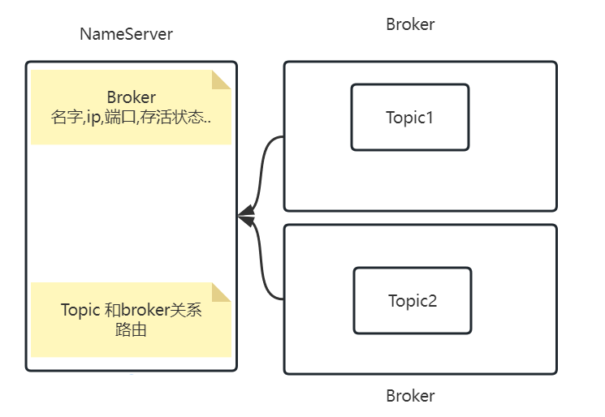

总之: nameserver作为协调器, 谁的信息被用到,就要到nameserver注册,谁要用注册信息,就要到nameserver同步抓取.

broker要作为rocketmq容器被生产者和消费者代码使用.

#### 2.4.2 broker

**Broker主要负责消息的存储、投递和查询以及服务高可用保证。**

NameServer几乎无状态节点，因此可集群部署，节点之间无任何信息同步。Broker部署相对复杂。

在 Master-Slave 架构中，Broker 分为 Master 与 Slave。一个Master可以对应多个Slave，但是一个Slave只能对应一个Master。Master 与 Slave 的对应关系通过指定相同的BrokerName，不同的BrokerId 来定义，BrokerId为0表示Master，非0表示Slave。Master也可以部署多个。

#### 2.4.3 主题队列

简单理解,主题是**一类消息的集合**,每次我们发送消息必须指定消息绑定某一个主题.

生产者发送的某一条消息,只能指向一个主题,多条消息可以指向同一个主题,同一个主题中有多个消息队列保存消息,消费端可以根据订阅的主题消费不同主题的消息.这样可以实现业务隔离.

比如电商主题可以是order,主题也可以是cart,还可以是product相关的..

一类消息,从数据的格式,携带body格式,都是完全一致的. 不会出现"**第一条消息的**"body是普通字符串,第二条消息是个对象Json,不可能第一条消息**延迟**消息(支付订单倒计时取消),第二条消息普通同步消息.

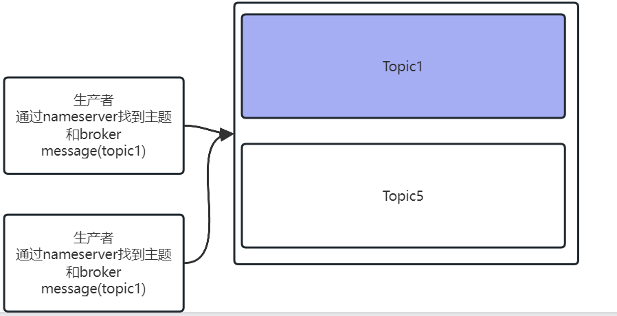

#### 2.4.4 queue队列

存储消息的物理实体(最小单位)。一个Topic中可以包含**多个Queue**(分布式体现的关键)，每个Queue中存放的就是该Topic的消息。一个Topic的Queue也被称为一个Topic中消息的分区（**Partition**）。

注意:一个Topic的Queue中的消息只能被一个消费者组中的一个消费者消费(消费点位逻辑)。一个Queue中的消息不允许同一个消费者组中的多个消费者同时消费。

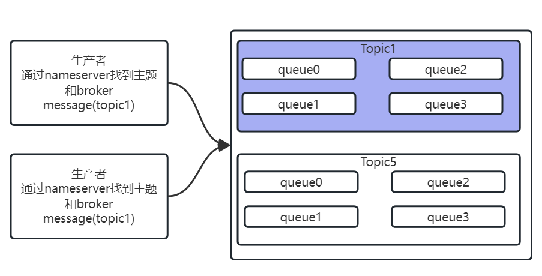

#### 2.4.5 生产者

问题:通过上述概念的了解,生产者,nameserver,broker之间是如何交互的.

- 启动 nameserver 保存broker路由信息
- 主题一旦创建,保存broker里,同时生成队列,这些数据,作为路由信息保存nameserver
- 生产者从nameserver拿到当前集群所注册信息(路由)
- 发送消息的时候,连接具体的那个broker找具体的topic的具体queue实现消息发送,使用的具体信息,在返回的SendResult中体现

#### 2.4.6 消费者分组和生产者分组

消息生产者，负责生产消息。本质上是程序中的一段代码.Producer投递消息到broker代理中.找到主题,负载均衡存放到队列中.

RocketMQ中的消息生产者都是以生产者组（Producer Group）的形式出现的。生产者组是同一类生产者的集合，产生同一类型的消息,这类Producer发送相同Topic类型的消息。**一个生产者组可以同时向多个主题发送消息。**

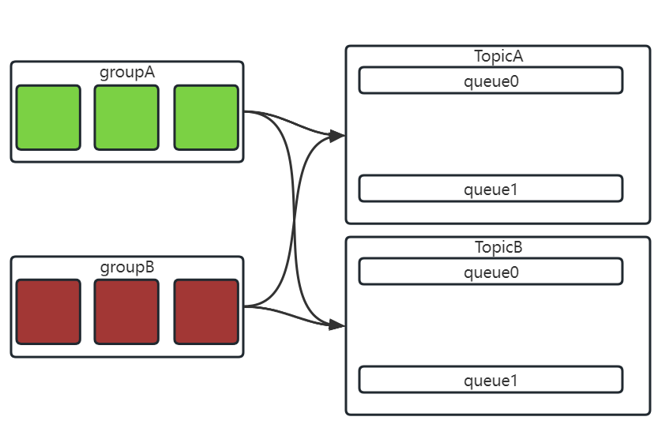

RocketMQ中的消息消费者都是以消费者组（Consumer Group）的形式出现的。消费者组是同一类消费者的集合，这类Consumer消费的是同一个Topic类型的消息,对应同一类消息数据。消费者组使得在消息消费方面，实现负载均衡（将一个Topic中的不同的Queue平均分配给同一个Consumer Group的不同的Consumer，注意，并不是将消息**负载均衡**）和容错（一个Consmer挂了，该Consumer Group中的其它Consumer可以接着执行消费逻辑.

由于主题中有多个队列,一组消费者,最多有和队列一样数量的消费成员,再多,无法绑定队列消费消息了.

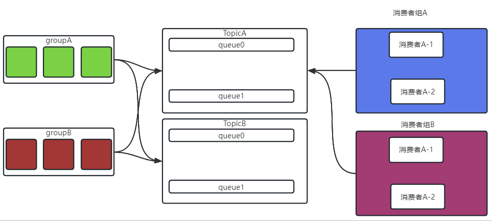

#### 2.4.7 消费点位(offSet)

在队列中记录了所有和偏移量有关的数据比如:

- 最小偏移量:都是0
- 最大偏移量:当前消息的个数

在消费者中也在记录偏移量

- 当前组对应主题队列的消费最小偏移量,和队列的最大偏移量(通过这两个值,能够知道当前消费者消费到哪个消息,还有多少没消费)

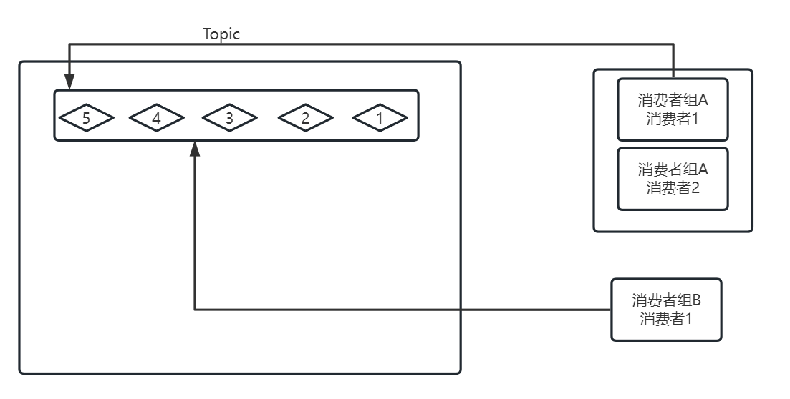

- 不同的消费者组

  - 记录的消费点位offset数据相互隔离的.

  

### 2.5 系统作业

根据官方的案例 生产端

https://rocketmq.apache.org/zh/docs/4.x/

- 普通消息
- 顺序消息
- 延迟消息
- 批量消息
- 事务消息

消费端 

- push
- pull

完成这些案例的代码编写,实现消息各种不同方式的发送,不同方式消费.