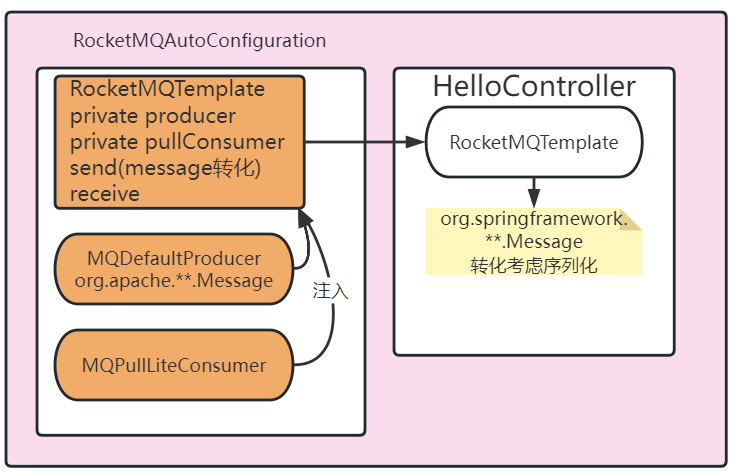

# Day12

## 1 问题解析

### 1.1 顺序消息

生产者代码核心逻辑:

按照订单Id,绑定一个固定的队列,按照生成消息的时间,做顺序发送,然后做顺序消费.

消费者代码核心逻辑:

按顺序消费,消费逻辑主要想要展现有消费成功,有消费失败

### 1.2 事务消息

参考今日内容

## 2 Rocket核心概念

### 2.1 Keys

发送消息的时候,消息可以携带一个属性properties.

主要作用就是方便消息的查询.

在业务代码中,一般都用来绑定业务数据,比如orderId orderSn userId等.

### 2.2 Tags

每个消息允许绑定一个标签,作用是在消费的时候对于主题消费大量消息来进行过滤使用的.

如果过滤掉,消费端代码consumeMessage()对于这条过滤的消息,不执行方法.


根据这个业务场景,做简单测试

producer: 两个组

consumer:两个组

约定tag: group1=ORDER group2=CART

## 3 Springboot整合RocketMQ

整合软件技术 redis mybatis es nacos dubbo

依赖:**-starter

yaml文件配置: 对应底层的**Properties类属性,封装配置类的.

自定义配置类或者注解使用(RocketMQTemplate)

### 3.1 案例使用

- 依赖

```xml
<!--整合的依赖-->
<dependency>
    <groupId>org.apache.rocketmq</groupId>
    <artifactId>rocketmq-spring-boot-starter</artifactId>
    <version>2.2.2</version>
</dependency>
<!--starter-web-->
<dependency>
    <groupId>org.springframework.boot</groupId>
    <artifactId>spring-boot-starter-web</artifactId>
</dependency>
```

- 属性配置yaml

```yaml
rocketmq:
  # namesrv地址
  name-server: localhost:9876
  # 当前应用程序的默认生产者和消费者分组
  # 代码中可以覆盖
  producer:
    group: my-rocket-group-prod
  consumer:
    group: my-rocket-group-consume
```

- 在代码中编写生产者和消费者逻辑

### 3.2 准备案例环境

HelloController+HelloService实现案例调用功能;

代码架构


调整架构,从HelloController同步调用,修改成引入rocketmq的异步调用.


### 3.3 生产端发送消息

发送消息的代码位置,注入一个RocketMQTemplate. 

HelloController

```java
package com.tarena.csmall.rocketmq.demo.controller;

import com.tarena.csmall.rocketmq.demo.service.HelloService;
import org.apache.rocketmq.client.producer.SendResult;
import org.apache.rocketmq.spring.core.RocketMQTemplate;
import org.springframework.beans.factory.annotation.Autowired;
import org.springframework.messaging.Message;
import org.springframework.messaging.support.MessageBuilder;
import org.springframework.web.bind.annotation.GetMapping;
import org.springframework.web.bind.annotation.RestController;

/**
 * @author java@tedu.cn
 * @version 1.0
 */
@RestController
public class HelloController {
    @Autowired
    private RocketMQTemplate rocketMQTemplate;
    @GetMapping("/hello")
    public String sayHi(String name){
        //发送消息 Message是rocketMQTemplate支持发送的消息参数
        //和底层api方法的Message不是同一个类,相当于将底层Message包装了一次.
        Message message=
                //payLoad在和,就是body
                MessageBuilder.withPayload(name)
                        .setHeader("age",18)
                        .build();
        SendResult sendResult = rocketMQTemplate.syncSend("rocket-topic-a:tagA", message);
        //rocketMQTemplate.receive();
        //发送消息
        return "success";
    }
}
```

无论RocketMQTemplate 用哪种发送send消息,最终都会调用doSend实现方法.其他所有方法syncSend send都是重载+外部调用.

doSend方法,将Message对象中的payLoad做了序列化,存储到rocketmq message的body中. 将header存储到header头中. 方便消费的时候做反序列化.



### 3.4 消费端(push)

**注意**:如果使用pull消费,继续使用RocketMQTemplate调用receive方法.每调用一次

就从对应目标队列中拿到一条消息.

push的消费端,处理步骤

1. 准备消费端component bean对象
2. 实现消费端push的接口,定义消息的泛型(涉及到spring框架如何将消息反序列化解析).实现方法
3. 配置注解,提供消费属性(监听绑定队列,过滤tag,消费者组);


```java
package com.tarena.csmall.rocketmq.demo.consumer;

import org.apache.rocketmq.spring.annotation.RocketMQMessageListener;
import org.apache.rocketmq.spring.core.RocketMQListener;
import org.springframework.stereotype.Component;

/**
    topic:消费端绑定主题
    consumerGroup:消费者分组
    selectorExpression: 顾虑的标签
 */
@Component
@RocketMQMessageListener(
        topic = "rocket-topic-a",
        consumerGroup = "${rocketmq.consumer.group}",
        selectorExpression = "*")
public class MyConsumerListener implements RocketMQListener<String> {
    /**
     * 每个listener自定义的对象,底层都会开启一个消费进程 绑定这个listerner
     * 在底层消费者中,监听consumerMessage方法里,调用这个类的onMessage;
     * 调用之前,已经实现了对象消息数据的转化
     * 接口有泛型,底层方法逻辑,会根据泛型,将消息message进行反序列化和数据封装
     * @param name 根据泛型反序列化的body对象
     * 对于消费成功还是失败,spring整合rocketmq: 只要抛异常,就返回失败,不抛异常就是正常
     */
    @Override
    public void onMessage(String name) {
        System.out.println("消费端接收到消息:"+name);
    }
}
```

### 3.5 异步下单操作


将同步的调用关系,转化成异步调用关系,可以引入rocketmq消息中间件.

BusinessService-->IOrderService 同步关系

OrderService-->ICartService OrderService-->IStockService 同步关系

考虑: 是不是所有的同步,都有必要转化成异步.

1. **Business-->调用OrderService**

可以将同步转化成异步.这样做的好处,提升请求并发qps. 缺点是不知道订单到底是成功还是失败.(**业务处理落地方案选型在这里是需要平衡的,并发和业务用户体验**)

2. **Order-->ICartService**

可以异步.只要订单新增成功,说明库存够用.删除购物车,可以不在当前业务同步执行,降低订单处理时长,提升RT效率.

3. Order-->IStockService

不可以异步,必须同步.(**银行账号,支付平台账号划款,转账到当前系统的用户账户金额中**)

将Business调用Order的过程实现异步下单:

Producer: BusinessServiceImpl生产消息 发送到队列

Consumer: Order的web应用实现消息的接收,调用OrderServiceImpl实现消费逻辑.


### 3.6 Business生产端

- 依赖 rocketmq

```xml
<dependency>
    <groupId>org.apache.rocketmq</groupId>
    <artifactId>rocketmq-spring-boot-starter</artifactId>
    <version>2.2.2</version>
</dependency>
```

- yaml 配置属性

```yaml
#添加rocket配置
rocketmq:
  name-server: localhost:9876
  producer:
    group: business-producer
  consumer:
    group: business-consumer
```

- 注入template发送消息.根据发送结果,处理业务逻辑

```java
package cn.tedu.csmall.all.adapter.service.impl;

import cn.tedu.csmall.all.service.IBusinessService;
import cn.tedu.csmall.all.service.IOrderService;
import cn.tedu.csmall.commons.exception.CoolSharkServiceException;
import cn.tedu.csmall.commons.pojo.order.dto.OrderAddDTO;
import cn.tedu.csmall.commons.restful.ResponseCode;
import lombok.extern.slf4j.Slf4j;
import org.apache.dubbo.config.annotation.DubboReference;
import org.apache.rocketmq.client.producer.SendResult;
import org.apache.rocketmq.spring.core.RocketMQTemplate;
import org.springframework.beans.factory.annotation.Autowired;
import org.springframework.messaging.Message;
import org.springframework.messaging.support.MessageBuilder;
import org.springframework.stereotype.Service;


@Service
@Slf4j
public class BusinessServiceImpl implements IBusinessService {
    @Autowired
    private RocketMQTemplate rocketMQTemplate;
   /* @DubboReference(loadbalance = "roundrobin")
    private IOrderService dubboOrderService;*/
    @Override
    public void buy() {
        // 模拟触发购买业务
        // 先实例化一个用于新增订单的DTO
        OrderAddDTO orderAddDTO=new OrderAddDTO();
        orderAddDTO.setUserId("UU100");
        orderAddDTO.setCommodityCode("PC100");
        //订单 快照
        orderAddDTO.setMoney(100);
        orderAddDTO.setCount(2);
        // 暂时只能进行输出,后期有微服务支持可以调用其他模块
        log.info("新增订单信息为:{}",orderAddDTO);
        // dubbo调用order模块新增订单的方法
        // 将上面实例化的orderAddDTO当做参数,让它在数据库中生效
        /*dubboOrderService.orderAdd(orderAddDTO);*/
        //替换成异步生单逻辑 发送订单新增的消息
        //消息的携带信息,消息的封装特点. 消息一定要精简(足够小的占用空间)准确(足够用处理业务逻辑)
        Message message= MessageBuilder.withPayload(orderAddDTO).build();
        SendResult sendResult = rocketMQTemplate.syncSend("business-order-topic:orderAdd", message);
        if (!sendResult.getSendStatus().toString().equals("SEND_OK")){
            throw new CoolSharkServiceException(ResponseCode.BAD_REQUEST,"订单消息发送失败");
        }
    }


}
```

### 3.7 Order消费端

课堂跟踪练习:参考以下步骤,实现消费端

#### 3.7.1 Order-adapter整合 rocketmq

- 依赖

- yaml

- 代码:消费端

#### 3.7.2 消费逻辑步骤

- 消费监听 实现接口
- spring bean对象
- 注解提供消费详细信息(主题,分组,过滤tag)

#### 3.7.3 获取消息之后的业务逻辑

- 注入IOrderServiceImpl实现,再调用orderAdd方法

- 消息类型是什么OrderAddDTO直接接收

```java
package cn.tedu.csmall.all.adapter.consumer;

import cn.tedu.csmall.all.service.IOrderService;
import cn.tedu.csmall.commons.exception.CoolSharkServiceException;
import cn.tedu.csmall.commons.pojo.order.dto.OrderAddDTO;
import lombok.extern.slf4j.Slf4j;
import org.apache.rocketmq.spring.annotation.RocketMQMessageListener;
import org.apache.rocketmq.spring.core.RocketMQListener;
import org.springframework.beans.factory.annotation.Autowired;
import org.springframework.stereotype.Component;

/**
 * @author java@tedu.cn
 * @version 1.0
 */
@Component
@RocketMQMessageListener(
        topic = "business-order-topic",
        consumerGroup = "${rocketmq.consumer.group}",
        selectorExpression = "orderAdd")
@Slf4j
public class OrderAddConsumerListener implements RocketMQListener<OrderAddDTO> {
    @Autowired
    private IOrderService orderService;
    @Override
    public void onMessage(OrderAddDTO orderAddDTO) {
        //调用service,执行orderAdd方法
        //异常处理逻辑,消息消费失败的处理逻辑
        try{
            orderService.orderAdd(orderAddDTO);
        }catch (CoolSharkServiceException e){
            //业务异常,说明订单新增业务性失败,比如库存没了
            log.error("库存减少失败,库存触底了:{},异常信息:{}",orderAddDTO,e.getMessage());
        }
        
    }
}
```


MQ的功能之一: 异步解耦

MQ的功能之二: 消峰填谷

#### 3.7.4  场景分析


分布式系统架构中,队列是分布式的,生产端是分布式集群,消费端也是分布式集群.

相当于有多个消费端同时监听队列,同时减库存,写入订单.

面试题:如何处理消息重复消费的问题. 重复消费大部分场景,需要解决的.

引入2个概念来解决: **幂等的业务方法**,和消息的**分布式锁**.

### 3.8 消息重复消费的问题

消息队列重复消费问题,是深入询问的面试题之一,设计到的2个概念,本章节详细介绍一下.

#### 3.8.1 方法的幂等

结论: 一个方法的一次业务逻辑调用和N次调用的结果是一致的,我们称这种方法就是幂等.

一旦重复消费,一定要把消费的业务逻辑方法(orderAdd)设计成幂等的.

- 幂等的方法
  - GET方法: 查询方法,天生幂等.
  - DELETE方法: 删除方法,天生幂等.
  - PUT方法: 修改,并不是天生幂等,需要设计
    - 减少库存: 
      - update stock_tbl set stock=stock-#{stock} where id=#{id}(不是幂等)
      - select * from stock_log where order_id=#{orderId}(查询日志,判断是否已经见过库存了),没有数据 update stock_tbl set stock=stock-#{stock} where id=#{id},insert into stock_log (字段) values (订单id,商品减库存信息) (这样设计就幂等了,依然有问题)
  - POST方法: 新增,并不是天生幂等,需要设计
    - 新增订单: insert into order_tbl (order_id,order_item_id,count,user_id) values (各种属性);如果使用唯一属性校验,作用在order_id order_sn(编号).同一张订单,这个字段值是相同(幂等满足,没做幂等不满足)

- 当前orderAdd方法设计幂等的解决思路(之一)

  - 使用订单id或者订单编号,**userId+商品id**(这个只满足当前我们的案例特点,不满足实际场景.)查询订单,如果已经存在了,库存不减少,订单不增了,购物车不用删除了
  - 补充一个查询费方法

  ```java
  @Override
  public void orderAdd(OrderAddDTO orderAddDTO) {
      //幂等设计思路: 利用userId和commodityCode 查询,如果已经存在了订单,方法直接执行结束
      //如果结果不存在,减库存,生单,删除购物车
      int count=orderMapper.selectExists(orderAddDTO);
      if (count>0){
          log.debug("订单已经新增了");
          return;
      }
      StockReduceCountDTO countDTO=new StockReduceCountDTO();
      countDTO.setCommodityCode(orderAddDTO.getCommodityCode());
      countDTO.setReduceCount(orderAddDTO.getCount());
      // 利用Dubbo调用stock模块减少库存的业务逻辑层方法实现功能
      stockService.reduceCommodityCount(countDTO);
      // 2.从购物车中删除用户选中的商品(调用Cart模块删除购物车中商品的方法)
      // 利用dubbo调用cart模块删除购物车中商品的方法实现功能
      Order order=new Order();
      BeanUtils.copyProperties(orderAddDTO,order);
      // 下面执行新增 假设insert是幂等的.
      orderMapper.insertOrder(order);
      log.info("新增订单信息为:{}",order);
      cartService.cartDelete(orderAddDTO);
  }
  ```

​		也在OrderMapper补充了一个sql语句,查询存在的订单.

```java
@Select("select count(id) from " +
"order_tbl where user_id=#{userId} and commodity_code=#{commodityCode}")
int selectExists(OrderAddDTO orderAddDTO);
```

#### 3.8.2 分布式锁

当前分布式消费架构


即使,将方法设计成幂等,这个架构中,消息重复消费

,满足线程安全问题的所有因素

- 并发/多线程
- 写操作
- 共享数据

只要解决其中一点,线程安全问题就消失了.

并发多线程-->串行

写操作--> 避免写(不能满足当前案例,必须写)

共享数据-->个体数据(不能满足,重复消费,重复订单是前提)

分布式线程安全问题的解决方案---**分布式锁**

错误思路: 引入synchronized同步锁,不能解决分布式场景下,多个进程的并发线程安全问题.


**概念**: 分布式场景下,多进程,多线程并发的抢锁机制. 抢到资源锁,执行业务逻辑,抢不到等待或者放弃执行.能够避免对同一个资源出现并发多线程操作的解决方案.

和synchronized的区别在于 synchronizeds本地锁.管理一个进程中的多线程,分布式锁是管理多个进程中的多线程.

分布式锁当前落地方案: redis setnx命令

## 4 Redis五中数据类型

目标:

- [ ] 了解redis五中类型以及应用场景
- [ ] 了解redis五中类型的操作命令
- [ ] 理解redis的分布式锁命令setnx机制

### 4.1 和类型无关的命令

- keys {patterns}

```shel
keys *
```

这个命令表示要查询 * 匹配的当前redis节点的所有key值.

**不能在线上系统redis使用keys *,会造成redis阻塞**

**不支持cluster分布式结构的**

- exists key

```
exists user
```

查看一个key值是否存在.如果存在返回1,如果不存在返回0 可以查看多个key

```exists
exists key1 key2 ...
```

- expire/pexpire key time

```
expire user 1000
```

给user数据在redis设置超时时间1000秒

```shell
pexpire user 1000
```

给user数据在redis设置超时时间1000毫秒

对于使用springboot客户端直接应用redis的程序代码,区别不大.

- ttl/pttl

```shell
ttl name
```

查看name这个key值在redis剩余秒数

```shell
pttl name
```

查看name这个key值在redis剩余毫秒数

**永久数据 -1,超时/删除数据 -2**

- del key 

```shell
del name
```

删除一个叫做name的key值

- type key

``` shell
>set name wanglaoshi
>type name
```

使用type可以查询当前redis存储这个key使用都的类型名称.

```shell
>lpush list01 100 200 300
>type list01
```

- flushall

```shell
flushall
```

清空当前redis实例中所有记录的数据.

**所以这个命令不能在生产环境上线的系统使用**

**经常在开发和测试环境使用**

- save

```shell
save
```

redis默认给你提供save命令的间隔调用时间

900 1

300 10

60 10000

上述配置的含义,表示三个定时扫描的逻辑. 前面的数值是时间秒,后面表示判断数据变动的次数.如果满足则调用save.(定时的趋势,数据变动越频繁,save调用的时间间隔越短)

如果是非正常关机,非正常断电导致redis进程消失没有save的数据,就丢失了

### 4.2 基本类型-String

### 4.3 基本类型-hash

### 4.4 基本类型-list

### 4.5 基本类型-set

### 4.6 基本类型-zset(sorted set)

相关命令,请参考 笔记resources中的redis.mht 可以用浏览器打开

只需要阅读 命令部分


