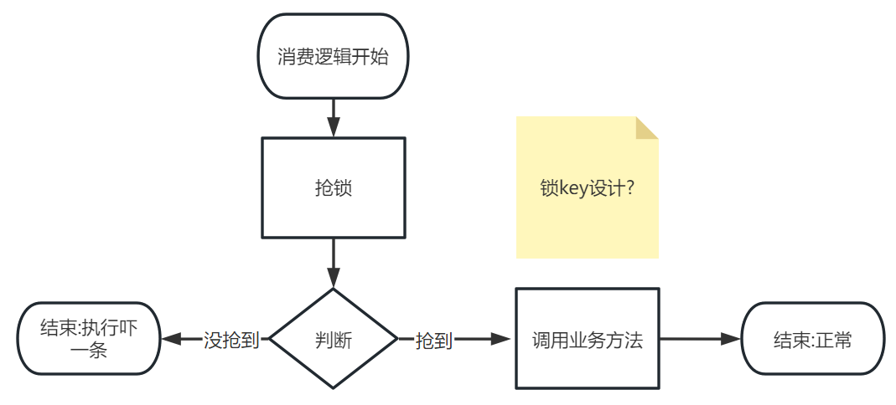
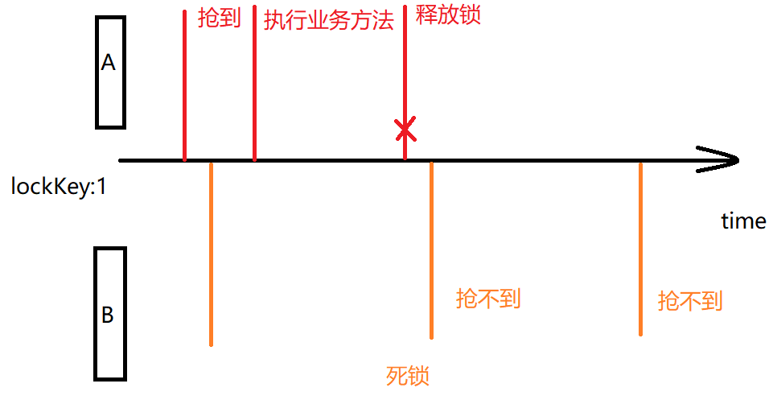
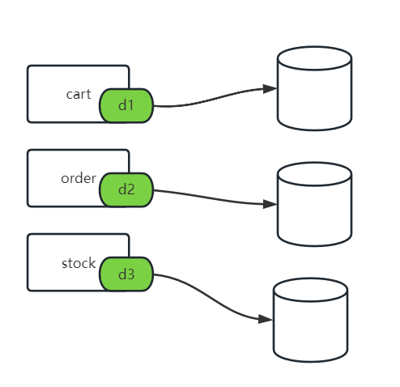

# Day13

## 回顾昨天思路

- 项目功能引入队列,实现异步调用
- 消息丢失[待补充],重复消费[重复消费原因待补充]
- 方法设计成幂等
- 方法有多线程调用安全问题
- 分布式锁--落地方式redis setnx

## 1 Redis五中数据类型

目标:

- [x] 了解redis五中类型以及应用场景
- [x] 了解redis五中类型的操作命令(增删查改)
- [x] 理解redis的分布式锁命令setnx机制

### 1.1 和类型无关的命令

- keys {patterns}

```shel
keys *
```

这个命令表示要查询 * 匹配的当前redis节点的所有key值.

**不能在线上系统redis使用keys *,会造成redis阻塞**

**不支持cluster分布式结构的**

- exists key

```
exists user
```

查看一个key值是否存在.如果存在返回1,如果不存在返回0 可以查看多个key

```exists
exists key1 key2 ...
```

- expire/pexpire key time

```
expire user 1000
```

给user数据在redis设置超时时间1000秒

```shell
pexpire user 1000
```

给user数据在redis设置超时时间1000毫秒

对于使用springboot客户端直接应用redis的程序代码,区别不大.

- ttl/pttl

```shell
ttl name
```

查看name这个key值在redis剩余秒数

```shell
pttl name
```

查看name这个key值在redis剩余毫秒数

**永久数据 -1,超时/删除数据 -2**

- del key 

```shell
del name
```

删除一个叫做name的key值

- type key

``` shell
>set name wanglaoshi
>type name
```

使用type可以查询当前redis存储这个key使用都的类型名称.

```shell
>lpush list01 100 200 300
>type list01
```

- flushall

```shell
flushall
```

清空当前redis实例中所有记录的数据.

**所以这个命令不能在生产环境上线的系统使用**

**经常在开发和测试环境使用**

- save

```shell
save
```

redis默认给你提供save命令的间隔调用时间

900 1

300 10

60 10000

上述配置的含义,表示三个定时扫描的逻辑. 前面的数值是时间秒,后面表示判断数据变动的次数.如果满足则调用save.(定时的趋势,数据变动越频繁,save调用的时间间隔越短)

如果是非正常关机,非正常断电导致redis进程消失没有save的数据,就丢失了

### 1.2 基本类型-String

- set key value

设置redis string类型的key-value数据

```shell
127.0.0.1:6379> set name wanglaoshi
127.0.0.1:6379> set age 18
```


- **setnx key value**

设置一个redis string类型的key-value数据,必须前提,key在redis不存在.

**应用场景: 抢锁使用** 使用redis来实现分布式锁必须使用的命令.

多个线程同时执行**同一个key**值的setnx命令,意味着都在争抢这个key值的锁.

最终只有一个线程能够成功存储,表明他抢到了锁.

```shell
127.0.0.1:6379> setnx name hulaoshi
(integer) 0
```

- incr/decr/incrby/decrby

```shell
127.0.0.1:6379> incr number01
(integer) 1
127.0.0.1:6379> decr number01
(integer) 0
127.0.0.1:6379> decrby number01 100
(integer) -100
127.0.0.1:6379> incrby number01 100
```

可以实现计步器.底层全部都是incr. 单线程的,计步器是线程安全的,不会有2个客户端执行incr之后拿到相同的结果.

应用场景:

1. 发号:排队 
2. **在redis做抢资源: decr 资源key值(票,优惠券)**
3. 统计在线人数

- String类型应用场景

缓存,将对象数据,序列化成String类型,存储到redis中

计步器应用场景

抢锁-分布式锁

### 1.3 基本类型-hash

- hset key field value

```shell
127.0.0.1:6379> hset user01 name wangcuihua
(integer) 1
127.0.0.1:6379> hset user01 age 18
(integer) 1
127.0.0.1:6379> hset user01 gender male
```


- hget key filed

拿到一个hash类型某个属性的值

```shell
127.0.0.1:6379> hget user01 name
"wangcuihua"
127.0.0.1:6379> hget user01 age
"18"
127.0.0.1:6379> hget user01 gender
"male"
```

- hkeys key

拿到一个hash类型的所有属性名set集合.

在hash中存储的数据,field和value同样都是可以用来计算使用的.hash类型可以应用在例如购物车数据存储.

```shell
127.0.0.1:6379> hkeys user01
1) "name"
2) "age"
3) "gender"
127.0.0.1:6379>
```

- hvals key

拿到一个hash类型的所有属性值set集合

```shell
127.0.0.1:6379> hvals user01
1) "wangcuihua"
2) "18"
3) "male"
127.0.0.1:6379> 
```

- hdel key field

单独删除hash类型的一个field属性,全删,del

```shell
127.0.0.1:6379> del cart:userId
(integer) 1
127.0.0.1:6379> keys *
1) "name"
2) "age"
3) "number01"
4) "user01"
5) "gender"
6) "friends"
127.0.0.1:6379> hdel user01 gender
(integer) 1
127.0.0.1:6379>
```

- hincrby key field step

对一个key值中的field数字属性,做step增长,step数字是正整数,增长,负整数,减少

```shell
127.0.0.1:6379> hvals user01
1) "wangcuihua"
2) "18"
127.0.0.1:6379> hincrby user01 age -1
(integer) 17
127.0.0.1:6379> hincrby user01 age 1
(integer) 18
127.0.0.1:6379>
```

- Hash类型应用场景

可以用来存储的结构比String的复杂,可以实现一些存储,对应关系.也可以实现缓存.

如果实现缓存,和String相比起来,取决于业务.

例子:  存储一个user对象 每个月属性中saveMoney

```java
public class User {
    private Long id;
    private String name;
    private String gender;
    private Integer age;
    private BigDecimal saveMoney;
}
```

使用string存储多个user 

user:{userId}

```json
{
	"id":1,
    "name":"催化",
    "gender":"male",
    "age":18,
    "saveMoney":20000;
}
```

业务需求场景1: 读数据多,使用String做json转化存储没有问题

业务需求场景2: 写的多,每天都在saveMoney数字基础之上,**增加当天的存储金额,减少获取的金额**

存储购物车的数据时候,用的不在是String 而是hash.

**redis的命令,掌握使用redis比较基础的知识. 如果需要学习使用了解命令详细细节,官网**

聊Hash和String 或者其他的类型,应用场景,很重要.

可以通过访问官网,查看commands标签内容,搜索想要查看的命令,我SET为例,告诉命令usage 格式

```
SET key value [NX | XX] [GET] [EX seconds | PX milliseconds |
  EXAT unix-time-seconds | PXAT unix-time-milliseconds | KEEPTTL]
```

SET key value 必须有的

[]内容可以省略,可能有默认值.

|或的关系,一个方括号中的选项如果A|B|C 只能条.

官网会解释相关选项的含义.

### 1.4 基本类型-list

- lpush/rpush

```shell
127.0.0.1:6379> lpush chengheng:girlfriends zhenzhen
(integer) 1
127.0.0.1:6379> lpush chengheng:girlfriends lianlian
(integer) 2
127.0.0.1:6379> lpush chengheng:girlfriends aiai
(integer) 3
127.0.0.1:6379> rpush chengheng:girlfriends xianxian
(integer) 4
127.0.0.1:6379> rpush chengheng:girlfriends huanhuan
(integer) 5
```


左,上,头

右,下,尾

- lrang key start stop

对一个list类型的key值,从其实位置下标start一直展示到结束位置end

```shell
lrange category:100 0 -1
```

从左计算,下标0到尾部展示所有元素

从尾部推入数据.

list比较常见的应用场景,FIFO 先入先出,做队列(简配版)

**lpush**/**rpush** 写入

**rpop**/**lpop** 移除

- rpop key

```shell
rpop category:100
```

- 应用场景

简配版的FIFO逻辑,实现队列功能.不能代替消息中间件,只能实现简单业务.

做缓存,数据存储,满足list结构的要求.比如可以存: 一个父级分类id 保存value是子级分类的list对象.

### 1.5 基本类型-set

集合,无序,不重复的元素组成.

- sadd key component1 component2 ... 

向一个set类型的key存储一批元素,如果有重复元素的值,存储失败.

```shell
sadd subjects:1 math english
sadd subjects:2 qima jijian music dance
```


- SET类型数据应用场景

**打标签**: 目前打标签都是通过**用户画像**.

访问斗鱼,

可以利用userId作为key值的业务数据 存储当前用户选择的喜好范围.

做集合计算: 共同好友,**可能认识的人.**

### 1.6 基本类型-zset(sorted set)

有序集合,不重复的元素,每个元素绑定一个**评分**.所以可以利用评分数字来进行**排序**.

- zadd

在一个有序集合中添加一个元素并且绑定积分

```shell
127.0.0.1:6379> zadd tedu 100 chengheng
(integer) 1
127.0.0.1:6379> zadd tedu 98 fanchuanqi
(integer) 1
127.0.0.1:6379> zadd tedu 99 liuguobin
(integer) 1
127.0.0.1:6379> zadd tedu 100 xiaoxuwei
```

- zrank key member元素名 查询这个元素的排序 正序

```shell
127.0.0.1:6379> zrank tedu chengheng
(integer) 2
127.0.0.1:6379> zrank tedu fanchuanqi
```

- zrangebyscore key minscore maxscore

查看这个集合中在某个评分区间的元素都有谁

0-100

100-200

200-500

500-20000

```shell
zrangebyscore tedu 101 201
```

- 应用场景(**关注积分的业务意义**)

  - 排行榜
    - 月票排行: 评分**月票数**
    - 战力排行: 评分战力值
    - TOP10热播剧: 评分点拨,观看次数
    - 前100名连载小说: 评分点击量
    - ...

  如果了解完redis的相关命令,了解redis基本结构.

  对应的理解RedisTemplate这种客户端的操作方法.

  如果对于某些操作api方法不能明确找到对应命令,RedisTemplate一定做了2次封装.

## 2 Redis实现分布式锁

### 2.1 抢锁的设计思路

目标: 多线程执行业务之前,先判断执行权限,抢锁,抢到锁的才能执行业务,抢不到的不执行.(当前案例中,抢锁,然后执行的业务逻辑是:orderAdd)



抢锁如何执行?: setnx key "" 

key值如何设计?: 需要结合业务,设计key值(redis中最主要的功能,都关系到key值的设计),抢锁的逻辑中,满足是业务数据,满足重复消费的重复数据.就可以实现这个key值的设计. **消息Id**是重复的.

当前业务流程设计**缺陷**: 如果有一个消费者抢到锁了,执行了业务方法.执行完成后,没有释放锁的机制.如果引入等待重抢的机制,由于抢到锁的没有释放,会导致**死锁**.


释放锁的逻辑引入


上述整改的流程中避免了死锁问题,但是存在删除失败导致死锁的问题.



所以,要保证del释放没有成功,在redis也一定不会长期保存.


兜底的解决死锁问题.基本不会出现死锁了.


为了解决误删除的问题,抢锁的时候setnx key value值设计成一个随机数.


随机数两个消费,多个消费者生成相同的可能性极低.

### 2.2 整改当前消费逻辑添加分布式锁

- 引入redis,哪消费,哪引入
  - 依赖
  - 属性yaml配置默认连接localhost:6379
  - 注入RedisTemplate
- 需要解决的问题:
  - 锁lock的key值需要用到msgId

```java
package cn.tedu.csmall.all.adapter.consumer;

import cn.tedu.csmall.all.service.IOrderService;
import cn.tedu.csmall.commons.exception.CoolSharkServiceException;
import cn.tedu.csmall.commons.pojo.order.dto.OrderAddDTO;
import com.alibaba.fastjson.JSON;
import com.sun.xml.internal.bind.v2.runtime.output.SAXOutput;
import lombok.extern.slf4j.Slf4j;
import org.apache.rocketmq.common.message.MessageExt;
import org.apache.rocketmq.spring.annotation.RocketMQMessageListener;
import org.apache.rocketmq.spring.core.RocketMQListener;
import org.springframework.beans.factory.annotation.Autowired;
import org.springframework.data.redis.core.StringRedisTemplate;
import org.springframework.data.redis.core.ValueOperations;
import org.springframework.stereotype.Component;

import java.nio.charset.StandardCharsets;
import java.util.Random;
import java.util.concurrent.TimeUnit;

/**
 * @author java@tedu.cn
 * @version 1.0
 */
@Component
@RocketMQMessageListener(
        topic = "business-order-topic",
        consumerGroup = "${rocketmq.consumer.group}",
        selectorExpression = "orderAdd")
@Slf4j
public class OrderAddConsumerListener implements RocketMQListener<MessageExt> {
    @Autowired
    private IOrderService orderService;
    @Autowired
    private StringRedisTemplate redisTemplate;
    @Override
    public void onMessage(MessageExt msg) {
        //拿到底层消息对象的body
        byte[] body = msg.getBody();
        //尝试先解析成string
        String orderJson=new String(body, StandardCharsets.UTF_8);
        System.out.println(orderJson);
        OrderAddDTO orderAddDTO=
            JSON.toJavaObject(JSON.parseObject(orderJson),OrderAddDTO.class);
        System.out.println(orderAddDTO);
        //1.生成锁的key值,生成当前这把锁的随机数
        //准备锁key
        String msgKeyLock="msg:order:add:"+msg.getMsgId();
        //准备随机数 4 6 8位
        String randCode=new Random().nextInt(9000)+1000+"";
        ValueOperations<String, String> stringOps = redisTemplate.opsForValue();
        try{
            //补充消息消费的抢锁机制
            //2.抢锁 setnx msgKeyLock randCode expire 10s
            Boolean tryLockSuccess = stringOps
                    .setIfAbsent(msgKeyLock, randCode, 10, TimeUnit.SECONDS);
            //3.判断 抢锁成功还是失败
            if(!tryLockSuccess){
                //3.2 失败了 可以等待5秒重新抢锁,也可以直接结束
                //尝试这里使用while编写等待5秒重新抢的逻辑
                log.info("有别人抢锁了,msgKey:{},value:{}",msgKeyLock,randCode);
                return;
            }
            //3.1 成功了 执行orderAdd
            orderService.orderAdd(orderAddDTO);
        }catch (CoolSharkServiceException e){
            //业务异常,说明订单新增业务性失败,比如库存没了
            log.error("库存减少失败,库存触底了:{},异常信息:{}",orderAddDTO,e.getMessage());
        }finally {
            //释放锁 读以下锁的value值,等于当前生成value才释放
            String s = stringOps.get(msgKeyLock);
            if (s!=null && s.equals(randCode)){
                //del msgKeyLock
                redisTemplate.delete(msgKeyLock);
            }
        }
    }
}
```

### 2.3 rocketmq什么时候重复消费

在broker做扩展的时候,消息队列的消息,做扩展的时候,原本存储在原队列的消息,会进行rebalance重平衡.

- 消费开始阶段


消费者consumer1 所在group1 绑定队列,push消费模式,使得消费者接受到了queue1 queue2的6条消息.消费过程,成功执行,即将返回确认.


并发push消费逻辑中,消费不是按照顺序执行的,ack确认(返回success),也不是按照顺序返回的.

如果这种机制,在rocketmq中队列结构没有发生变化下,是没问题的.


总结:

- 消费者并发消费的逻辑,同一组消费者绑定分布式队列,推送批量的消息
- 在某个消费者还没有来得及消费,或者没来得及返回确认给rocketmq,队列发生了扩容缩容
- rocketmq会对队列中所有的消息做rebalance重平衡(消息重新分配给不同队列),消费者绑定也充平衡
- 导致已经推送的但是未返回确认的消息,被发送给不同消费者多次.

### 2.4 消息丢失的问题

rocketmq kafka rabbitmq activemq都是队列.只要谈到其中一个.

1. 重复消费的问题(方法必须设计成幂等,一旦设计成幂等,可能造成线程安全隐患,所以引入分布式锁)
2. 消息丢失如何处理.

面试题:消息丢失如何处理.

#### 2.4.1 消息在哪里丢失

- 发送没成功,没有解决不成功的业务逻辑
- rocketmq保存的时候,断电,宕机,丢失消息(运行的时候,消息存储在内存)
- 消费端丢失消息(没有成功处理消息,就直接返回success,**并不是所有的消费逻辑都是先消费,再确认的,如果关注的是消费速度,不关注成功或者是否丢失,就可以这样处理**)

### 2.4.2 发送端确保发送成功并且配合失败的业务处理

**同步发送**,接收发送结果,SEND_OK才结束.

客户端代码底层都有默认重试(retry 3 times).发送重试都失败了.

处理发送失败的逻辑.

1. 发送到备用/失败的队列
2. 记录日志,将消息来源,目标和消息内容,详细记录,等待监控系统,维护人员来直接处理

#### 2.4.3 消费端确保消息不丢失

一定是先消息费,在确认,消费失败,返回失败(rocketmq消费点位保持原有位置不变,同一个消费者组,会重新拿到消息)

#### 2.4.4 rocketmq 主从+同步刷盘


同步刷盘(消息数据可靠性保证): 如果持久化内存消息数据到磁盘失败,发送结果没有成功.

异步刷盘: 只要内存接收到了生产端的消息数据,数据是否持久化到磁盘,都会给生产端发送成功接收信息.

**主从的双机热备**: broker可以配置主从,考虑数据可靠性,和性能,一般主master做同步刷盘,slave做异步刷盘.(都同步刷盘,100%保证消息只要到达rocketmq就不会丢失,但是性能不能保证.)

## 3 分布式事务

### 3.1 分布式事务概括

什么是分布式事务?

- 事务4大特性
  - A(Atomicity): 原子性,多步操作,之间没有别的操作
  - C(consistency): 一致性,整体一致
  - I(isolation): 隔离性(自主复习mysql常见面试题,隔离级别,幻读,脏读,不可重复读).多个事务之间不相互影响
  - D(Durability): 一旦事务提交,结果不可变更

在分布式场景,架构中,保证事务4大特性的技术/方案,就是分布式事务.

- 分布式事务结构

  - 分布式架构,连接绑定同一个数据库

  

  - 分布式架构,连接各自的数据库

  

  - 单体架构

  

### 3.2 分布式基础理论

#### 3.2.1 CAP理论

- 概念
  - C: 数据一致性(修改,写等操作时,是否能达到整体数据一致性)
  - A: 系统可用性(系统的增删查改的访问,是否在可用的时间段内反馈操作结果)
  - P: 分区(数据,系统信息,分开了多个区域)/分区容忍度


这个系统保存了3份数据,整体是一本书.由于某个部分的网络通信失败,导致数据接收,传递延迟,卡顿,彻底失败不可达,这种情况在分布式,集群架构中,在CAP理论中叫做P(分区)


分布式的场景下

P永远存在的.在P存在的前提下 在聊的就是取A还是取C

CP: 分区情况出现,保证数据的整体一致性.不能保证可用性A

AP: 分区情况出现,保证系统可用性(短时间反馈结果),不可能保证C的存在.

AC: 不会在分布式情况中出现.

这种理论支持技术选型.支持系统处理业务功能的方向.

支付功能: 银行/支付平台 系统的用户账户金额(CP)

普通业务功能: 一般需要考虑AP选型,保证系统可用性(查询商品,因为某个商家提交了新的商品导致查询暂时不可用)

#### 3.2.1 BASE理论

BASE 基于CAP理论CP AP选型,一种折中的方案.

基本可用(**b**asically available):系统可以故障,可以延迟,允许**部分损失**,保证基本核心功能.

软状态(**s**oft-state):允许系统数据存在中间状态,但是中间状态存在时间不长,也不影响系统使用.必须做到最终一致性.

最终一致性(eventual consisitency):最终一致性,不能保证在系统的可用时间点,所有数据是一致的,但是我可以保证**过一段时间,时间不长**,一定能满足所有数据一致.


**最终一致性**,是从一致性C中衍生出来的

- 强一致性: 任何时间点,系统的任何数据,对外访问都是一致的,只要不一致,就一定要牺牲可用性解决不一致.
- 弱一致性: 不能保证任何时间点,系统数据都是一致性.也不能保证多长时间,数据一致性可以满足.
  - 最终一致性是弱一致性延伸,不能保证任何时间点数据都是一致的,但是能保证过一段时间数据可以达到一致,并且这段时间满足基本可用的要求.

目前市场绝大部分的系统,都是满足BASE理论的.CAP只存在于细节场景.

nacos: 支持ap同时也支持cp(心跳检测服务注册信息的机制 ap)

eureka: 支持注册中心ap选型. 不能保证注册信息是强一致性的(如果某个实例宕机,最长120秒之后才能将实例剔除)

zookper: 支持注册中心cp选型.(如果某个实例宕机,zookeeper一定保证剔除,没剔除之前,zookeeper不可用)

### 3.3 分布式落地方案

消息事务(最终一致性),rocketmq支持消息事务.

- 场景 订单新增,减库存,购物车删除


- 分布式落地思路
  - stock减库存和订单新增入库 强一致
  - 减库存生订单  和购物车删除 最终一致性


当前架构,满足最终一致性要求,流程跑通后,订单数据,库存数据,购物车数据.

如果新增订单成功了,保证消息发送成功.才能保证最终一致性的结果.

- 消息事务方案


### 3.4 rocket事务消息案例

1. 发送半消息

HelloService

```java
/**
     * 发送半消息测试
     */
@GetMapping("/half")
public String sendHalf(){
    Message message=MessageBuilder.withPayload("半消息").build();
    rocketMQTemplate
        .sendMessageInTransaction(
        "trans-test-topic",
        message,"业务数据");
    return "success";
}
```

2. 本地事务监听器

```java
package com.tarena.csmall.rocketmq.demo.consumer;

import lombok.extern.slf4j.Slf4j;
import org.apache.rocketmq.spring.annotation.RocketMQTransactionListener;
import org.apache.rocketmq.spring.core.RocketMQLocalTransactionListener;
import org.apache.rocketmq.spring.core.RocketMQLocalTransactionState;
import org.springframework.messaging.Message;
import org.springframework.stereotype.Component;

/**
和消费端监听,类似的
 1.spring bean对象
 2.实现一个接口 事务监听接口
 3.使用注解
当前这个类,就是本地代码,不能和半消息发送的客户端代码分开,到两个应用程序
 */
@Component
@RocketMQTransactionListener
@Slf4j
public class MyTransactionConsumerListener implements RocketMQLocalTransactionListener {
    /**
     * @param message 半消息中的消息对象
     * @param o 业务数据
     * @return
     */
    @Override
    public RocketMQLocalTransactionState executeLocalTransaction(Message message, Object o) {
        log.info("当前执行本地事务的逻辑,time:{}");
        log.info("本次本地事务,执行结束后返回UNKNOWN");
        return RocketMQLocalTransactionState.UNKNOWN;
    }

    /**
     * 回调方法 只有上面的本地事务方法返回UNKONNW或者超时,才会调用.
     * @param message
     * @return
     */
    @Override
    public RocketMQLocalTransactionState checkLocalTransaction(Message message) {
        log.info("进入到回调方法,说明本地事务方法执行返回UNKNOWN或者抛异常,或者超时");
        return RocketMQLocalTransactionState.UNKNOWN;
    }
}

```

当前两个方法:

executeLocalTransaction

进程中一旦发送了半消息,说明开始消息事务流程,就会进入这个方法,执行本地业务,通过本地事务,控制返回结果.

checkLocalTransaction

在本地事务方法中,返回结果是unknown和超时和异常,会调用.

有以下几种组合情况

```shell
excute: 调用 COMMIT
check: 不调用
消息是否发送到队列: 发送
```

```txt
excute: 调用 ROLLBACK
check: 不调用
消息是否发送到队列: 不发送
```

```shell
excute: 调用 超时/异常/UNKNOWN
check: 调用 COMMIT
消息是否发送到队列: 发送
```

```shell
excute: 调用 超时/异常/UNKNOWN
check: 调用 ROLLBACK
消息是否发送到队列: 不发送
```

```shell
excute: 调用 超时/异常/UNKNOWN
check: 调用 UNKNOWN
消息是否发送到队列: 不发送
```


作业:

使用消息事务落地方案,修改demo案例中,新增订单业务中,库存减少,订单insert,删除购物车.

