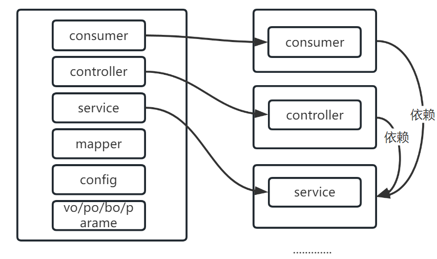
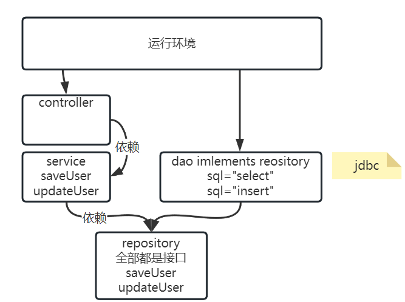

# Day14

## 1 分布式事务

## 1.1 整合demo案例中

#### 1.1.1架构,代码关系


#### 1.1.2 发送半消息


OrderServiceImpl

```java
package cn.tedu.csmall.all.adapter.service.impl;


import cn.tedu.csmall.all.adapter.mapper.OrderMapper;
import cn.tedu.csmall.all.service.ICartService;
import cn.tedu.csmall.all.service.IOrderService;
import cn.tedu.csmall.all.service.IStockService;
import cn.tedu.csmall.commons.exception.CoolSharkServiceException;
import cn.tedu.csmall.commons.pojo.order.dto.OrderAddDTO;
import cn.tedu.csmall.commons.pojo.order.entity.Order;
import cn.tedu.csmall.commons.pojo.stock.dto.StockReduceCountDTO;
import cn.tedu.csmall.commons.restful.JsonPage;
import cn.tedu.csmall.commons.restful.ResponseCode;
import com.github.pagehelper.PageHelper;
import com.github.pagehelper.PageInfo;
import java.util.List;
import java.util.Map;

import lombok.extern.slf4j.Slf4j;
import org.apache.dubbo.config.annotation.DubboReference;
import org.apache.dubbo.config.annotation.DubboService;
import org.apache.rocketmq.spring.core.RocketMQTemplate;
import org.springframework.beans.BeanUtils;
import org.springframework.beans.factory.annotation.Autowired;
import org.springframework.messaging.Message;
import org.springframework.messaging.support.MessageBuilder;
import org.springframework.stereotype.Service;
import org.springframework.transaction.annotation.Transactional;

// order模块是具备生产者特征的,它会被business模块调用,所以也要加@DubboService注解
@DubboService(loadbalance = "random")
@Service
@Slf4j
public class OrderServiceImpl implements IOrderService {
    @Autowired
    private OrderMapper orderMapper;
    /**
     * 防止消息异步消费逻辑中,重复消费的问题,业务方法
     * 设计成幂等的
     * @param orderAddDTO
     */
    @Autowired
    private RocketMQTemplate rocketMQTemplate;
    @Override
    public void orderAdd(OrderAddDTO orderAddDTO) {
        int count=orderMapper.selectExists(orderAddDTO);
        if (count>0){
            log.debug("订单已经新增了");
            return;
        }

        //发送一个半消息,消息如果发送成功,是给购物车用的
        //只要包含当前订单用户,的订单商品是什么 消息特点精简准确
        //消息不仅只有消费者在使用,还有本地事务,和检查事务的方法都在使用
        //主要考虑check检查,如果消息本身携带的内容不足以支持检查逻辑
        //需要想办法携带更多信息
        String msgData=orderAddDTO.getUserId()+":"+orderAddDTO.getCommodityCode();
        Message message= MessageBuilder.withPayload(msgData)
                .setHeader("name","王翠花")
                .setHeader("orderId","1")
                .build();
        //object参数表示业务数据,当前业务逻辑 减库存生单
        rocketMQTemplate.
                sendMessageInTransaction(
      "order-add-topic",message,orderAddDTO);
    }

    // 分页查询所有订单的业务逻辑层方法
    // page是页码,pageSize是每页条数
    public JsonPage<Order> getAllOrdersByPage(Integer page, Integer pageSize){
        // PageHelper框架实现分页的核心操作:
        // 在要执行分页的查询运行之前,设置分页的条件
        // 设置的方式如下(固定的格式,PageHelper框架设计的)
        // PageHelper设置page为1就是查询第一页
        PageHelper.startPage(page,pageSize);
        // 下面开始持久层方法的调用
        // 此方法运行时因为上面设置了分页条件,sql语句中会自动出现limit关键字
        List<Order> list = orderMapper.findAllOrders();
        // 查询结果list中包含的就是分页查询范围的数据了
        // 但是这个数据不包含分页信息(总页数,总条数,是否是首页,是否是末页等)
        // 我们要利用PageHelper框架提供的PageInfo类型,来进行返回
        // PageInfo对象可以既包含分页数据,又包含分页信息
        // 这些信息会在PageInfo对象实例化时自动计算,并赋值到PageInfo对象中
        return JsonPage.restPage(new PageInfo<>(list));
    }


}
```

#### 1.1.3 本地事务

本地事务方法调用顺序,在发送半消息之后执行.


OrderAddTransactionListener

```java
package cn.tedu.csmall.all.adapter.transaction;

import cn.tedu.csmall.all.adapter.mapper.OrderMapper;
import cn.tedu.csmall.all.service.IStockService;
import cn.tedu.csmall.commons.exception.CoolSharkServiceException;
import cn.tedu.csmall.commons.pojo.order.dto.OrderAddDTO;
import cn.tedu.csmall.commons.pojo.order.entity.Order;
import cn.tedu.csmall.commons.pojo.stock.dto.StockReduceCountDTO;
import org.apache.dubbo.config.annotation.DubboReference;
import org.apache.rocketmq.spring.annotation.RocketMQTransactionListener;
import org.apache.rocketmq.spring.core.RocketMQLocalTransactionListener;
import org.apache.rocketmq.spring.core.RocketMQLocalTransactionState;
import org.springframework.beans.BeanUtils;
import org.springframework.beans.factory.annotation.Autowired;
import org.springframework.messaging.Message;
import org.springframework.stereotype.Component;

/**
 * @author java@tedu.cn
 * @version 1.0
 */
@Component
@RocketMQTransactionListener
public class OrderAddTransactionListener implements RocketMQLocalTransactionListener {
    @DubboReference
    private IStockService stockService;
    @Autowired
    private OrderMapper orderMapper;

    /**
     * 1.减库存
     * 1.1 减成功 进入第二步生单
     * 1.2 减失败 rollback
     * 2.生单
     * 2.1 生单成功 commit
     * 2.2 生单失败 补偿库存 unkonwn
     * 其他异常问题 unknown
     * @param message userId":"commodityCode
     * @param o OrderAddDTO
     * @return
     */
    @Override
    public RocketMQLocalTransactionState executeLocalTransaction(Message message, Object o) {
        OrderAddDTO orderAddDTO=(OrderAddDTO)o;
        try{
            StockReduceCountDTO countDTO=new StockReduceCountDTO();
            countDTO.setCommodityCode(orderAddDTO.getCommodityCode());
            countDTO.setReduceCount(orderAddDTO.getCount());
            // 利用Dubbo调用stock模块减少库存的业务逻辑层方法实现功能
            stockService.reduceCommodityCount(countDTO);
        }catch (CoolSharkServiceException e){
            //返回rollback
            return RocketMQLocalTransactionState.ROLLBACK;
        }catch (Throwable e){
            //返回unknown
            return RocketMQLocalTransactionState.UNKNOWN;
        }
        try{
            Order order=new Order();
            BeanUtils.copyProperties(orderAddDTO,order);
            orderMapper.insertOrder(order);
        }catch (Exception e){
            return RocketMQLocalTransactionState.UNKNOWN;
        }
        return RocketMQLocalTransactionState.COMMIT;
    }

    /**
     * 1. 检查订单是否成功.
     * 1.1 成功 commit
     * 1.2 没有成功 进入第2步
     * 2. 库存对当前订单是否已经减成功
     * 2.1 减成功,回退 第3步
     * 2.2 没减成功 rollback
     * 3.回退库存
     * 3.1 可能失败 unknown
     * 3.2 回退成功 rollback
     * @param message
     * @return
     */
    @Override
    public RocketMQLocalTransactionState checkLocalTransaction(Message message) {
        return null;
    }
}
```

#### 1.1.4 完成检查补偿


利用检查补偿的方法,画的业务流程图


OrderAddTransactionListener

```java
@Override
public RocketMQLocalTransactionState checkLocalTransaction(Message message) {
    //状态不明确,回调check方法,检查库存是否减少,检查订单是否生成
    String userIdAndCommodityCode = (String) message.getPayload();
    Object name = message.getHeaders().get("name");
    Object orderId = message.getHeaders().get("orderId");
    String userId=userIdAndCommodityCode.split(":")[0];
    String commodityCode=userIdAndCommodityCode.split(":")[1];
    OrderAddDTO orderAddDTO=new OrderAddDTO();
    orderAddDTO.setUserId(userId);
    orderAddDTO.setCommodityCode(commodityCode);
    int exist = orderMapper.selectExists(orderAddDTO);
    if (exist>0){
        //当前检查的这个订单已经生成,说明库存肯定减了
        return RocketMQLocalTransactionState.COMMIT;
    }
    //存在一个库存的日志表格,记录减库存的日志数据
    //通过传递订单信息,查询日志,如果减了就回退,如果没减,没有操作
    //返回给调用者检查结果是成功还是失败
    try{
        stockService.checkStockData();
    }catch (CoolSharkServiceException e){
        //没有库存减少的日志 没有任何减库存的操作
        return RocketMQLocalTransactionState.ROLLBACK;
    }
    //补偿回退 TODO
    try{
        //补偿
        System.out.println("订单没有生成.库存减少了,开始补偿");
    }catch (Exception e){
        //补偿失败
        return RocketMQLocalTransactionState.UNKNOWN;
    }
    return RocketMQLocalTransactionState.ROLLBACK;
}
```

#### 1.1.5 购物车消费


购物车整合rocketmq

购物车编写消费逻辑

```java
package cn.tedu.csmall.all.adapter.consumer;

import cn.tedu.csmall.all.service.ICartService;
import org.apache.rocketmq.spring.annotation.RocketMQMessageListener;
import org.apache.rocketmq.spring.core.RocketMQListener;
import org.springframework.beans.factory.annotation.Autowired;
import org.springframework.context.annotation.ScopeMetadata;
import org.springframework.stereotype.Component;

/**
 * @author java@tedu.cn
 * @version 1.0
 */
@Component
@RocketMQMessageListener(
        topic="order-add-topic",
        consumerGroup = "${rocketmq.consumer.group}",
        selectorExpression = "*")
public class CartDeleteConsumerListener implements RocketMQListener<String> {
    @Autowired
    private ICartService cartService;
    @Override
    public void onMessage(String msg) {
        String userId=msg.split(":")[0];
        String commodityCode=msg.split(":")[1];
        //删除购物车
        cartService.deleteUserCart(userId, commodityCode);
    }
}
```

## 2 鲁班周边环境调整

### 2.1 前端启动

#### 2.1.1 介绍

- luban-front 前台

前台主要是给师傅用的.

师傅抢单

签到/上传施工图片/完成订单

- luban-admin-front

后台是管理用的.

需求单

厂商/供应商 入住

#### 2.1.2 启动前端

node.js版本是 16 X 保证能运行

- luban-admin-front

启动顺序

```shell
1. npm install
2. npm run dev
```

- luban-front

启动顺序

```shell
1. npm install
2. npm run dev:h5
```

### 2.2 直接启动的项目

#### 2.2.1 gateway(网关)

- 只需要nacos运行,默认连接localhost:8848 public DEFAULT_GROUP

#### 2.2.2 login(登录注册)

- 导入登录的数据库表格


- 本地有redis(略)
- nacos localhost:8848(略)
- 运行bat文件/sh文件


通过idea配置bat/sh


#### 2.2.3  attach(上传图片)

- 文件上传路径,和访问的关系

图片上传关系到鲁班中许多功能的业务流转.


spring.resources.static-lcations: 上传图片存放的路径,也是访问这个项目静态资源的路径.

spring.mvc.static-path-pattern: 访问attach服务时,匹配静态资源的规则

例如:

在

E:/home/images/dev/attach/**haha.txt**

E:/home/images/dev/attach/**123456.png**

attach 启动默认运行端口8092.

http://localhost:8092/static/123456.png 

http://localhost:8092/static/a/b/c/d/1.png

E:/home/images/dev/attach/**a/b/c/d/1.png**

- 导入数据库sql文件


## 3 分层开发和整洁架构

目标

- [x] 了解分层开发的概念
- [x] 理解分层开发实现结构的功能
- [ ] 落地整洁架构最终鲁班的项目

概念:纵向拆分(横向拆分)

### 3.1 分层开发(横向拆分)

分层开发的概念:

maven多模块开发项目管理.

可以利用这种管理功能,实现一个项目的多层次模块开发--分层开发.

比如,当前项目HelloController依赖HelloService

### 

这样做目的: 复杂开发过程.解耦(不调整依赖关系,无法解耦).

分层开发(横向拆分)和纵向拆分的区别在于,拆出多层,最终运行也是一个项目.

### 3.2 整洁架构

<<代码整洁之道>>作者Bob大叔曾经说过

翻译过来:

程序架构总是一样的.

让程序运行很简单.

让程序"正确"很难.

让程序**维护简单,扩展简单**就是正确

以 controller--service-mapper 为例,按照直觉分层开发,做依赖关系.


问题1: 没有实现控制层,对持久层之间的隔离关系,可以随意的在controller中注入,依赖mapper


问题2: 架构分层之间是纯粹强耦合.


分层开发没有达到最终的目的,实现解耦,实现扩展维护方便.

对应以上问题,在bob大叔的 <<整洁架构之道>>中,提到的解决的思想.

### 3.3 整洁架构落地方案

核心点: 分层的众多模块中,有**最核心的业务模块(service)**.

其他的模块,包括controller,redis,rocketmq,mysql,mybatis这些模块切分出来,都是容易被替换掉的.

核心稳定的模块,如果依赖了容易变动不稳定模块,不满足整洁架构的思想.

解决方案: **依赖倒置**(开发原则)

**是*程序要依赖于抽象接口,不要依赖于具体实现***




- 分层数据封装
  - 入参（接收的参数）
    - query: 查询使用
    - param：写入使用（持久层写入转化成DO）
    - 远程调用：DTO
  - 出参（返回值）
    - service出参：BO
    - infrustructure出参: BO
    - dao出参：DO
    - adapter出参：VO
    - 远程调用： DTO

### 3.4 搭建worker项目架构

#### 3.4.1 顶级夫工程继承操作

继承私服的父级项目tarena-mall-bom

#### 3.4.2 创建项目架构

- worker-admin：后台后端
- worker-common（代码和依赖）：worker公用
- worker-po（代码和依赖）：包含的内容就是worker所有数据库entity对象
- worker-server：前台后端

#### 3.4.3 根据分层架构依赖关系，搭建创建8个模块

worker-server

	- adapter
	- main
	- client-api
	- infrustructure
	- dao-api
	- dao-impl
	- daomain
	- protocol

# 附录

## 1 maven加载私服无法下载

现象: 拒绝连接远程私服,settings配置的,

关键字: http://0.0.0.0 blocked

原因: idea默认的管局settings.xml配置,禁止使用http协议访问私服.

解决方法: 拦截删除

- 使用一个正常的maven项目 执行mvn clean compile -X


- 进入文件夹,修改内容,将mirror(不是mirrors)注释或者删除


## 2 前端启动问题

现象: npm install 报错  npm run 报错

原因:

- 命令执行错了
- 网络不通畅

- node.js(16.X) npm(8.5)版本


## 3 mac运行passport

现象: 无法运行java -jar命令

原因: 代码内配置属性,不是针对mac设置的

解决方案:

master 提交了新版本


## 4 jar运行节省内存问题

可以在java -jar命令中添加选项,限制内存上限.

128m参数:

```shell
java -jar ***.jar -Xmx128M -Xms128M -XX:MaxMetaspaceSize=128M -XX:MetaspaceSize=128M
```

idea跑的java程序能加


## 5 连接mysql失败

现象: Access to "root@localhost:3306" denied

原因: 你的数据库 密码用户名 不是root root

解决方案: 运行passport.jar 默认使用root/root 需要覆盖jar内的springboot项目代码配置文件application.yaml

java -jar passport-provider-1.0-SNAPSHOT.jar -Xmx128M -Xms128M -XX:MaxMetaspaceSize=128M -XX:MetaspaceSize=128M --server.port=8099 --spring.profiles.active=local **--spring.datasource.password=root**

## 6 演示项目和本地项目

现象:

http://dev.front.luban.p.yufeiworld.com/

http://localhost:8989

访问演示页面测试本地代码功能.

## 7 注册失败

现象: insert语句中缺少avator字段

关键字: unknown column 'avator'

原因: 导入的不是commont-passport.sql 而是common_passort.sql

