# Day15

## 1 分层其他依赖

保证最后main启动的时候,可以支持SSM框架内容.

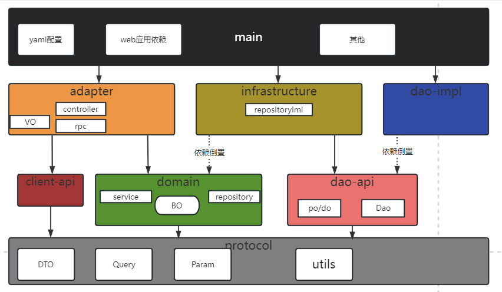

简单的启动测试案例,能否从main启动时,获取controller service repository dao接口代理.

### 1.1 dao-api

定义持久层接口,定义使用的数据库表格对应po.

```xml
<dependency>
    <groupId>org.example</groupId>
    <artifactId>worker-po</artifactId>
    <version>1.0-SNAPSHOT</version>
</dependency>
<dependency>
    <groupId>mysql</groupId>
    <artifactId>mysql-connector-java</artifactId>
</dependency>
```

### 1.2 dao-impl

定义持久层实现,看到实现的依赖 jpa hibernate mybatis

```xml
<dependency>
    <groupId>org.mybatis</groupId>
    <artifactId>mybatis-spring</artifactId>
    <version>2.1.0</version>
</dependency>
```

### 1.3 infrustructure

### 1.4 domain

添加一个公用common

```xml
<dependency>
    <groupId>org.example</groupId>
    <artifactId>worker-common</artifactId>
    <version>1.0-SNAPSHOT</version>
</dependency>
```

### 1.5 adapter

需要spring mvc等支持

```xml
<!--私服提供的 adapter支持依赖-->
<dependency>
    <groupId>com.tedu.inn</groupId>
    <artifactId>inn-spring-adapter-support</artifactId>
    <version>1.0.0-SNAPSHOT</version>
</dependency>
```

### 1.6 main

负责整合,跑通应用.

```xml
<!--持久层整合-->
<dependency>
    <groupId>com.baomidou</groupId>
    <artifactId>mybatis-plus-boot-starter</artifactId>
 <dependency>
            <groupId>org.mybatis.spring.boot</groupId>
            <artifactId>mybatis-spring-boot-starter</artifactId>
            <version>2.1.4</version>
        </dependency>
</dependency>
<!--TODO dubbo配置-->
<!--TODO nacos-->
```

## 2 测试整合项目main

main 提供了所需的启动web应用依赖内容.

配置持久层 

1. - [x] 依赖

2. - [x] 编写持久层实现(xml映射文件)

   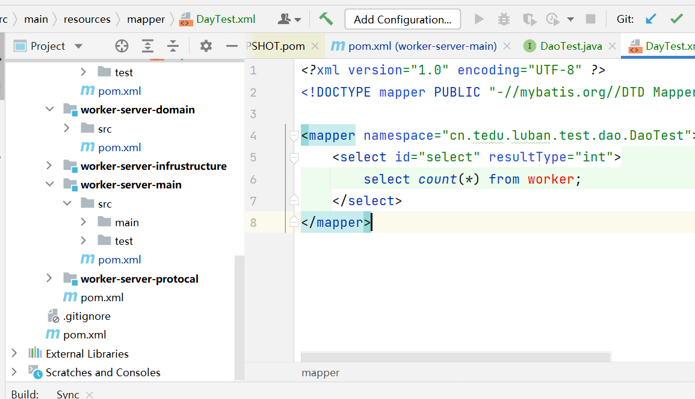

   namespace对应接口全路径

   select标签的id值对应接口的方法名称

3. - [x] 编写持久层接口

   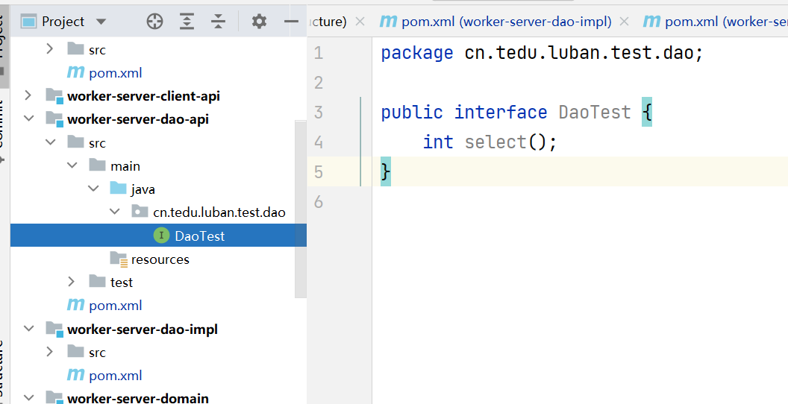

4. - [x] main扫描接口包

   ```java
   @SpringBootApplication
   @MapperScan("cn.tedu.luban.test.dao")
   public class WorkerServerApplication {
       //检测以下是否能够创建myabtis的实现对象DaoTest
       public static void main(String[] args) {
           //从启动方法获取返回值,spring上下文对象
           ConfigurableApplicationContext
           context = SpringApplication
                   .run(WorkerServerApplication.class, args);
           DaoTest proxy = context.getBean(DaoTest.class);
           System.out.println(proxy.getClass().getName());
           int select = proxy.select();
           System.out.println(select);
       }
   }
   ```

5. yaml 数据源mybatis各种属性

```yaml
server:
  port: 9001
spring:
  application:
    name: luban-worker-server
  datasource:
    url: jdbc:mysql://localhost:3306/tarena_tp_luban_worker?useSSL=false&useUnicode=true&characterEncoding=utf-8&serverTimezone=Asia/Shanghai&allowMultiQueries=true
    username: root
    password: root
    driver-class-name: com.mysql.cj.jdbc.Driver
# mybatis
mybatis:
  configuration:
    cache-enabled: false   # 不启用mybatis缓存
    map-underscore-to-camel-case: true # 映射支持驼峰命名法
    log-impl: org.apache.ibatis.logging.stdout.StdOutImpl # 将运行的sql输出到控制台
  mapper-locations: classpath*:mapper/*.xml
```

## 	3 前台师傅功能

### 3.1 luban-front配置

项目中 **vue.config.js**的文件,配置了前端请求的代理,代理会根据配置向外发出请求.

一共配置了4个代理

-  访问功能的网关

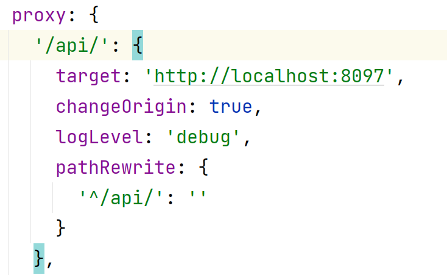

- 图片上传服务

只考虑上传,访问演示系统环境中图片上传是没问题的.考虑的是读取图片,rpc调用.必须使用本地attach

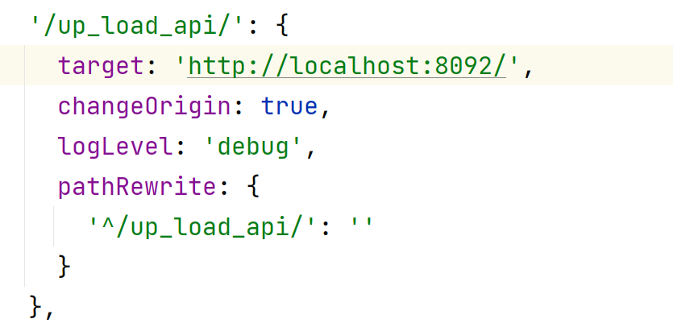

- base基本服务

在系统中查询服务区域,查询服务类型,都可以访问演示系统提供的base服务

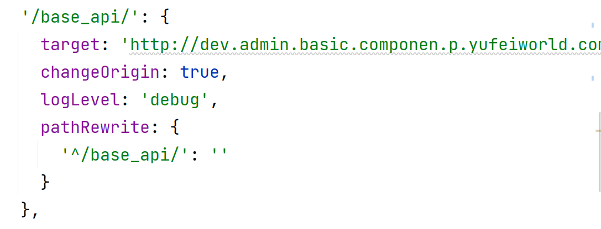

- 登录注册

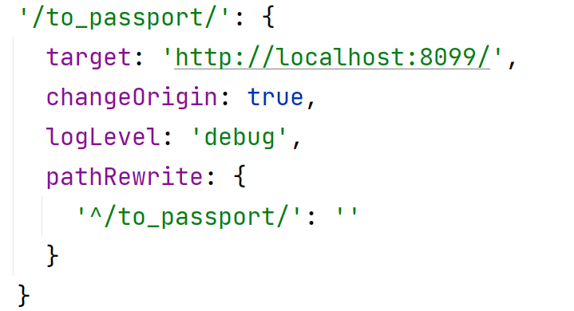

### 3.2 师傅相关表格ER图

目标:

- [ ] 掌握ER图分析创建过程

ER图--实体关系图(entity Relationship )

在设计项目之初.做数据库设计的一个阶段性分析过程.产出ER图.(数据库的概念设计)

#### 3.2.1ER练习案例

设计步骤: 需求分析,实体确定,实体关系

需求: 请给一个论坛,设计功能,包含**用户**可以登录,用户可以申请成为**版主**.论坛有**板块**,用户可以在板块里发**帖**,可以**回帖**.版主可以删除所有回帖和发帖,用户只能删除自己的回帖和发帖.

确定实体: 用户 版主 板块 帖子 回帖

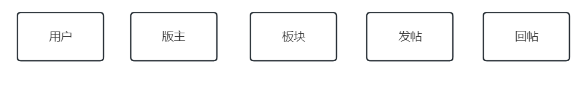

实体关系: 需要根据实体提供的功能,完成实体与其他实体的关系确定,最后需要优化,**删除间接关系**,**保留最清晰联系**.最终由创建数据库DBA决定到底如何关联实体对应表格.

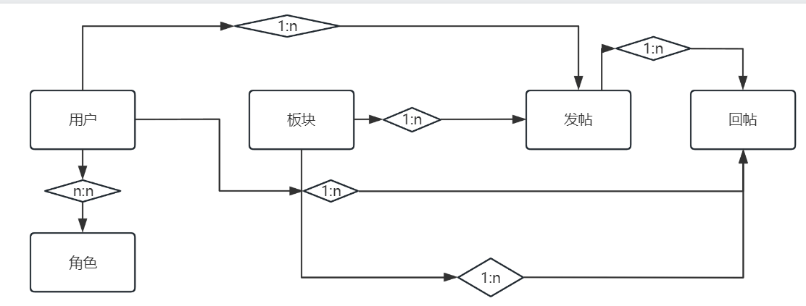

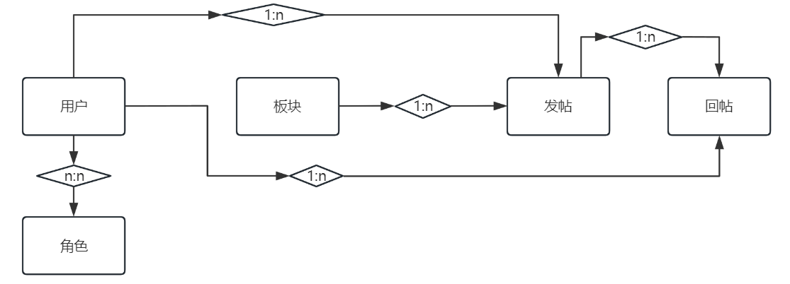

(数据库设计六个阶段 需求分析 概念设计,逻辑设计,物理设计,数据库创建,数据库运维)

如果设计到表格落地:

user: table_user

role: table_role

user_role: table_user_role

reply: table_reply(uerId),外键需要加到哪里

如果是1对1的表格,任何一方理论上做外键,但是应该区分主从表.

主表: 核心数据

从表: 数据依赖主表数据存在

#### 3.2.2 鲁班表格ER关系(非常重要)

鲁班平台需求描述: 支持运营商 供应商 厂家入住提供维修需求订单的平台,可以允许用户登录注册,线下培训考核,成为师傅进行抢单,并且对订单结果负责的一个服务平台系统.

- **运营商/厂家/供应商** 入住
- 用户的登录注册
- **用户**成为师傅需要师傅入住
- 师傅入住后,绑定给一个**平台账号**
- 厂家提供**需求单**,平台定义**结算**分润
- **师傅**入住时选择**服务区域**
- 师傅入住时选择**服务分类**
- 师傅入住时上传身份信息**图片**
- 师傅查询需求单,抢单,生成**订单**
- 师傅签到,上传施工图片,完成订单
- 平台进行订单结算

实体确定: 

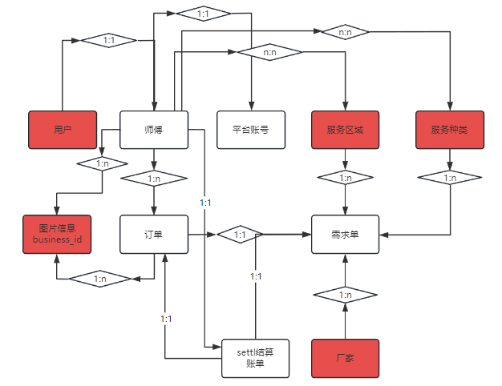

### 3.3 前台师傅接口--师傅入住

- 从上向下开发业务功能
  - adapter 接收请求 controller
  - domain 处理业务
    - service
    - repository 定义domain接口 **Repository
  - infrustructure 定义repositoryImpl
  - dao-api 接口定义持久层功能
  - dao-impl xml 映射文件sql语句

#### 3.3.1 adapter

- WorkerServerController

```java
package com.tarena.luban.worker.server.controller;

import com.tarena.tp.luban.worker.server.dto.param.WorkerCreateParam;
import com.tedu.inn.protocol.exception.BusinessException;
import org.springframework.beans.factory.annotation.Autowired;
import org.springframework.web.bind.annotation.PostMapping;
import org.springframework.web.bind.annotation.RequestBody;
import org.springframework.web.bind.annotation.RequestMapping;
import org.springframework.web.bind.annotation.RestController;

/**
 前台师傅接口
 1. 入住 写操作
 2. 查询详情,查询的是已经审核通过的当前登录的师傅信息
 */
@RestController
@RequestMapping("/worker")
public class WorkerServerController {
    @Autowired
    private WorkerServerService workerServerService;
    /**
     * 返回 通用数据result
     */
    @PostMapping("/create")
    public Long createWorker(@RequestBody WorkerCreateParam workerCreateParam) throws BusinessException {
        //调用 worker service 新增
        return workerServerService.create(workerCreateParam);
    }
}
```

#### 3.3.2 domain

相关代码 处理的问题,后端代码如何获取userId

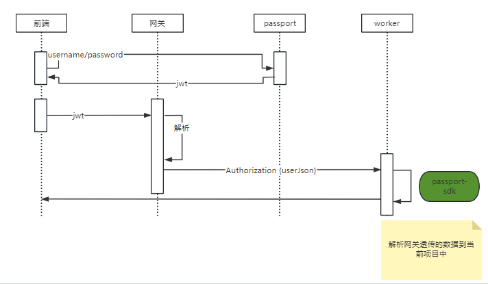

- WorkerServerService

```java
package com.tarena.luban.worker.server.manange;
import com.tarena.luban.worker.server.repository.WorkerAreaRepository;
import com.tarena.luban.worker.server.repository.WorkerCategoryRepsoitory;
import com.tarena.luban.worker.server.repository.WorkerRepository;
import com.tarena.passport.protocol.LoginUser;
import com.tarena.passport.sdk.context.SecurityContext;
import com.tarena.tp.luban.worker.server.common.enums.ResultEnum;
import com.tarena.tp.luban.worker.server.dto.param.WorkerAreaParam;
import com.tarena.tp.luban.worker.server.dto.param.WorkerCategoryParam;
import com.tarena.tp.luban.worker.server.dto.param.WorkerCreateParam;
import com.tedu.inn.commons.utils.Asserts;
import com.tedu.inn.protocol.exception.BusinessException;
import lombok.extern.slf4j.Slf4j;
import org.springframework.beans.factory.annotation.Autowired;
import org.springframework.stereotype.Service;
import org.springframework.transaction.annotation.Transactional;
import org.springframework.util.CollectionUtils;

import java.util.List;

/**
 * @author java@tedu.cn
 * @version 1.0
 */
@Service
@Slf4j
public class WorkerServerService {
    @Autowired
    private WorkerRepository workerRepository;
    @Autowired
    private WorkerAreaRepository workerAreaRepository;
    @Autowired
    private WorkerCategoryRepsoitory workerCategoryRepsoitory;
    /**
     * 1. 补充userId
     * 2. 检查 手机号
     * 3. 检查 身份证 和真实名称是否匹配 TODO
     * 4. 存储 worker workerCategory workerArea
     * 使用定义好的repository接口
     * @param workerCreateParam
     * @return
     */
    @Transactional(rollbackFor = Exception.class)
    public Long create(WorkerCreateParam workerCreateParam) throws BusinessException {
        //获取userId
        Long userId=getUserIdByToken();
        //检查 手机号 身份证 TODO
        checkPhoneAndIdCard(workerCreateParam);
        //挨个存储对应数据到持久层
        workerCreateParam.setUserId(userId);
        Long id=saveWorker(workerCreateParam);
        saveWorkerArea(workerCreateParam);
        saveWorkerCategory(workerCreateParam);
        return id;
    }

    /**
     * 先删除,后新增
     * @param workerCreateParam
     */
    private void saveWorkerCategory(WorkerCreateParam workerCreateParam) {
        workerCategoryRepsoitory.deleteByUserId(workerCreateParam.getUserId());
        List<WorkerCategoryParam> workerCategoryParams = workerCreateParam.getWorkerCategoryParams();
        if (!CollectionUtils.isEmpty(workerCreateParam.getWorkerCategoryParams())){
            //循环
            workerCategoryParams.forEach(param -> {
                param.setUserId(workerCreateParam.getUserId());
                workerCategoryRepsoitory.save(param);
            });
        }
    }

    /**
     * 先删除,后新增
     * @param workerCreateParam
     */
    private void saveWorkerArea(WorkerCreateParam workerCreateParam) {
        workerAreaRepository.deleteByUserId(workerCreateParam.getUserId());
        //循环存储 <foreach>
        //TODO 批量存
        List<WorkerAreaParam> workerAreaParams
                = workerCreateParam.getWorkerAreaParams();
        for (WorkerAreaParam workerAreaParam : workerAreaParams) {
            //提交的参数 workerCategoryParam中和workerParam类似的,也没有userId;
            workerAreaParam.setUserId(workerCreateParam.getUserId());
            //insert into worker_area
            workerAreaRepository.save(workerAreaParam);
        }
    }

    /**
     * 1. 当前用户有可能已经是师傅了.
     * 1.1 先查讯数据库是否有当前用户.师傅信息 有就报错 没有 就新增
     * 1.2 不管有没有 如果有就删除.重新新增
     * @param workerCreateParam
     * @return
     */
    private Long saveWorker(WorkerCreateParam workerCreateParam) {
        //如果当前用户在数据库中有师傅信息,就删除 重新入住师傅信息
        workerRepository.delete(workerCreateParam.getUserId());
        Long id=workerRepository.save(workerCreateParam);
        //TODO rpc 调用 将身份信息,worker-id,和当前图片传递给attach系统,做更新
        return id;
    }

    private void checkPhoneAndIdCard(WorkerCreateParam workerCreateParam) {
        //TODO
        log.info("check phone and idCard,now passed");
    }

    private Long getUserIdByToken() throws BusinessException {
        LoginUser loginToken = SecurityContext.getLoginToken();
        //判断 user登录还是没登录 如果loginUser是空的,说明没登录
        Asserts.isTrue(loginToken==null,
                new BusinessException(ResultEnum.USER_TOKEN_VERIFY_FAILED));
        return loginToken.getUserId();
    }

}
```

#### 3.3.3 infrustructure

- 实现domain定义的repository接口
- 根据代码需求创建dao-api的dao接口

#### 3.3.4 dao-impl映射文件

- worker insert delete
- workerArea insert delete
- workerCategory insert delete

实现xml映射文件,从源代码中粘贴修改

- namespace 对应当前接口类
- 不需要方法的删除
- 根据当前接口中方法名,确定标签的id是否对应
- 根据接口中方法参数,确定sql中#{参数名}是否正确

insert标签

```xml
<insert id="insert" parameterType="com.tarena.tp.luban.worker.po.Worker" useGeneratedKeys="true" keyColumn="id"
        keyProperty="id">
```

mybatis可以通过 useGeneratedKeys属性 决定是否要补充参数的属性值.

keyColumn就是读取数据库的字段.

keyProperty补充到对象的属性

#### 3.3.5 main模块启动

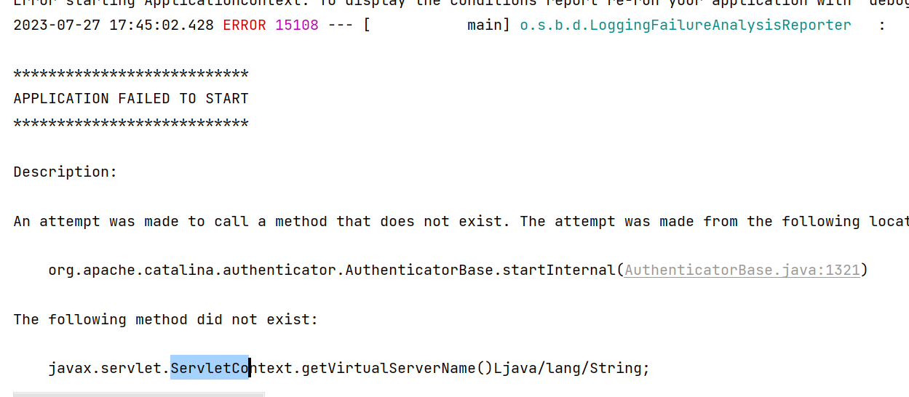

spring-boot-starter-web 底层web容器 默认tomcat

tomcat容器里默认加载servlet容器,会有servlet-api存在.

main依赖分层的模块,依赖中存在servlet-api,会和main starter-web冲突