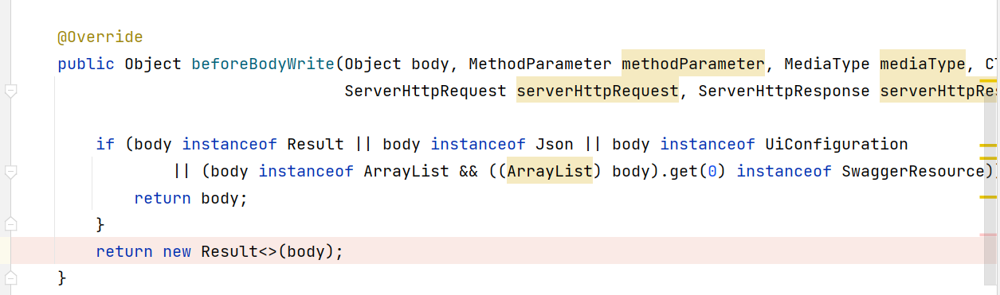

# Day 16

## 1 问题解析

### 1.1 启动servlet冲突问题


解决方法: 启动项目main 将传递过来servlet-api依赖去除.

### 1.2 nacos注册中心

- 依赖
- yaml配置

### 1.3 用户信息验证失败


断点查看源代码 LoginUserFilter (在处理网关解析后的jwt数据 userJson字符串)

如果过滤器不生效,就会导致解析userJson没执行,后端代码获取LongUser对象是空.


LongUserFilterAutoConfiguration 需要满足条件才会帮助项目程序创建过滤器.


所以根据源码分析,第一个条件没满足,导致当前LoginUserFilter没有自动配置.无法生效.


在passport-sdk包中提供了一个FastJsonAutoConfiguration.

FastJson实现的自动配置.


1. 要解析用户userJson,要经过过滤器LoginUserFilter
2. 过滤器生效(bean对象),自动配置类条件要满足(容器具备一个Json实现bean对象)
3. 所以要求FastJsonAutoConfiguration要满足条件,json.provider=fastjson
4. 当前系统不满足这个条件

根据上述分析,在yaml文件中

提供属性

```yaml
json:
	provider: fastjson
```

### 1.4 前端效果不对

当前worker-server端:师傅入住 

- nacos
- passport
- attach
- gateway
- worker-server

正常执行了入住功能,但是前端没有反馈成功,因为响应没有做处理,直接返回的是controller的方法返回值,需要返回

Result的对象.

```json
{
    "code":200,
    "message":"成功"
    "data":{},
	"success":true
}
```

源代码中每个main模块中有非常多配置类


1. 第一个是全局异常捕获
2. 接口文档插件配置
3. 配置springmvc cors(当前没有) 防止knife4j接口文件响应异常
4. WebResponseHander 将响应做统一处理输出



这个方法执行位置在controller返回数据之后,响应返回前端之前.

controller返回值如果不满足要求,就会统一封装成Result对象.

body就是controller返回数据

### 1.5 前端请求到后台服务的流转过程

- http://localhost:8989/api/worker/create 发给前端代理(vue.config.js)
- http://localhost:8097/worker/create 进入网关
- lb://luban-worker-server/worker/create 找到路由断言匹配,负载均衡服务
- http://localhost:9001/worker/create 进入controller逻辑

## 2 远程dubbo调用

### 2.1 业务需求

当前worker入住,要调用attach-server服务,实现图片数据更新


缺少的功能是师傅入住,远程调用attach将图片数据库数据 businessType=77(worker业务) businessId=(生成的师傅id)

### 2.2 dubbo配置

- 依赖
- yaml(自动配置中属性,目的就是给配置类用的)
- 注解

这种自动配置的使用方式,不符合分层开发目的,避免业务侵入性


### 2.3 xml配置

- 依赖 dubbo

```xml
<dependency>
    <groupId>org.apache.dubbo</groupId>
    <artifactId>dubbo</artifactId>
    <version>2.7.8</version>
</dependency>
```

- xml配置

```xml
<?xml version="1.0" encoding="UTF-8"?>
<beans xmlns="http://www.springframework.org/schema/beans"
       xmlns:xsi="http://www.w3.org/2001/XMLSchema-instance"
       xmlns:dubbo="http://dubbo.apache.org/schema/dubbo"
       xsi:schemaLocation="http://www.springframework.org/schema/beans
    http://www.springframework.org/schema/beans/spring-beans.xsd
    http://dubbo.apache.org/schema/dubbo
    http://dubbo.apache.org/schema/dubbo/dubbo.xsd">
    <!--配置dubbo 原来在yaml自动配属性中看到 xml中也有-->
    <!--dubbo应用-->
    <dubbo:application name="${spring.application.name}">
        <!--关闭qos-->
        <dubbo:parameter key="qos.enable" value="false"/>
    </dubbo:application>
    <!--protocol dubbo -1-->
    <dubbo:protocol name="dubbo" port="-1"/>
    <!--注册中心-->
    <dubbo:registry
            id="dubboNacos"
            protocol="nacos"
            address="localhost:8848"
            use-as-config-center="false"
            use-as-metadata-center="false"/>
    <!--消费者配置接口-->
    <dubbo:reference id="attachApi" interface="com.tarena.tp.attach.server.client.AttachApi"
                 check="fasle" registry="dubboNacos"/>   
</beans>
```

- 依赖provider接口 添加到调用模块domain

```xml
<!--远程调用attach-->
<dependency>
    <groupId>com.tarena.tp.attach</groupId>
    <version>1.0.0-SNAPSHOT</version>
    <artifactId>luban-attach-server-client-api</artifactId>
</dependency>
```

- 导入到当前启动worker-server进程中

@ImportResource

### 2.4 domain层代码 补充远程调用

在saveWorker方法中远程调用

```java
package com.tarena.luban.worker.server.manange;
import com.tarena.luban.worker.server.repository.WorkerAreaRepository;
import com.tarena.luban.worker.server.repository.WorkerCategoryRepsoitory;
import com.tarena.luban.worker.server.repository.WorkerRepository;
import com.tarena.passport.protocol.LoginUser;
import com.tarena.passport.sdk.context.SecurityContext;
import com.tarena.tp.attach.server.client.AttachApi;
import com.tarena.tp.attach.server.param.AttachUpdateParam;
import com.tarena.tp.luban.worker.server.common.enums.ResultEnum;
import com.tarena.tp.luban.worker.server.dto.param.IdCardParam;
import com.tarena.tp.luban.worker.server.dto.param.WorkerAreaParam;
import com.tarena.tp.luban.worker.server.dto.param.WorkerCategoryParam;
import com.tarena.tp.luban.worker.server.dto.param.WorkerCreateParam;
import com.tedu.inn.commons.utils.Asserts;
import com.tedu.inn.protocol.exception.BusinessException;
import lombok.extern.slf4j.Slf4j;
import org.checkerframework.checker.units.qual.A;
import org.springframework.beans.factory.annotation.Autowired;
import org.springframework.stereotype.Service;
import org.springframework.transaction.annotation.Transactional;
import org.springframework.util.CollectionUtils;

import java.util.ArrayList;
import java.util.List;

/**
 * @author java@tedu.cn
 * @version 1.0
 */
@Service
@Slf4j
public class WorkerServerService {
    @Autowired
    private WorkerRepository workerRepository;
    @Autowired
    private WorkerAreaRepository workerAreaRepository;
    @Autowired
    private WorkerCategoryRepsoitory workerCategoryRepsoitory;
    //domain不关心实现,没有实现,报错
    @Autowired
    private AttachApi attachApi;
    /**
     * 1. 补充userId
     * 2. 检查 手机号
     * 3. 检查 身份证 和真实名称是否匹配 TODO
     * 4. 存储 worker workerCategory workerArea
     * 使用定义好的repository接口
     * @param workerCreateParam
     * @return
     */
    @Transactional(rollbackFor = Exception.class)
    public Long create(WorkerCreateParam workerCreateParam) throws BusinessException {
        //获取userId
        Long userId=getUserIdByToken();
        //检查 手机号 身份证 UNDO
        checkPhoneAndIdCard(workerCreateParam);
        //挨个存储对应数据到持久层
        workerCreateParam.setUserId(userId);
        Long id=saveWorker(workerCreateParam);
        saveWorkerArea(workerCreateParam);
        saveWorkerCategory(workerCreateParam);
        return id;
    }

    /**
     * 先删除,后新增
     * @param workerCreateParam
     */
    private void saveWorkerCategory(WorkerCreateParam workerCreateParam) {
        workerCategoryRepsoitory.deleteByUserId(workerCreateParam.getUserId());
        List<WorkerCategoryParam> workerCategoryParams = workerCreateParam.getWorkerCategoryParams();
        if (!CollectionUtils.isEmpty(workerCreateParam.getWorkerCategoryParams())){
            //循环
            workerCategoryParams.forEach(param -> {
                param.setUserId(workerCreateParam.getUserId());
                workerCategoryRepsoitory.save(param);
            });
        }
    }

    /**
     * 先删除,后新增
     * @param workerCreateParam
     */
    private void saveWorkerArea(WorkerCreateParam workerCreateParam) {
        workerAreaRepository.deleteByUserId(workerCreateParam.getUserId());
        //循环存储 <foreach>
        //TODO 批量存
        List<WorkerAreaParam> workerAreaParams
                = workerCreateParam.getWorkerAreaParams();
        for (WorkerAreaParam workerAreaParam : workerAreaParams) {
            //提交的参数 workerCategoryParam中和workerParam类似的,也没有userId;
            workerAreaParam.setUserId(workerCreateParam.getUserId());
            //insert into worker_area
            workerAreaRepository.save(workerAreaParam);
        }
    }

    /**
     * 1. 当前用户有可能已经是师傅了.
     * 1.1 先查讯数据库是否有当前用户.师傅信息 有就报错 没有 就新增
     * 1.2 不管有没有 如果有就删除.重新新增
     * @param workerCreateParam
     * @return
     */
    private Long saveWorker(WorkerCreateParam workerCreateParam) throws BusinessException {
        //如果当前用户在数据库中有师傅信息,就删除 重新入住师傅信息
        workerRepository.delete(workerCreateParam.getUserId());
        Long id=workerRepository.save(workerCreateParam);
        //rpc 调用 将身份信息,worker-id,和当前图片传递给attach系统,做更新
        //远程调用
        try{
            //远程调用,更新已经上传的图片,绑定到当前worker
            createAttach(id,workerCreateParam.getAttachList());
        }catch (Exception e){
            //远程调用失败
            throw new BusinessException(ResultEnum.ATTACH_FAILED);
        }
        return id;
    }
    //人为定义的类型.
    private static final Integer bizType=100;
    private void createAttach(Long businessId, List<IdCardParam> attachList) {
        //要将attachList 图片(attach服务 没有绑定业务)
        //封装远程调用参数 attach执行一个简单update attach set bysiness_id=#{参数} business_id=#{师傅id}
        //where id=#{当前图片id}
        List<AttachUpdateParam> attachUpdateParams=new ArrayList<>();
        //封装
        for (IdCardParam idCardParam : attachList) {
            //参数元素
            AttachUpdateParam attachUpdateParam=new AttachUpdateParam();
            attachUpdateParam.setIsCover(idCardParam.getType());
            // 图片id bizId bizType 主要数据
            attachUpdateParam.setId(idCardParam.getId());
            attachUpdateParam.setBusinessType(bizType);
            attachUpdateParam.setBusinessId(businessId.intValue());
            //添加到list
            attachUpdateParams.add(attachUpdateParam);
        }
        //调用远程
        attachApi.batchUpdateAttachByIdList(attachUpdateParams);
    }

    private void checkPhoneAndIdCard(WorkerCreateParam workerCreateParam) {
        //UNDO
        log.info("check phone and idCard,now passed");
    }

    private Long getUserIdByToken() throws BusinessException {
        LoginUser loginToken = SecurityContext.getLoginToken();
        //判断 user登录还是没登录 如果loginUser是空的,说明没登录
        Asserts.isTrue(loginToken==null,
                new BusinessException(ResultEnum.USER_TOKEN_VERIFY_FAILED));
        return loginToken.getUserId();
    }
}
```

## 3 师傅详情

### 3.1 接口抽象

| 要素     | 值             | 备注       |
| -------- | -------------- | ---------- |
| 请求地址 | /worker/detail |            |
| 请求方式 | GET            |            |
| 请求参数 | 空             | 解析userId |
| 返回值   | WorkerVO       |            |

返回值说明WorderVO

AccountVO: 远程调用account服务 查询已经审核通过的师傅绑定的账号

List<WorkerAreaVO>: 师傅绑定区域.

List<WokrderCategoryVO>: 师傅绑定的服务种类.

List<AttachVO>: 师傅绑定的身份证图片

### 3.2 开发

#### 3.2.1 WorkderServerController

#### 3.2.2 WorkerServerService

#### 3.2.3 WorkerRepository

#### 3.2.4 WorkerDao 

#### 3.2.5 WorkerMapper.xml

课堂练习:

将查询 area和category的方法写完

代码详见提交的项目

### 3.3 问题

完成所有查询,封装好数据,到页面检测功能


思路: 通过检查对应代码位置,发现AccountBO暂时没有查询,会导致转化异常.所以在业务层返回添加一个假数据

### 3.4 展示师傅信息

当前已经注册成为师傅,但是前端没有消除成为师傅的按钮

审核数据 0 1 2(未注册) 3(已注册未审核)


## 4 准备好后续开发的环境

### 4.1 worker-admin删除保留开发框架

删除代码原则:

不删/保留

- 数据封装对象: BO VO DTO PO PAGEQUERY
- 转化的类:**Converter \*\*Asemble
- 接口一律不删:

- XML不删: 明白sql语句 增删拆改,条件作用

周末作业1:

按照这个原则,将luban-project(**master分支** 不是all-done)

account-admin/account-server

worker-admin

settle-admin/settle-server

order-admin/order-server

demand-admin/demand-server

周末作业2:

2个功能实现

入住(很多环境)

详情查询 worker-parent提交

### 4.2 日志框架

当前luban-project使用日志框架

将error debug info分到不同文件了.

