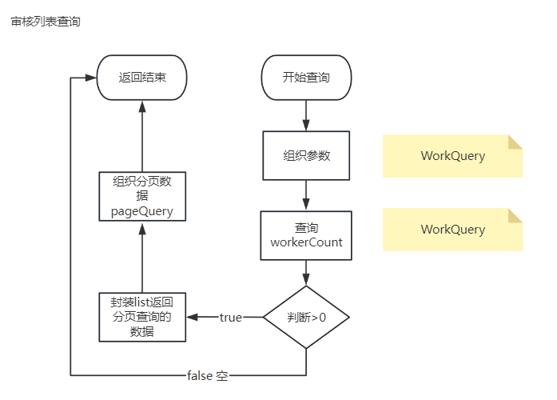
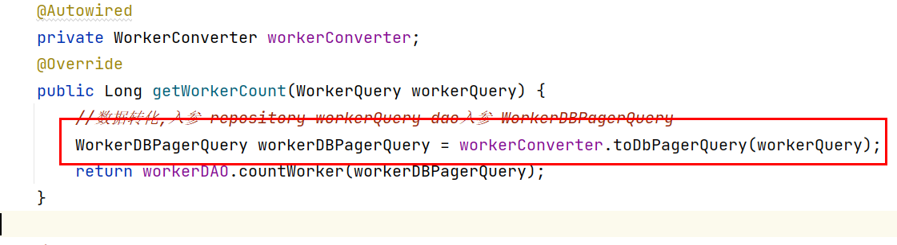
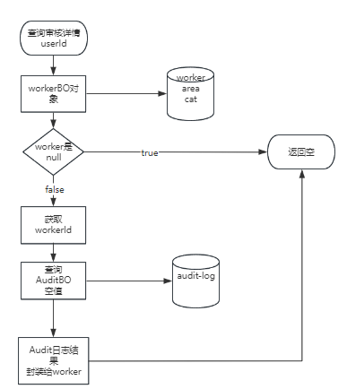
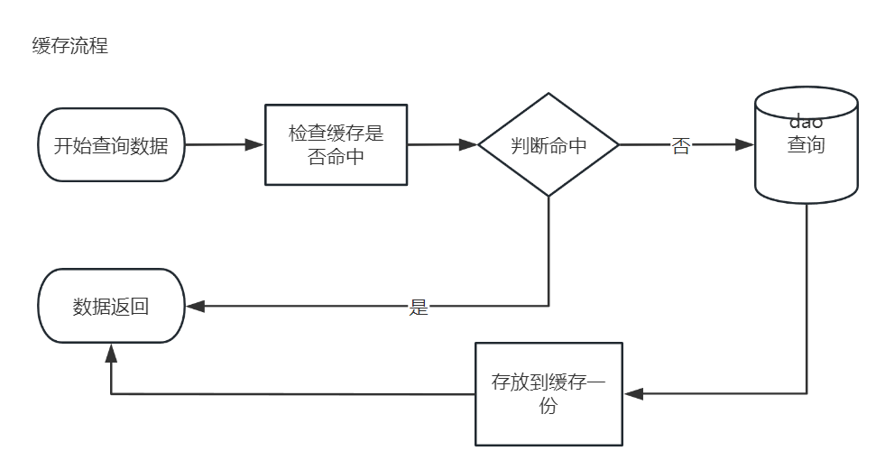
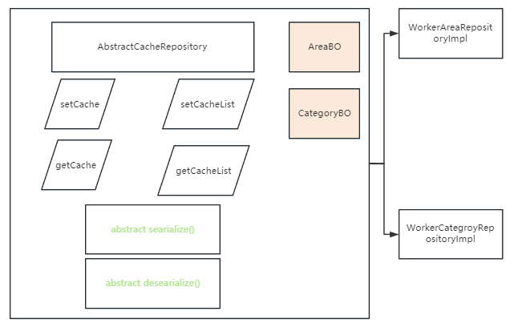

# Day 17 

## 1 师傅后台功能

### 1.1 师傅审核列表

#### 1.1.1 相关功能

业务流程图



分页查询参数

pageNo: 页数

pageSize:每页条数

total:总条数 (select count(*))

totalPage(lastPageIndex): 总页数**(total%pageSize==0? total/pageSize:(total/pageSize+1) )**

select * from table_a where 条件 limit **0,5**

select * from table_a where 条件 limit start,rows

start=**(pageNo-1)*rows**

rows=pageSize



在持久层查询数据(列表),将pageNo 和pageSize做了limit分页条件的封装 

limit 0,5 这样的结果 会拼接到sql语句中

select * from table_a where 条件 #{limit}

```sql
select * from table_a where 条件 "limit 0,5"
```

select * from table_a where 条件 ${limit}

```
select * from table_a where 条件 limit 0,5
```


${} 其他案例

需求: 查询用户信息 username phone email,将三种不同查询条件,使用一个sqlxml映射完成.

**Dao

user getUserByCondition(String condition,String value);

select * from user where ${condition} = #{value};

```sql
select * from user where username="张三"
```

需求: 使用不同的条件,做不同的排序, 时间字段 desc asc 不同查询

**Dao

List<User> getUsersDescByColunme(String colunme)

select * from user where 条件 order by ${colunme} desc

```sql
select * from user where 条件 order by gmt_create desc
```

#### 1.1.2 启动进程和启动方式

- 软件工具
  - nacos
  - mysql(不用主动启动,必须有表格)
- java进程
  - passport
    - bat/shell脚本启动(知道里面java命令)
  - attach(附件服务)
    - businessType
    - businessId
  - gateway
- 前端
  - luban-front
  - luban-admin-front

- 测试的服务
  - worker-admin

### 1.2 后台审核详情查询

#### 1.2.1 查询审核详情流程



查询审核详情 涉及到查询worker详情

使用的参数 userId

#### 1.2.2 远程调用图片服务

- 怎么调用: dubbo
- 配置调用dubbo: 业务无侵入
  - 依赖
  - xml
- 在业务层注入attachApi

### 1.3 缓存逻辑

#### 1.3.1 缓存逻辑流程

Cache-Aside 缓存方案



#### 1.3.2 查询引入缓存流程

业务: 师傅area和师傅分类

- key值如何设计: userId/workerId
  - "业务前缀": worker:area  worker:cat
  - "业务数据": userId
- 数据如何绑定到redis: 
  - [ ] String
  - [ ] hash
  - [x] list

类图

​	

```java
package com.tarena.tp.luban.worker.admin.infrastructure.persistence.impl;

import java.util.List;

/**
 * @author java@tedu.cn
 * @version 1.0
 */
public abstract class AbastractCacheRepository<T> {
    //setCacheList areaBO categoryBO
    public boolean setCacheList(String key, List<T> t){
        //TODO redis list结构的数据,存储缓存
        return true;
    }
    public List<T> getCacheList(String key){
        //TODO
        return null;
    }
    //将单个对象T 序列化成Json字符串
    abstract String searialize(T t);
    //单个对象反序列化
    abstract T deSearilaize(String json);
}
```

#### 1.3.3 完成缓存逻辑

- 依赖
- 完成代码

#### 1.3.4 缓存课堂练习

- CategoryRepoImpl 继承
- 实现抽象方法 JSON 把对象和json字符串相互转化
- 定义业务key值前缀 "worker:categories:"
- cache-aside 缓存方案实现读取分类的list数据

#### 1.3.5 面试题整理

目标:

- [x] 整理相关问题的话术,碰到问题.

思路: 概念 是什么 原因 为什么 解决方案 如何解决

- 缓存雪崩
  - 概念: 缓存在长期应用的系统中,存储了大量的高并发访问数据.一旦这些数据突然批量消失.访问吞吐的并发,到达数据库,导致数据库崩溃.
  - 原因: 
    - 大量数据超时时间固定,相同的.
    - redis分片宕机(数据分布式).短时间造成雪崩,但是不会持续,也不会总是交给代码处理.(翻阅附录-redis分布式).因为高并发高吞吐的redis架构是cluster,保证集群高可用,数据的高可靠性.
  - 解决方案:
    - 超时时间不要固定
    - 第二种代码不提供解决方案,最多降级处理(不重要的数据降级)
- 穿透
- 击穿
- 一致性

#  附录 

## redis分布式

- 架构演变

**单机**

优点: 搭建简单

缺点: 读写瓶颈,单机故障,存储数据总量上限

使用场景: 不会在线上(test,prod)系统使用(除非没什么并发),会搭建在开发场景.

**哨兵集群**

优点: 管理主从的集群.可以解决单点故障问题

缺点: 不能实现分布式,不能实现高吞吐,高并发,大量数据存储.

使用场景: 考虑高可靠性的,但是没有高并发的场景.

**cluster**: 多个主从组成的集群,引入分布式计算

优点: 高吞吐,高并发,高数据存储容量

缺点: 数据设计key值如果不合理,批量读写会导致性能极大浪费.(没有批量需求的业务,碰不见)

使用场景: 高并发 高吞吐场景

6个redis 总吞吐量保守估计 4C4G(6台) 服务器中10万/s