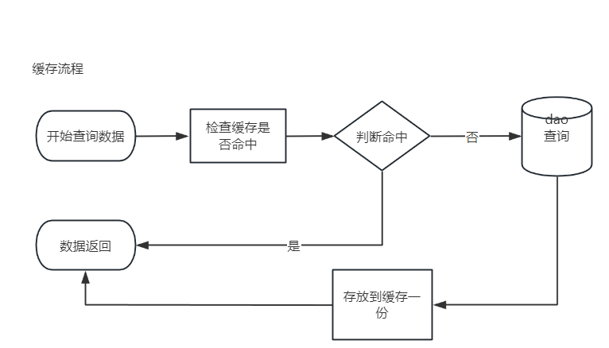
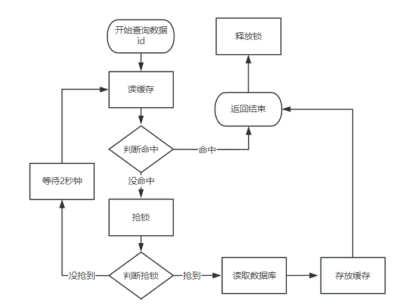
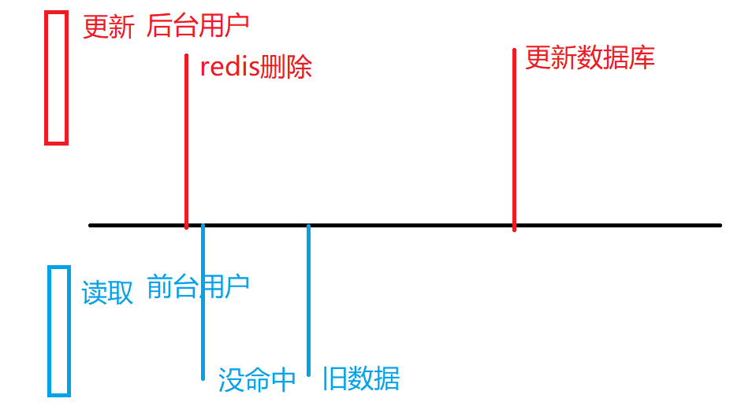
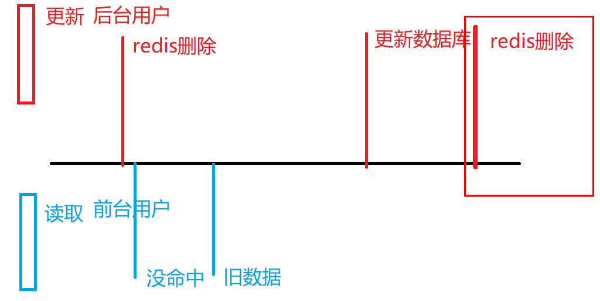
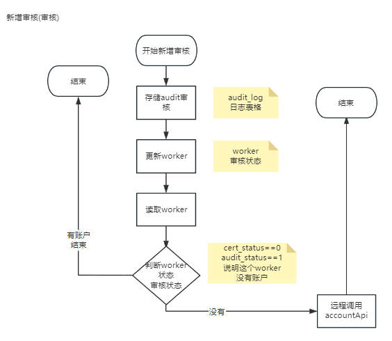
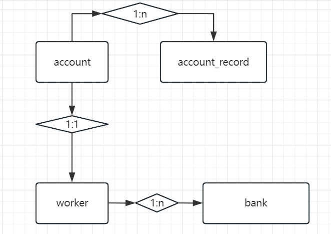
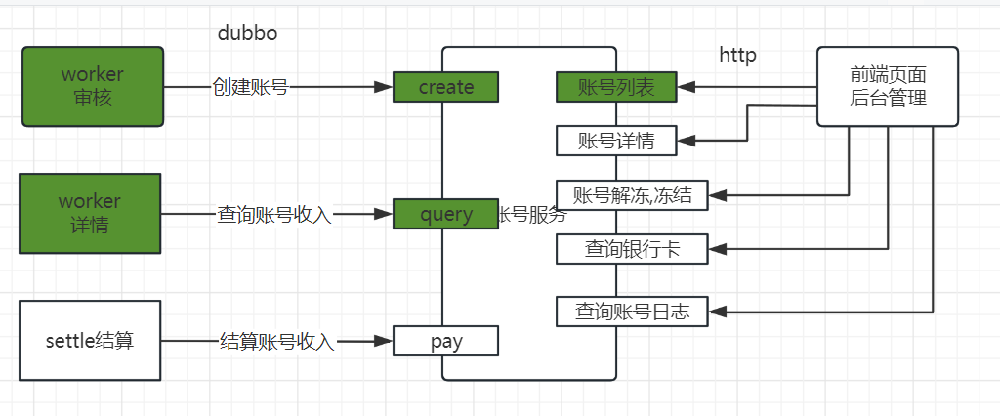
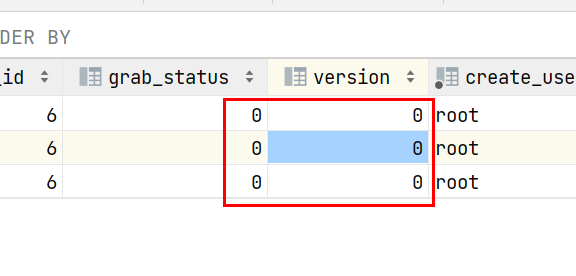
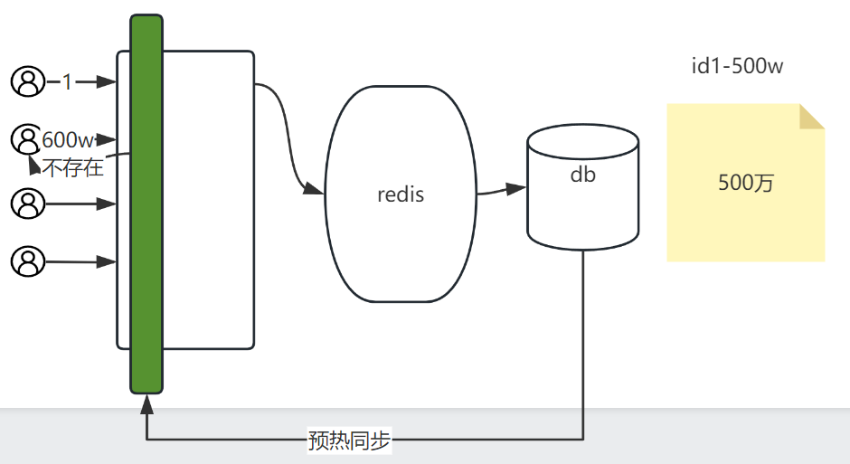

# Day18

## 1 缓存方案

#### 1.1 面试题整理

目标:

- [x] 整理相关问题的话术,碰到问题.

思路: 概念 是什么 原因 为什么 解决方案 如何解决

- 缓存雪崩

  - 概念: 缓存在长期应用的系统中,存储了大量的高并发访问数据.一旦这些数据突然批量消失.访问吞吐的并发,到达数据库,导致数据库崩溃.
  - 原因: 
    - 大量数据超时时间固定,相同的.
    - redis分片宕机(数据分布式).短时间造成雪崩,但是不会持续,也不会总是交给代码处理.(翻阅附录-redis分布式).因为高并发高吞吐的redis架构是cluster,保证集群高可用,数据的高可靠性.
  - 解决方案:
    - 超时时间不要固定
    - 第二种代码不提供解决方案,最多降级处理(不重要的数据降级)

- 穿透:

  - 概念: 缓存没有命中数据,同时数据库也没有命中数据,缓存穿透就出现了
  - 原因:
    - 故意造成 高并发请求,携带无效数据
    - 错误,误差
  - 解决方案:
    - 错误误差: 通过日志,监控.
    - 故意: 引入过滤器(**布隆过滤器**),拦截根本不存在的数据.或者对于数据库查询为null的(临时数据),也存储到缓存(redis可能会因为大量故意访问,出现大量null数据)

- 击穿:

  - 概念: 对于cache-aside缓存方案中,命中返回缓存,没命中查询数据库.如果没命中的数据是热点数据(并发高,访问高).可能造成大量线程在缓存都没有命中数据,都到数据库查询数据.
  - 原因: 高并发访问热点数据,缓存方案cache-aside 造成的逻辑问题.
  - 解决方案: 分布式锁. 

  

  穿透和击穿的区别:

  1. 穿透是缓存没有,数据库也没有,击穿缓存没有,但是数据库有
  2. 都是高并发造成的影响.穿透更多的情况是大量不同数据,击穿针对少量(相同)业务数据(热点)

- 一致性

  - 批量一致性
    - 批量: 一次性处理大批数据.
    - 解决方案: 预热同步.同步刷新
  - 增量一致性
    - 增量: 一次处理1条,几条数据,相比于批量百万,千万级别数据量,非常小的数据量.

- 增量一致性场景: redis存储200万数据,有一条数据存储了一个电脑的商品信息.后台对这个电脑数据做了变更,原价在数据库200元-500元.

  - redis和mysql同步改(写,先写谁,后写谁)
    - 先写redis(200-500) 在写数据库(200-500); **问题数据库写失败.**
    - 先写数据库(200-500)在写redis(200-500); 处理事务问题.
  - redis先删,mysql写
    - 造成高并发下的数据不一致问题(因为cache-aside缓存方案).

  

  - 采用双删(延迟双删)

  延迟双删和双删的区别,就是第二次删除redis的时候,是否要先等待1-3秒.

  

## 2 项目功能

### 2.1 新增审核

#### 2.1.1 业务流程图

#### 2.1.3 师傅模块其他功能(作业)

- 师傅列表查询(和审核列表区别,就是展示的都是通过的)
- 师傅启用
- 师傅禁用

### 2.2 账户

#### 2.2.1 账户表格和ER图

#### 2.2.2 账号服务功能

#### 2.2.3 账号的创建

- 什么时候调用账号创建? 审核通过创建
- 调用方式 dubbo
- account provider角色 在account-server 有对外暴露的接口
- adapter层 实现这个接口,并且server启东时,支持dubbo运行

账号dubbo远程调用.检查调整的内容

第一步: 确定角色  谁是provider(admin server) account-server 谁是consumer worker-admin

第二步: dubbo配置

1. 依赖(当前在源代码基础上实现的配置,依赖一般不需要检查)
2. applicationContext
   1. dubbo:reference dubbo:service 代替原来自动配的注解 @DubboReference @DubboService
   2. 其他标签都对应的yaml文件配置.
3. provider 提供实现(accountRpcService 有没有添加@Service)
4. consumer 注入使用(@Autowired)

#### 2.3.4 当前实现功能时序图（对应全景图）

https://sparrowzoo.feishu.cn/docx/My4mdlLuMovmQixHko4c6qXbnYc?from=from_copylink

 ## 3 抢单相关时序图

### 3.1 供应商和需求单

https://sparrowzoo.feishu.cn/docx/My4mdlLuMovmQixHko4c6qXbnYc?from=from_copylink

需求单是供应商通过远程调用提供的接口推送过来的.

现在没有这个流程,在数据库直接准备可以抢的需求单.

数据request_order表格 修改grab_status 抢单状态0 还没人抢 1 已经被抢了,version 0 1 表示版本(防止抢单多线程并发,导致抢单 多个师傅抢到一个订单).

# 附录

## 布隆过滤器

布隆工作流程(filter)

布隆过滤器缺点

批量新增到布隆,也可以增量新增.不能删除(重新清空预热).

判断存在的概率,有可能误判的.比如100万条 判断100万条存在 200条实际是不存在的

误差0.02%.

