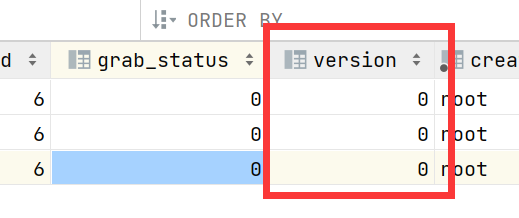

# 问题解析

## 1 需求单查询列表功能的bug

业务逻辑:

需要用户登录 师傅入住 审核入住通过.

查询师傅详情(areaIds,categoryIds)

demand-server-dao-impl 包含持久层实现

requestOrderMapper.xml


# Day 19

## 1 需求单

### 1.1 需求单抢单

为了防止 多个师傅同时争抢一个订单,demand服务需求单抢单操作使用的乐观锁 CAS(compare and swap)逻辑.

乐观锁: 在做数据操作时,采取乐观的态度,总是人为没有别的而线程/没有别的操作和我同时进行,但是一旦有,操作的数据中可以使用cas 先比较在交换的逻辑防止线程安全,数据冲突.



```sql
update request_order set grab_status=1,version=1 where request_order_id=21 and version=0
```

上述sql语句满足乐观锁的一个实现逻辑原理CAS 比较并交换

比较 条件中判断version=0

交换 抢单状态和版本同时+1

## 2 订单

### 2.1 生单功能


### 2.2 订单列表

https://sparrowzoo.feishu.cn/docx/My4mdlLuMovmQixHko4c6qXbnYc

### 2.3 订单列表订单详情

业务流程


### 2.4 订单状态更新(略)

- 状态值status 
- orderLog写入

保证事务.

### 2.5 图片上传绑定

课上完成:

把attach中上传的图片id 绑定到当前订单

课堂跟踪练习:

仿照签到:

**新增一个订单图片绑定状态,做order数据更新**

**实现订单log日志的新增**