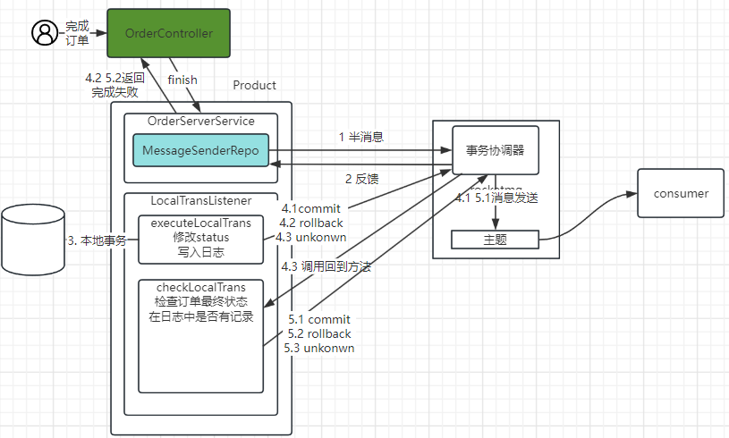
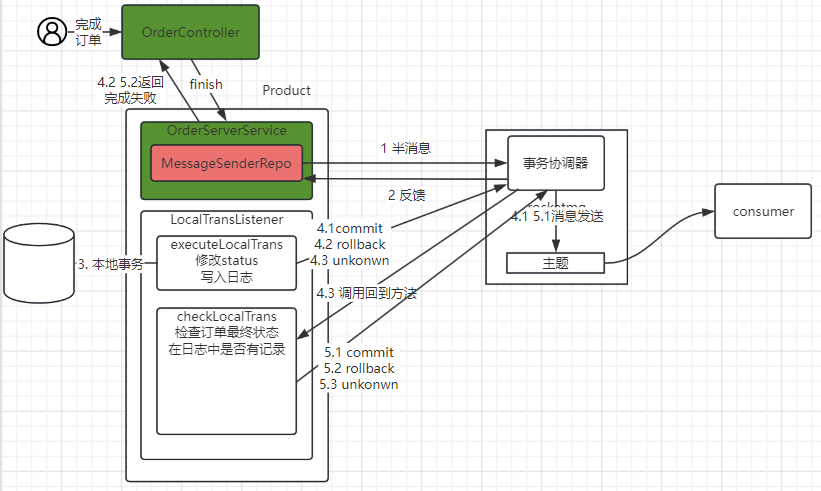
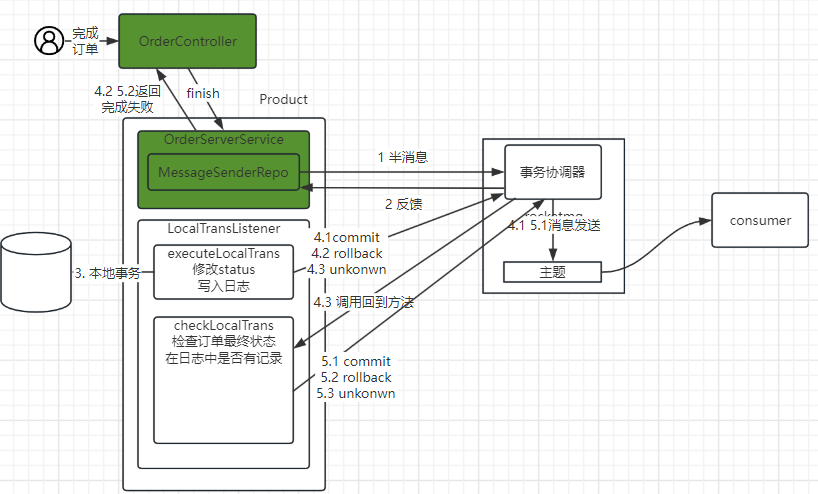
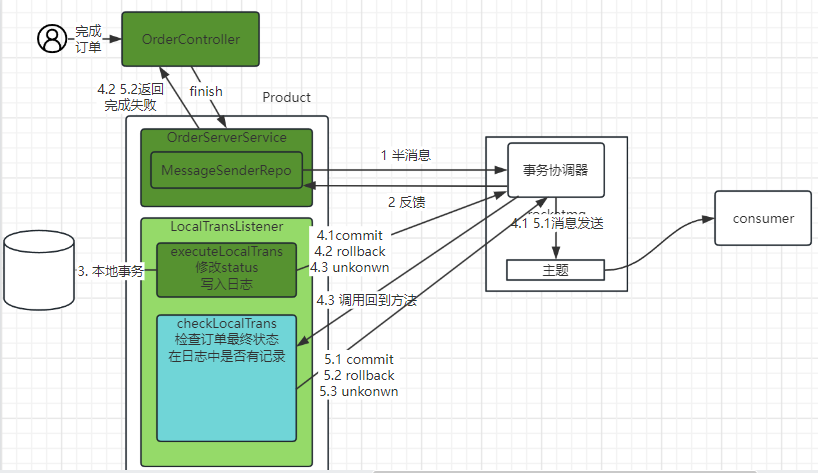
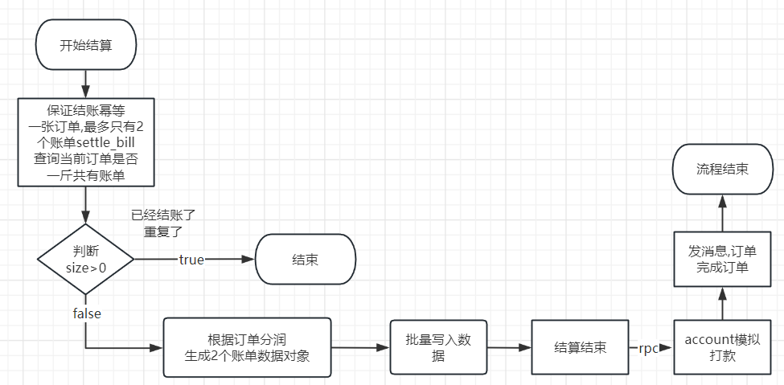
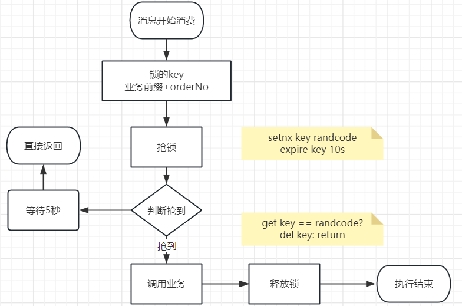

# 问题解析

## 1 课堂跟踪

### 1.1 前端问题

前端逻辑,和状态逻辑不配套.

课堂配套练习完成的. 状态新增50

重新拉最新的luban-front

## 2 项目推进

### 2.1 完成订单

通过分布式消息事务解决本地事务和发消息的一致性

#### 2.1.1 OrderServerService && MessageTransSenderRepository

#### 2.1.2 MessageTransRepoImpl

#### 2.1.3 LocalTransactionLisetner

### 2.2 结算订单

#### 2.2.1 业务流程图

结算执行业务流程

在消费之前 添加分布式锁逻辑

#### 2.2.2 远程调用

provider: account-server(暂时还没实现)

consumer: settle-server

- duubo依赖
- applicationContext.xml

### 2.3 系统作业

画时序图 参考课上连接

https://sparrowzoo.feishu.cn/docx/My4mdlLuMovmQixHko4c6qXbnYc