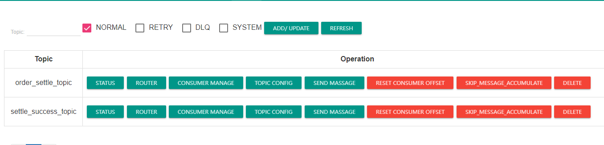

# Day 21

## 1 问题解析

### 1.1 rocketmq清空数据

在操作系统中清空rocketmq的消息和**主题数据**.

通过控制台删除主题的按键



内存中没有主题数据了.但是磁盘没有清空.

rocketmq运行过程,所有消息,主题 创建生成,都会出现 commit_log.

找到磁盘中提交的日志,删除之后,rocketmq的数据才是真正消失了.

windows环境,commit_log ${user.home}/store/commitLog


**原则: 做任何磁盘文件,删除,修改操作之前,一定要备份**

## 2 linux学习

### 2.1 背景

当前项目运行,需要多少中软件,程序

- nacos
- rocketmq namesrv broker dashboard
- redis
- mysql
- 项目jar(idea windows中打jar运行)

以上内容,整体形成了一个对外提供功能的项目系统(鲁班上门).

线上系统,肯定要在linux,linux服务器操作系统相比windows更稳定.

### 2.2 什么是linux系统

操作系统,目前版本很多 rehat centos rockeyLinux ubantu Debian等等.

不同版本内核命令相同 cd ls,其他软件操作命令 yum 对应centos apt对应ubantu

1990年代,由 利纳斯.托瓦蒂 芬兰 赫尔辛基大学 学生 在校园网发布0.1版本.

**注意: 不要用windows使用习惯,理解linux**

### 2.3 虚拟机

#### 2.3.1 介绍

虚拟机是一个可以在已有操作系统(windows),虚拟化资源,创建独立隔离的一个操作系统的软件.


#### 2.3.2 启动 虚拟机linux


#### 2.3.3 虚拟机网络的问题

- 真实服务器

有服务器通信ip地址.通过22 ssh 安全连接,提供 服务器的账号 和密码,可以通过操作客户端软件 远程连接.

- 虚拟机通过虚拟网卡网络连接

无论什么软件的虚拟机,网络连接逻辑,是一致的.


登录配置(详情参考课前资料手册)

### 2.3  linux系统的基础命令

cd mkdir pwd ls cp mv rm等等.

#### 2.3.1 命令提示符

登录到linux系统之后,可以看到一个命令窗口,窗口最前方.是命令提示符信息.


[信息]包括 {当前登录用户名}@{当前主机名称} {当前文件夹名称}

如果当前文件夹名字叫做~ 表示用户家目录.

#### 2.3.2 命令格式

在命令提示符中,收入的命令格式

主命令 [选项] [选项参数]

一般情况下,命令选项,和选项参数是可以省略的,或者有默认值的.

部分命令操作的功能,必须携带选项和参数的. 比如 cp命令必须待参数.

主命令: 祈使句动词

选项: 副词

选项参数: 补语

run 正常抛

run --slowly 慢点抛

run --slowly toWest

#### 2.3.3 pwd指令

作用: 返回当前所在的路径 **绝对路径(所有展示路径从/开始的,都是绝对路径)**


/root表示什么意思?

在linux磁盘中有一个总根目录 /,有一个文件夹,名字叫做root/

/home/software/aaa.html ? 

#### 2.3.4 ls指令

展示文件夹中的内容的指令.

-a: 展示目标文件夹下,所有文件内容,目录内容,linux系统中,文件和文件夹的名字带.开始的,都是隐藏的.

-l: 以详情展示

-R: (不要轻易使用) 递归的查看

可以通过参数指定查看的文件夹.展示一个树

```shell
ls
ls /home
ls -a /home
```


ls 没有添加选项 没有添加查询的文件夹,默认展示当前所在文件夹下得可见文件和目录

ls /home 查询/home下得所有可见文件和目录

```shell
ls -l
ls -al
```


#### 2.3.5 cd指令

**相对路径**: 从当前所在路径计算

```shell
cd mysql
```

**绝对路径**: 从根目录/计算

```shell
cd /
cd /opt
```

区别在于 cd转化目标的路径是否以/开始

如果是.这种路径就是绝对路径

如果不是.这种就是相对路径,相对路径 特殊的值 ./表单当前路径 ../表示当前的上一级路径.


cd - 回播目录 从当前目录中跳转回上次的目录

cd ~直接跳到当前登录用户的家目录

#### 2.3.6 mkdir

创建目录的意思(相对路径,和绝对路径)

mkdir [选项] 想要创建的目标目录(文件夹)

```shell
[root@rockylinux8 resource]# mkdir /tedu
```

会在根目录/下创建一个tedu的文件夹

```shell
[root@rockylinux8 resource]# mkdir tedu
```

会在当前路径resource中创建一个文件夹tedu

可以添加选项 

-p: 允许创建多级目录,不添加不允许创建.

```shell
[root@rockylinux8 resource]# mkdir -p /tarena/a/b
```

在创建/tarena/a/b的时候,没有哪级路径,就先创建哪一级,知道所有路径创建完毕.

rmdir 只能删除空目录.

```shell
[root@rockylinux8 resource]# rmdir ../../tarena/a/b
```

#### 2.3.7 touch指令

创建一个,或者多个空文件

touch 文件名称(绝对路径,相对路径)

```shell
[root@rockylinux8 tarena]# touch /home/resource/tarena/demo01.txt
[root@rockylinux8 tarena]# touch demo02.txt
```

#### 2.3.8 cp指令

复制

cp [选项] source dest

选项:

-r 递归复制(不加-r 最多只能复制一个文件,-r可以允许复制一个有内容的文件夹)

```shell
[root@rockylinux8 tarena]# cp demo01.txt ../tedu/
```

将 tarean(当前路径)中demo01.txt 作为source复制

复制到 上级(../)路径中的tedu里.

如果目标是存在的文件夹,就会复制到这个文件夹,如果目标不存在,这个文件就会被复制成目标的文件存在.


总结: dest既可以是文件夹(必须存在) 也可以是个新的文件名称(复制之前不存在)

```shell
[root@rockylinux8 tarena]# cp -r /home/resource/tarena/ /root
```

#### 2.3.9 rm指令

rm可以支持非空文件夹删除.

-r: 递归删除

-f: 强制删除

常用格式:

rm -rf 目标删除的文件/文件夹

```shell
[root@rockylinux8 home]# rm -rf mysql/
```

这个命令时将home下得mysql文件夹整体删除,所有确认都返回yes.

#### 2.3.10 mv指令

move 缩写,迁移(剪切,粘贴)

mv source dest

和cp的区别是 cp执行万 source存在的.

mv执行完 source没了

```shell
[root@rockylinux8 resource]# mv tedu/demo01.txt tarena/
```

将resource下tedu的demo01.txt文件迁移到目标 tarena中,tedu的文件就消失了.

dest是不存在的,迁移之后,还会重命名.

```shell
[root@rockylinux8 resource]# mv tedu/haha tarena/demo02.txt
```


#### 2.3.11 cat指令

查看文件,只读,不能修改.

cat 查看目标文件

```shell
[root@rockylinux8 dockerfiles]# cat Dockerfile 
```

#### 2.3.12 tail指令

和cat类似,也是查看文件的,但是只查看尾部内容.

```shell
[root@rockylinux8 sql]# tail /home/docs/sql/bibilili.sql 
```

一般会使用tail命令查看日志文件 **.log

不会使用tail看静态内容.动态查看. 输入命令后,如果文件发生变动,可以看到变动内容的.

```shell
tail -f 目标文件
```

```shell
[root@rockylinux8 sql]# tail -f /home/docs/sql/bibilili.sql
```

### 2.4 文本编辑器


在当前linux系统,内置携带了文本编辑器 vi vim.

在操作linux文本编辑是非常常见的操作手段.

#### 2.4.1 vim操作命令

```shell
vim 目标文件(存在和不存在都可以)
```


#### 2.4.2 编辑三种状态

- 一般模式
  - vim刚刚打开一个文件
  - 从编辑模式退出 
- 编辑模式
  - 从一般模式,使用快捷键进入编辑模式
- 命令模式
  - 在一般是输入命令

#### 2.4.3 一般模式快捷键

进入编辑模式,区别在于,进入之后光标位置变化

a:当前光标向后一个

A:当前光标调到行末尾

**i**: 贯标位置不变

I: 和A相反 调到当前行第一个

**o**: 向下一行 并且带有回车

O: 和o相反,在当前光标所在的上一行 换行回车

替换编辑

r: 点击一次r 替换光标所在的文字一次(替换文件中端口号)

R: 点击一次R 直到ESC键退出编辑,一直替换

文本复制粘贴和删除快捷键

yy: **复制当前光标所在行 一行**

dd: **剪切当前光标所在行一行**

p: **将文本编辑器中剪切板内容 粘贴到当前光标所在行的下一行.**

u: 回退

#### 2.4.4 命令模式

- 保存 :w
- 退出 :q (没有变动文件,已保存之后) 如果没有保存,想要退出 :q!

通过命令模式,在vim编辑器中

1. 保存另存为
2. 替换文本
3. 查找 目标
4. ...

练习:

1. 在home下创建文件 demo01.html
2. 在demo01.html中编辑文件内容

```txt
aaa
bbb
ccc
```

3. 保存文件(另存为/home/demo02.html)
4. 在home中创建一个文件夹/home/practice/demo
5. 将home中的demo02.html 复制到新文件夹中,并且重命名为demo03.txt
6. 使用tail 查看 文件 cat命令查看文件内容
7. 将文件删除.

需求: 能否在linux安装开发软件?

mysql redis rocketmq es...

看官网的教程描述.

以redis为例

如果服务器中安装搭建,环境如果碰到迁移,服务器崩溃,总要重新搭建,成本还是非常高的.----docker容器